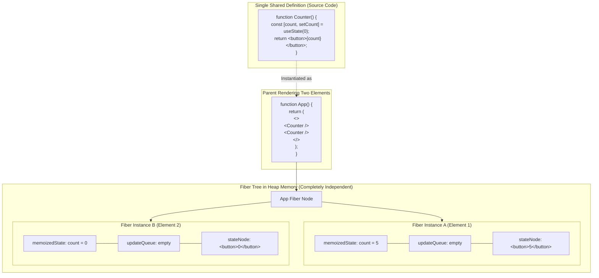
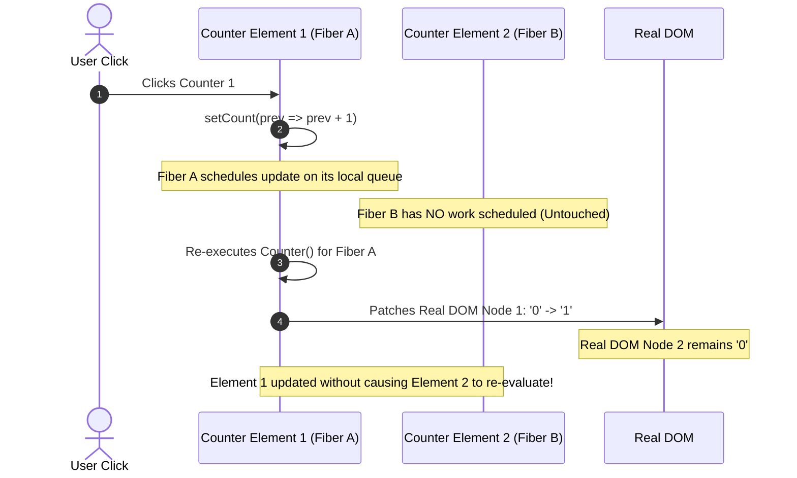
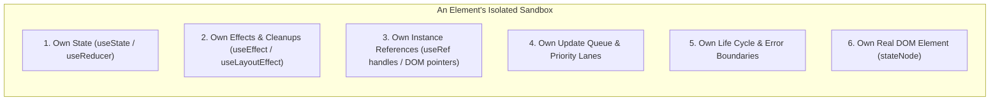

# Component Isolation and Independent State Architecture

> [!note] Core Mental Model
>
> The principle that **"each element has its own everything"** means that in React, every declared instance of a component operates as an entirely self-contained, isolated runtime sandbox. Even if two elements share the exact same source code, definition, or function, their **state, effects, refs, update queues, and DOM bindings are completely distinct and independent in memory**.


> [!abstract] Why Components Do Not Leak State
>
> Component functions are not singletons. React creates an independent **Fiber node instance** in the heap for every single element mounted in the UI tree. When you call `useState` or `useRef`, the allocated data structures attach directly to that specific element's Fiber node—never to the component function itself or to a shared global registry.


## Shared Code Definition vs Independent Fiber Allocations



## What Happens When One Element Updates

Code snippet



## What Does "Its Own Everything" Actually Include?

Code snippet



## Key Concepts

### 1. State Isolation (No Global Contamination)

- If you render `<Counter/>` ten times on the same page, there are ten separate `count` variables stored in memory.

- Modifying the state of Counter #1 has **zero impact** on Counter #2 through #10.

- State is tied to the **position of the element in the component tree**, not the function name.

### 2. Independent Effect Lifecycles and Cleanups

- Each instance tracks its own timers, event listeners, and cleanup callbacks.

- If Counter #1 unmounts, only Counter #1's `useEffect` cleanup function fires. Counter #2 keeps its event listeners and intervals running without interruption.

### 3. Independent Reference Identity (`useRef`)

- Every mounted element receives a dedicated `useRef` object (`{ current: ... }`).

- DOM references do not collide: `ref1.current` references the native DOM node of Element 1, while `ref2.current` references the distinct DOM node of Element 2.

### 4. Independent Update Queues

- Each Fiber node maintains its own `updateQueue`.

- When an interaction occurs on Element 1, React marks only Fiber 1 with dirty Lane flags. Element 2 is not scheduled for re-execution unless the shared parent re-renders and passes down new props.

## Common Interview Questions

- What does the phrase "each component instance has its own isolated state" mean in React?

- If two elements use the exact same custom hook, do they share state?

- How does React maintain separate state for two identical `<Dropdown/>` components rendered side-by-side?

- What would happen if a developer used an external variable outside the component body to store state instead of `useState`?

- How do you intentionally share state between two independent component instances?

## Strong Answers / Talking Points

- **The Custom Hook Illusion**:

    - _Common misconception_: Candidates often assume that using a custom hook (e.g., `useAuth()` or `useWindowSize()`) shares state between components.

    - _Accurate answer_: Custom hooks share **stateful logic**, not state itself. Each component calling a custom hook allocates its own set of hook nodes on its own Fiber.

- **The Module-Level Variable Trap**:

    - If a developer declares `let globalCount = 0;` outside the component function, all instances read and mutate the same shared pointer, breaking component isolation and introducing severe race conditions and non-deterministic UI bugs.

- **Breaking Isolation Deliberately (Lifting State Up)**:

    - If two elements _must_ coordinate (e.g., an accordion where opening one tab closes the other), you must deliberately break isolation by **lifting state up** to their closest common ancestor or placing it into a shared Context / external store.

## Code Snippets / Examples

```javascript
import { useState, useRef, useEffect } from 'react';

// Shared function definition:
export function IndependentWidget({ label }) {
  // 1. OWN STATE: Unique to every instance of IndependentWidget
  const [count, setCount] = useState(0);

  // 2. OWN REF: Separate DOM node pointer and timer tracking
  const buttonRef = useRef(null);
  const clickTracker = useRef(0);

  // 3. OWN EFFECT: Independent cleanup and synchronization lifecycle
  useEffect(() => {
    const timer = setInterval(() => {
      // Runs independently for each instance on screen
      console.log(`[${label}] Heartbeat`);
    }, 5000);

    return () => clearInterval(timer); // Cleaned up only when THIS instance unmounts
  }, [label]);

  const handleClick = () => {
    clickTracker.current += 1;
    setCount(prev => prev + 1); // Rerenders ONLY this element
  };

  return (
    <div style={{ border: '1px solid #ccc', margin: '8px', padding: '8px' }}>
      <h4>{label}</h4>
      <p>State Count: {count}</p>
      <p>Ref Clicks: {clickTracker.current}</p>
      <button ref={buttonRef} onClick={handleClick}>
        Increment {label}
      </button>
    </div>
  );
}

// Parent rendering multiple elements from the same definition:
export function Dashboard() {
  return (
    <div>
      {/* Element A: Holds its own state, refs, DOM node, and intervals */}
      <IndependentWidget label="Widget A" /

      {/* Element B: Completely isolated; changes in Widget A will NOT touch Widget B */}
      <IndependentWidget label="Widget B" />
    </div>
  );
}
```

```javascript
// THE ANTI-PATTERN: Breaking isolation with module-level state
let sharedCount = 0; // BUG: Shared across ALL instances globally!

export function BrokenWidget() {
  const [, forceRender] = useState({});

  const increment = () => {
    sharedCount++; // Mutates the global variable
    forceRender({}); // Re-renders only this component, leaving others out of sync
  };

  return <button onClick={increment}>Shared: {sharedCount}</button>;
}
```

## Related Topics

- [[React State and Props Architecture]]

- [[Rules of Hooks and Internal Linked List Architecture]]

- [[React Fiber Architecture and Non-Blocking Rendering]]

- [[React Reconciliation and Diffing Algorithm]]

## Tags

#fullstack #interview #react-architecture #component-isolation #fiber #state-management #mermaid

## Revision Checklist

- [ ] Can explain in 60 seconds

- [ ] Can explain trade-offs

- [ ] Can give a real project example

- [ ] Can answer common follow-ups
