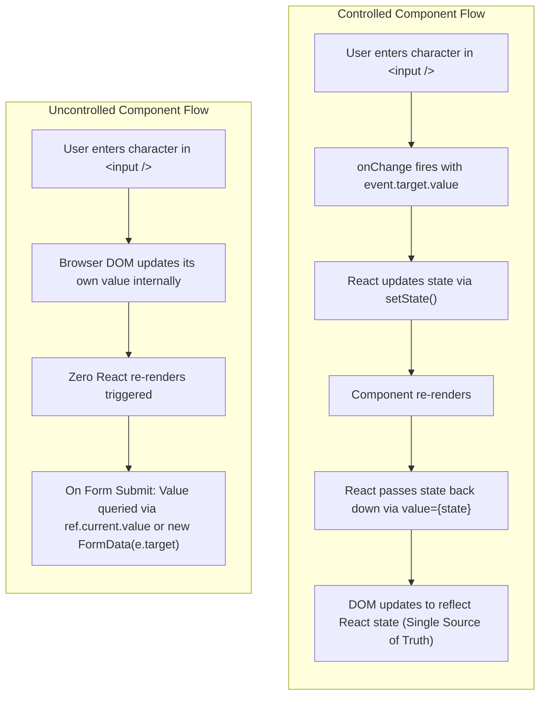
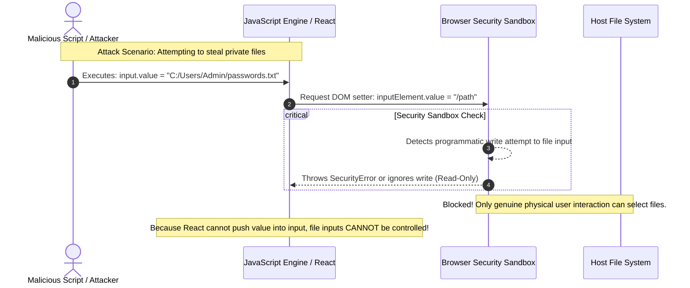

# Form Handling Controlled vs Uncontrolled Components and File Inputs

> [!note] Core Mental Model
>
> In **Controlled Components**, form data is handled by a React component via internal state (`useState`); React is the single source of truth. In **Uncontrolled Components**, form data is handled directly by the browser DOM itself, and values are queried on demand via `useRef` or native `FormData`.


> [!abstract] Why File Inputs (`<input type="file" />`) Are ALWAYS Uncontrolled
>
> A file input's `value` attribute on the DOM node is **strictly read-only** for JavaScript due to browser security guardrails. Because React cannot imperatively set or push programmatic file values into `<input type="file" />`, React cannot control it; therefore, it is inherently uncontrolled.


## Controlled vs Uncontrolled Architecture



## The File Input Security Boundary: Why `value` is Read-Only

Code snippet



## Controlled vs Uncontrolled: Architectural Trade-Offs

|**Feature**|**Controlled (useState)**|**Uncontrolled (useRef / FormData)**|
|---|---|---|
|**Source of Truth**|React Component State|Browser DOM|
|**Re-render on Keystroke**|Yes (Every character updates state)|No (Zero re-renders during typing)|
|**Instant Validation**|Trivial (Validates on every character)|Requires manual `onChange` or post-submit validation|
|**Dynamic Disabling**|Trivial (e.g., disable button if `!isValid`)|Requires extra listeners or form state libraries|
|**Performance with 50+ Inputs**|Can drop frames if parent re-renders heavily|High performance (Direct native DOM storage)|
|**Integration with Native APIs**|Requires converting to objects manually|Direct compatibility with `new FormData(form)`|

## Key Concepts

### 1. Controlled Components

- The input value is bound to state: `<input value={state} onChange={e => setState(e.target.value)} />`.

- React controls what the user sees at every keystroke. If you do not call `setState`, the input will appear frozen to the user because React overwrites the DOM node back to `value`.

- Ideal for: Instant inline field validation, dynamic formatters (e.g., credit card masking `####-####`), conditional inputs, or disabling submit buttons in real time.

### 2. Uncontrolled Components

- The input maintains its own internal state in the DOM: `<input defaultValue="initial" ref={inputRef} />`.

- Use `defaultValue` or `defaultChecked` to supply initial values without seizing control of subsequent updates.

- Pull data on demand when the form is submitted using `new FormData(event.currentTarget)` or `inputRef.current.value`.

- Ideal for: Massive enterprise forms (50–100 fields) where keystroke re-renders cause input lag, or simple forms that only validate on submit.

### 3. Why File Inputs (`<input type="file" />`) are Inherently Uncontrolled

- In React, a component is "controlled" only if React can dictate both:

    1. Reading its state (`onChange`).

    2. **Writing its state** back to the DOM (`value={state}`).

- **The Browser Security Sandbox**:

    - The DOM `HTMLInputElement.value` property for file inputs is **read-only** (with the sole exception of assigning an empty string `""` to clear selection).

    - JavaScript cannot write a file path into `input.value` (e.g., `input.value = "C:/secret.key"`).

    - **The Threat Prevented**: If browsers allowed scripts to set the file path programmatically, malicious websites could invisibly populate `<input type="file" value="~/.ssh/id_rsa">` and trigger a simulated click/submit event to exfiltrate private user files without user awareness.

- Because React cannot set the `value` of `<input type="file" />`, **React cannot control it**.

- Files can only be chosen via a trusted user interaction (the native operating system file picker dialog or drag-and-drop).

- React tracks file selection by reading `event.target.files` (`FileList` object) or referencing the DOM element with `useRef`.

## Common Interview Questions

- What is the difference between controlled and uncontrolled inputs in React?

- Why does assigning an `input` a `value` prop without an `onChange` handler make it read-only?

- Why is `<input type="file" />` always an uncontrolled component in React?

- What security catastrophe would occur if browsers allowed JavaScript to set `fileInput.value` arbitrarily?

- How do you reset or clear a file input in React if the DOM property is read-only?

- When would you deliberately choose uncontrolled components over controlled ones in production?

## Strong Answers / Talking Points

- **The Read-Only File Security Guarantee**:

    - The browser’s file input acts as an operating system boundary. Only the OS file picker initiated by an authenticated user click can grant a web application access to local files. Exposing programmatic writes to JavaScript would dismantle user filesystem isolation.

- **How to Programmatically Clear a File Input**:

    - While JavaScript cannot set a file input's value to a custom path, browsers explicitly permit assigning an empty string `input.value = ""` to wipe the selection:

```javascript
fileInputRef.current.value = ""; // Allowed: clears the selected file
```

    - Alternatively, changing the React `key` prop on the file input (`<input type="file" key={resetToken} />`) forces React to unmount the old DOM node and mount a completely empty one.

- **The Modern Performance Middle Ground**:

    - Developers often default to controlled components and then experience performance bottlenecks on large forms due to cascading re-renders.

    - Modern production form libraries (like React Hook Form) use **uncontrolled components under the hood via refs** for performance, while exposing an intuitive subscription API for validation and submission.

## Code Snippets / Examples

```javascript
import { useState, useRef } from 'react';

// 1. Controlled Component (State-driven, Real-time validation)
export function ControlledForm() {
  const [username, setUsername] = useState('');
  const [error, setError] = useState('');

  const handleChange = (e) => {
    const val = e.target.value;
    setUsername(val);

    // Instant validation on keystroke
    if (val.length > 0 && val.length < 3) {
      setError('Username must be at least 3 characters');
    } else {
      setError('');
    }
  };

  return (
    <div>
      <input value={username} onChange={handleChange} placeholder="Username" />
      {error && <p style={{ color: 'red' }}>{error}</p>}
    </div>
  );
}

// 2. Uncontrolled Component with Native FormData (Zero Re-renders)
export function UncontrolledForm() {
  const handleSubmit = (e) => {
    e.preventDefault();
    // Read all values on-demand directly from native DOM
    const formData = new FormData(e.currentTarget);
    const payload = Object.fromEntries(formData.entries());
    console.log('Submitted Payload:', payload);
  };

  return (
    <form onSubmit={handleSubmit}>
      {/* defaultValue provides initial value without controlling updates */}
      <input name="email" defaultValue="user@example.com" />
      <input name="password" type="password" />
      <button type="submit">Submit</button>
    </form>
  );
}

// 3. Handling File Inputs (Inherently Uncontrolled)
export function FileUploadForm() {
  const fileInputRef = useRef(null);
  const [selectedFileName, setSelectedFileName] = useState(null);

  const handleFileChange = (e) => {
    // Read the FileList from DOM element safely
    const file = e.target.files?.[0];
    if (file) {
      setSelectedFileName(file.name);
    }
  };

  const handleClear = () => {
    // The ONLY permitted write to a file input DOM value: empty string
    if (fileInputRef.current) {
      fileInputRef.current.value = '';
      setSelectedFileName(null);
    }
  };

  return (
    <div>
      {/* NEVER pass value={...} to a file input! */}
      <input
        type="file"
        ref={fileInputRef}
        onChange={handleFileChange}
      /

      {selectedFileName && (
        <div>
          <p>Selected: {selectedFileName}</p>
          <button type="button" onClick={handleClear}>Remove File</button>
        </div>
      )}
    </div>
  );
}
```

## Related Topics

- [[React State and Props Architecture]]

- [[React useRef and useImperativeHandle Architecture]]

- [[Web Security & Identity Architecture. SOP, XSS, CSRF & Token Lifecycles|Frontend Security and OWASP Top 10]]

- [[React Synthetic Events and Event Delegation|Browser Event Propagation and Synthetic Events]]

## Tags

#fullstack #interview #react-forms #controlled-components #uncontrolled-components #file-input #security #mermaid

## Revision Checklist

- [ ] Can explain in 60 seconds

- [ ] Can explain trade-offs

- [ ] Can give a real project example

- [ ] Can answer common follow-ups
