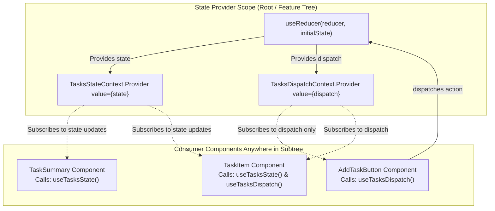
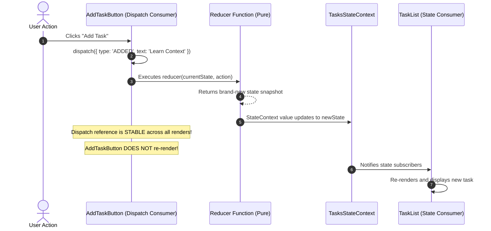

> [!note] Core Mental Model
> 
> Pairing `useReducer` with React Context creates an ergonomic, built-in state management pattern often referred to as the **"Lightweight Redux" pattern**. `useReducer` manages complex state transitions via deterministic actions and pure reducer functions, while React Context distributes both the **state** and the **dispatch** function throughout the component tree without prop drilling.
> 
>   

> [!abstract] The Split-Context Optimization
> 
> A common performance pitfall is putting both `state` and `dispatch` inside a single Context provider. Whenever state updates, every consumer of that context re-renders—even components that only need `dispatch`. Splitting them into **two independent contexts** (`StateContext` and `DispatchContext`) ensures components that only trigger actions never re-render when state changes.
> 
>   

## Architecture: Dual-Context with useReducer



## State Flow and Re-render Boundary

Code snippet



## Key Concepts

### 1. Why Pair useReducer with Context?

- **`useState` limitations at scale**: Passing multiple state variables and setter functions down several component layers leads to cluttered prop interfaces and scattered mutation logic.
    
      
    
- **Predictable State Transitions**: `useReducer` centralizes state updates inside a single pure reducer function `(state, action) => newState`, decoupling _what happened_ (actions) from _how state updates_ (reducer logic).
    
      
    
- **Global / Subtree Dispatching**: Context makes `dispatch` globally available without having to thread callback functions down through intermediate layers.
    
      
    

### 2. Why Split State and Dispatch Contexts?

- Context triggers a re-render in **all consuming components** whenever its `value` reference changes (`Object.is(prevValue, nextValue) === false`).
    
      
    
- If state and dispatch share a single context:
    
      
    
    
    ```    JavaScript
    // ANTI-PATTERN: Single Context
    <TaskContext.Provider value={{ state, dispatch }}>
    ```
    
    Every time `state` updates, the `{ state, dispatch }` object receives a new memory address, forcing components that only care about `dispatch` (like an "Add Task" button) to re-render needlessly.
    
      
    
- **The Solution**: React guarantees that `dispatch` returned by `useReducer` has a **stable identity** (its memory reference never changes across re-renders). Providing `dispatch` via a separate `DispatchContext` means components consuming only dispatch **never re-render** due to state transitions.
    
      
    

### 3. Custom Hook Encapsulation

- Exposing raw `useContext(SomeContext)` calls directly in UI components creates boilerplate and risks null pointer bugs if used outside a provider.
    
      
    
- Best practice: Wrap each context in a dedicated custom hook (`useTasksState()`, `useTasksDispatch()`) that asserts the hook is executed inside its provider boundary.
    
      
    

## Common Interview Questions

- Why would you choose `useReducer` + Context over `useState` + Context?
    
      
    
- Why is splitting `StateContext` and `DispatchContext` considered a best practice?
    
      
    
- Does `dispatch` returned by `useReducer` change its reference between renders?
    
      
    
- What are the architectural differences between `useReducer` + Context and Redux / Zustand?
    
      
    
- How do you handle asynchronous operations (like API calls) when using `useReducer` and Context?
    
      
    
- What causes performance degradation in React Context, and how do you mitigate it?
    
      
    

## Strong Answers / Talking Points

- **Context is Not a State Manager**:
    
      
    - _Critical Interview Distinction_: React Context is not a state management library; it is a **dependency injection / transport mechanism**. `useReducer` is the state manager. Context simply pipes the state and dispatch to the desired subtree.
        
          
        
- **Context vs Redux / Zustand**:
    
      
    - _Context + useReducer_: Built into React, requires zero external bundle size, excellent for low-to-medium frequency updates (user auth, theme, localized features, complex forms).
        
          
        
    - _External Stores (Redux / Zustand)_: Use fine-grained selector subscriptions outside React's Virtual DOM reconciler. They prevent re-renders at the individual component property level, making them better suited for high-frequency state updates (e.g., live streaming tickers, canvas tools, games).
        
          
        
- **Handling Async Actions**:
    
      
    - Reducers must remain **pure functions**—they cannot perform side effects, async calls, or generate random IDs.
        
          
        
    - Asynchronous workflows must be handled in the calling event handler or via an action helper function _before_ calling `dispatch`:
        
          
        
        
        ```JavaScript
        // Call API first, then dispatch deterministic result
        async function handleSave(dispatch, data) {
          dispatch({ type: 'SAVE_START' });
          try {
            const result = await api.post('/tasks', data);
            dispatch({ type: 'SAVE_SUCCESS', payload: result });
          } catch (err) {
            dispatch({ type: 'SAVE_ERROR', error: err.message });
          }
        }
        ```
        

## Code Snippets / Examples


```JavaScript
import { createContext, useContext, useReducer } from 'react';

// 1. Define Pure Reducer & Initial State
const initialState = [
  { id: 1, title: 'Learn Context + Reducer', completed: false }
];

function tasksReducer(tasks, action) {
  switch (action.type) {
    case 'ADDED': {
      return [
        ...tasks,
        { id: action.id, title: action.title, completed: false }
      ];
    }
    case 'TOGGLED': {
      return tasks.map(task => 
        task.id === action.id ? { ...task, completed: !task.completed } : task
      );
    }
    case 'DELETED': {
      return tasks.filter(task => task.id !== action.id);
    }
    default: {
      throw new Error(`Unhandled action type: ${action.type}`);
    }
  }
}

// 2. Create Two Distinct Contexts
const TasksStateContext = createContext(null);
const TasksDispatchContext = createContext(null);

// 3. Provider Component Encapsulating Logic
export function TasksProvider({ children }) {
  const [tasks, dispatch] = useReducer(tasksReducer, initialState);

  return (
    <TasksStateContext.Provider value={tasks}>
      <TasksDispatchContext.Provider value={dispatch}>
        {children}
      </TasksDispatchContext.Provider>
    </TasksStateContext.Provider>
  );
}

// 4. Custom Hooks with Guardrails
export function useTasks() {
  const context = useContext(TasksStateContext);
  if (context === null) {
    throw new Error('useTasks must be used within a TasksProvider');
  }
  return context;
}

export function useTasksDispatch() {
  const context = useContext(TasksDispatchContext);
  if (context === null) {
    throw new Error('useTasksDispatch must be used within a TasksProvider');
  }
  return context;
}
```


```JavaScript
// 5. Consumer Components (Clean & Decoupled)
import { useState } from 'react';
import { useTasks, useTasksDispatch } from './TasksContext';

// Only consumes dispatch -> NEVER re-renders when task list updates!
export function AddTask() {
  const [text, setText] = useState('');
  const dispatch = useTasksDispatch();

  const handleAdd = () => {
    if (!text.trim()) return;
    dispatch({ type: 'ADDED', id: Date.now(), title: text });
    setText('');
  };

  return (
    <div>
      <input value={text} onChange={(e) => setText(e.target.value)} />
      <button onClick={handleAdd}>Add Task</button>
    </div>
  );
}

// Consumes state -> Re-renders when tasks state updates
export function TaskList() {
  const tasks = useTasks();
  const dispatch = useTasksDispatch();

  return (
    <ul>
      {tasks.map(task => (
        <li key={task.id}>
          <span 
            style={{ textDecoration: task.completed ? 'line-through' : 'none' }}
            onClick={() => dispatch({ type: 'TOGGLED', id: task.id })}
          >
            {task.title}
          </span>
          <button onClick={() => dispatch({ type: 'DELETED', id: task.id })}>
            Delete
          </button>
        </li>
      ))}
    </ul>
  );
}
```

## Related Topics

- [[React State and Props Architecture]]
    
      
    
- [[React useState Hook and State Batching Architecture]]
    
      
    
- [[Rules of Hooks and Internal Linked List Architecture]]
    
      
    
- [[Pure Components and React memo]]
    
      
    

## Tags

#fullstack #interview #react-context #usereducer #state-management #lightweight-redux #mermaid

  

## Revision Checklist

- [ ] Can explain in 60 seconds
    
      
    
- [ ] Can explain trade-offs
    
      
    
- [ ] Can give a real project example
    
      
    
- [ ] Can answer common follow-ups