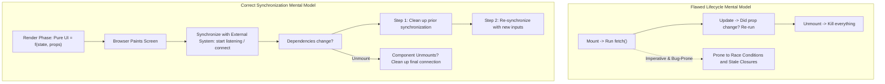
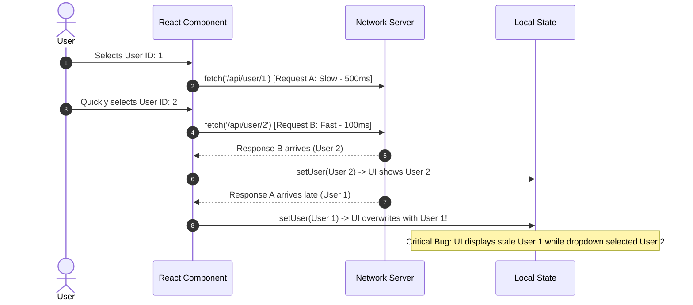
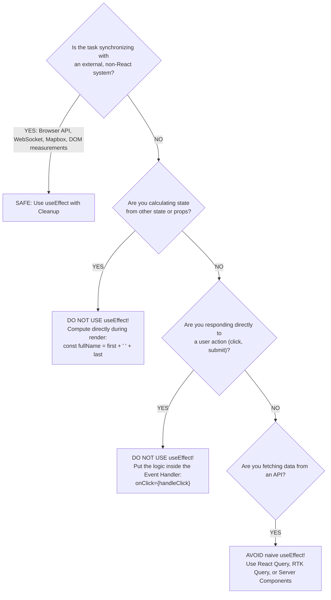

# React useEffect and Synchronization Architecture

> [!note] The True Mental Model of useEffect
> 
> `useEffect` is **not** a lifecycle hook masquerading as `componentDidMount` or `componentDidUpdate`. Its sole purpose is **synchronization**: keeping your React component's state and props in sync with an **external, non-React system** (e.g., browser APIs, timers, WebSockets, canvas contexts, or third-party imperative widgets).
> 
>   

> [!abstract] Why useEffect is an Anti-Pattern for Direct Data Fetching and State Derivation
> 
> Using `useEffect` to fetch data or derive state creates **waterfalls**, **race conditions**, **unnecessary double renders**, and **boilerplate-heavy error/loading tracking**. React state should either be computed on the fly during rendering (for derived values) or managed via dedicated async caching primitives like TanStack Query, SWR, or Server Components.
> 
>   

## The Synchronization Cycle vs Lifecycle Fallacy



## Why useEffect Fails at Data Fetching: The Race Condition



## When to Use vs When NOT to Use useEffect



## Key Concepts

### 1. The Real Mental Model: Synchronization, Not Lifecycles

- `useEffect` tells React: _"After you paint the screen, run this code so my component stays synchronized with the outside world."_

- If your component has no dependency on an outside system (e.g., window events, third-party libraries, audio elements, network sockets), you likely do not need `useEffect`.

### 2. Why useEffect is Anti-Pattern for State Updates

- **The "State Mirroring" Trap**: Developers often sync prop changes into internal state using an effect:

```javascript
// BAD: Redundant state + extra re-render cycle
useEffect(() => {
  setFilteredList(items.filter(i => i.active));
}, [items]);
```

- **The Cost**: Setting state inside `useEffect` forces a **second render pass** immediately after the first render committed and painted.

- **The Fix**: Derive state during render:

```javascript
// GOOD: Zero extra renders, runs synchronously during render
const filteredList = useMemo(() => items.filter(i => i.active), [items]);
```

### 3. Problems with Naive Data Fetching in useEffect

1. **Network Race Conditions**: Fast requests can be overwritten by slower, stale responses from previous renders.

2. **Network Cascades (Waterfalls)**: If a parent component fetches data inside an effect, and its child also fetches inside an effect, the child cannot even start fetching until the parent finishes, mounts, and paints.

3. **No Automatic Caching or Deduplication**: Re-mounting the component fetches the exact same data from scratch every single time.

4. **No Error / Loading Primitives**: Requires manual boilerplate (`isLoading`, `error`, `data` states across every single endpoint).

5. **Strict Mode Issues**: Development double-mounting triggers duplicate network calls unless manually aborted using `AbortController`.

## Common Interview Questions

- What is the primary purpose and mental model of `useEffect`?

- Why is fetching data directly inside `useEffect` considered problematic in production React apps?

- How does a race condition occur when fetching data inside `useEffect`, and how do you fix it using `AbortController`?

- When should you derive a value during rendering instead of using `useEffect` and `useState`?

- What are the architectural advantages of dedicated data-fetching libraries (TanStack Query) over `useEffect`?

- Why does an empty dependency array `[]` not necessarily mean "run only on mount"?

## Strong Answers / Talking Points

- **The Single-Sentence Mental Model**:

    - _"Don't ask when the component did mount or update; ask which external system this effect is keeping in sync with."_

- **Explain the Dual-Render Problem**:

    - When you trigger a `setState` inside `useEffect`, React executes the render phase $\rightarrow$ commits to real DOM $\rightarrow$ paints to screen $\rightarrow$ runs the effect $\rightarrow$ schedules a new state update $\rightarrow$ re-executes the render phase $\rightarrow$ commits again $\rightarrow$ repaints.

    - This wastes CPU cycles, introduces layout shift (CLS), and drains mobile battery.

- **Why Server State is Fundamentally Different from Client State**:

    - Local state (`useState`) is synchronous, local, and owned by your component.

    - Server state (API data) is asynchronous, remote, shared, and out of your control. Trying to shoehorn server state into local state variables via `useEffect` requires manually handling retries, cache invalidation, window refocus refetching, and deduplication.

## Code Snippets / Examples

```javascript
import { useState, useEffect } from 'react';

// 1. BAD: State derivation via useEffect (Extra render pass)
export function BadDerivedState({ items }) {
  const [total, setTotal] = useState(0);

  useEffect(() => {
    // Triggers an unnecessary second render pass after paint
    setTotal(items.reduce((acc, curr) => acc + curr.price, 0));
  }, [items]);

  return <div>Total: ${total}</div>;
}

// 2. GOOD: Derive during render (Zero overhead, instant)
export function GoodDerivedState({ items }) {
  // Calculated inline during the render phase
  const total = items.reduce((acc, curr) => acc + curr.price, 0);
  return <div>Total: ${total}</div>;
}

// 3. Handling API Race Conditions safely if useEffect MUST be used
export function SafeFetchUser({ userId }) {
  const [user, setUser] = useState(null);

  useEffect(() => {
    const controller = new AbortController();

    async function loadUser() {
      try {
        const res = await fetch(`/api/users/${userId}`, {
          signal: controller.signal
        });
        const data = await res.json();
        setUser(data);
      } catch (err) {
        if (err.name !== 'AbortError') {
          console.error('Fetch error:', err);
        }
      }
    }

    loadUser();

    // CLEANUP: Aborts obsolete in-flight requests when userId changes
    return () => {
      controller.abort();
    };
  }, [userId]);

  return <div>{user ? user.name : 'Loading...'}</div>;
}

// 4. LEGITIMATE USE CASE: Synchronizing with an External System
export function WindowScrollTracker() {
  const [scrollY, setScrollY] = useState(0);

  useEffect(() => {
    // External system: Browser window global event bus
    const handleScroll = () => setScrollY(window.scrollY);

    window.addEventListener('scroll', handleScroll);

    // Un-synchronize / teardown
    return () => {
      window.removeEventListener('scroll', handleScroll);
    };
  }, []); // Synchronized once for window lifecycle

  return <div>Scroll position: {scrollY}px</div>;
}
```

## Related Topics

- [[React Lifecycle and Execution Flow|React Component Lifecycle]]

- [[React useEffect and Synchronization Architecture|React useEffect vs useLayoutEffect]]

- [[React State and Props Architecture]]

- [[TanStack Query Server State and Stale While Revalidate Patterns|Client State vs Server State (TanStack Query)]]

- [[React useEffect and Synchronization Architecture|Stale Closures in React Hooks]]

## Tags

#fullstack #interview #react-hooks #useeffect #synchronization #mermaid

## Revision Checklist

- [ ] Can explain in 60 seconds

- [ ] Can explain trade-offs

- [ ] Can give a real project example

- [ ] Can answer common follow-ups