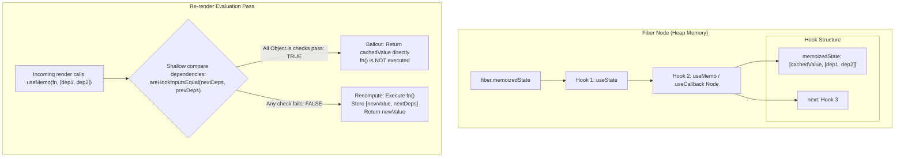
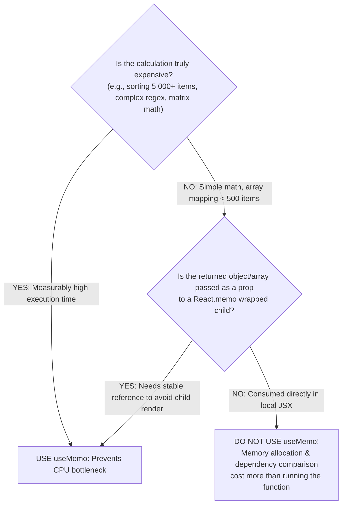

# React useMemo, useCallback, and Fiber Memoization Architecture

> [!note] Core Mental Model
> 
> `useMemo` caches the **result of a calculation** between renders. `useCallback` caches a **function definition** between renders. In fact, `useCallback(fn, deps)` is syntactic sugar for `useMemo(() => fn, deps)`. Both hooks optimize performance by preserving referential identity across re-renders to prevent unnecessary computations and child re-renders.
> 
>   

> [!abstract] How Memoization Works in the Fiber Node
> 
> React does not use an external cache table or hash map for `useMemo` and `useCallback`. Inside the component's Fiber node, the hook's `memoizedState` property stores a simple two-element array: `[valueOrFunction, dependencies]`. On every re-render, React performs a shallow reference check (`Object.is`) across the dependency array; if all dependencies are identical, React returns the cached first element without executing the factory function.
> 
>   

## How useMemo and useCallback Are Stored in the Fiber Tree



## When useMemo is Worth It vs Overhead



## The useCallback and React.memo Partnership

```mermaid
sequenceDiagram
    autonumber
    actor User as User Action
    participant Parent as Parent Component
    participant Child as ExpensiveChild (React.memo)
    participant DOM as Real DOM

    Note over Parent,Child: Without useCallback: Inline function recreated on render
    Parent->>Parent: Parent re-renders (state update)
    Parent->>Parent: const handleClick = () => {...} (NEW Reference!)
    Parent->>Child: &lt;ExpensiveChild onClick={handleClick} /&gt;
    Child->>Child: React.memo compares prev.onClick === next.onClick (FALSE)
    Child->>DOM: ExpensiveChild re-renders unnecessarily!

    Note over Parent,Child: With useCallback: Reference preserved
    Parent->>Parent: Parent re-renders
    Parent->>Parent: useCallback returns cached handleClick (SAME Reference!)
    Parent->>Child: &lt;ExpensiveChild onClick={handleClick} /&gt;
    Child->>Child: React.memo compares prev.onClick === next.onClick (TRUE)
    Note over Child,DOM: Child re-render SKIPPED! Complete bailout.
```

## Key Concepts

### 1. What is `useMemo`?

- Caches the **computed return value** of a function between re-renders.

- Syntax: `const cachedValue = useMemo(calculateValue, dependencies)`.

- On initial mount: Runs `calculateValue()`, stores `[cachedValue, dependencies]` on the Fiber hook, and returns the result.

- On re-render: Compares current dependencies with stored dependencies using `Object.is`. If unchanged, returns the stored `cachedValue` without re-running `calculateValue()`.

### 2. What is `useCallback`?

- Caches a **function definition** between re-renders to maintain referential identity.

- Syntax: `const cachedFn = useCallback(fn, dependencies)`.

- In JavaScript, `() => {} !== () => {}` (functions are objects with unique memory references).

- Every time a parent re-renders, any plain arrow function created inside its body is assigned a **brand-new memory address**.

- `useCallback` ensures that the returned function points to the **exact same memory address** until its dependencies change.

### 3. How Fiber Stores Memoized Hooks Internally

- Like `useState`, each `useMemo` and `useCallback` corresponds to a hook node in the Fiber's linked list:

```javascript
// Internal representation in React's reconciler (ReactFiberHooks.js)
hook.memoizedState = [nextValue, nextDeps];
```

- React iterates through the dependency arrays:

```javascript
function areHookInputsEqual(nextDeps, prevDeps) {
  for (let i = 0; i < prevDeps.length && i < nextDeps.length; i++) {
    if (Object.is(nextDeps[i], prevDeps[i])) continue;
    return false;
  }
  return true;
}
```

### 4. Why "Memoization Itself Has a Cost"

Memoization is not free performance; it trades CPU and memory overhead:

1. **Memory Cost**: The Fiber must retain extra heap memory for the cached value, factory closure, and the dependency array for the entire lifespan of the component.

2. **Comparison Cost**: On _every single render_, React must iterate through the `deps` array and perform `Object.is()` comparisons.

3. **Closure Overhead**: Creating the factory function `() => compute(a, b)` allocates an ephemeral closure function on every render anyway.

- **Rule of Thumb**: For lightweight calculations (e.g., `a + b`, filtering an array under 100 items), computing the value directly is faster than running dependency checks and allocating cache arrays.

## Common Interview Questions

- What is the difference between `useMemo` and `useCallback`?

- How is `useCallback` implemented internally using `useMemo`?

- Where and how does React store memoized values inside the Fiber architecture?

- Why is it counterproductive to wrap every function in `useCallback` and every variable in `useMemo`?

- What are the only two legitimate use cases for `useCallback`?

- Why does `useCallback` do nothing to prevent re-renders unless paired with `React.memo` or a hook dependency?

## Strong Answers / Talking Points

- **useCallback is Syntactic Sugar**:

    - `useCallback(fn, deps)` is literally equivalent to `useMemo(() => fn, deps)`.

    - The React source code implements them in parallel inside `ReactFiberHooks.js`: `mountCallback` sets `hook.memoizedState = [callback, nextDeps]`, while `mountMemo` sets `hook.memoizedState = [nextValue, nextDeps]`.

- **The Two Legitimate Use Cases for `useCallback`**:

    1. **Passing callbacks to memoized children**: Passing a callback to a child component wrapped in `React.memo`. Without `useCallback`, the new function reference breaks `React.memo`'s shallow prop check every render.

    2. **Passing functions into other hook dependencies**: When a function is listed inside the dependency array of another hook (such as `useEffect`), stabilizing the function reference prevents the effect from running on every single render.

- **When is a calculation "expensive"?**:

    - Most JavaScript operations on modest datasets take less than a millisecond (e.g., filtering 200 items takes $<0.1\text{ms}$).

    - Unless an operation takes $\ge 1\text{ms}$ or creates noticeable frame drops (profilable via `performance.now()` or Chrome DevTools), using `useMemo` costs more in code complexity, memory, and comparison cycles than simply recalculating.

## Code Snippets / Examples

```javascript
import React, { useState, useMemo, useCallback } from 'react';

// 1. Child wrapped in React.memo to prevent unnecessary re-renders
const ExpensiveList = React.memo(function ExpensiveList({ items, onItemClick }) {
  console.log('ExpensiveList rendered');
  return (
    <ul>
      {items.map(item => (
        <li key={item.id} onClick={() => onItemClick(item.id)}>
          {item.name}
        </li>
      ))}
    </ul>
  );
});

export function ParentDashboard() {
  const [count, setCount] = useState(0);
  const [filterText, setFilterText] = useState('');
  const [rawItems] = useState(() =>
    Array.from({ length: 5000 }, (_, i) => ({ id: i, name: `Item ${i}` }))
  );

  // USE CASE 1: useMemo for CPU-heavy filtering on large datasets (5,000 items)
  const filteredItems = useMemo(() => {
    console.log('Calculating filtered items...');
    return rawItems.filter(item =>
      item.name.toLowerCase().includes(filterText.toLowerCase())
    );
  }, [rawItems, filterText]); // Only recomputes when rawItems or filterText changes

  // USE CASE 2: useCallback to maintain stable reference for React.memo child
  const handleItemClick = useCallback((id) => {
    console.log('Item clicked:', id);
  }, []); // Empty deps: function reference remains identical across all renders

  return (
    <div>
      {/* Updating count re-renders Parent, but ExpensiveList skips re-render! */}
      <button onClick={() => setCount(c => c + 1)}>Counter: {count}</button>

      <input
        value={filterText}
        onChange={(e) => setFilterText(e.target.value)}
        placeholder="Filter 5,000 items..."
      />

      <ExpensiveList items={filteredItems} onItemClick={handleItemClick} />
    </div>
  );
}

// 3. Demonstrating that useCallback is just useMemo for functions
export function EquivalenceDemo(props) {
  // These two lines are architecturally identical:
  const fnA = useCallback(() => console.log(props.id), [props.id]);
  const fnB = useMemo(() => () => console.log(props.id), [props.id]);

  return null;
}
```

## Related Topics

- [[Rules of Hooks and Internal Linked List Architecture]]

- [[React Fiber Architecture and Non-Blocking Rendering]]

- [[React useMemo, useCallback, and Fiber Memoization Architecture|Pure Components and React memo]]

- [[React useEffect and Synchronization Architecture|Stale Closures in React Hooks]]

- [[JavaScript Data Types, Objects & Prototypal Inheritance|JavaScript Pass-by-Reference vs Pass-by-Value]]

## Tags

#fullstack #interview #react-hooks #usememo #usecallback #memoization #fiber #mermaid

## Revision Checklist

- [ ] Can explain in 60 seconds

- [ ] Can explain trade-offs

- [ ] Can give a real project example

- [ ] Can answer common follow-ups