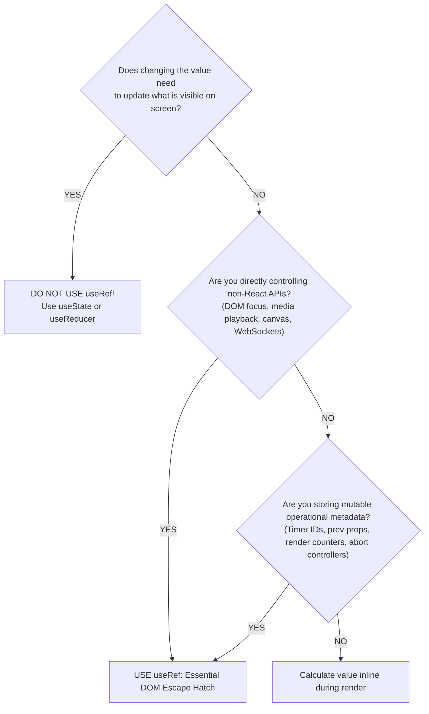

> [!note] The Core Mental Model of useRef
> 
> `useRef` provides a persistent, mutable container (`{ current: value }`) whose reference remains stable across the entire component lifecycle. Mutating `.current` **does not trigger a re-render**. It is an "escape hatch" to hold values that do not affect the component's visual rendering output or to directly interact with native browser DOM nodes.
> 
>   

> [!abstract] The Purpose of useImperativeHandle
> 
> By default, passing a `ref` exposes the entire raw underlying DOM element. `useImperativeHandle` customizes the instance value exposed to parent components, letting you expose a controlled, restrictive API (e.g., exposing only `.focus()` and `.scrollIntoView()` rather than the entire `<input />` node). In React 19, `ref` can be passed as a standard prop (deprecating the need for `forwardRef`), while `useImperativeHandle` continues to shape the exposed imperative interface.
> 
>   

## State vs Ref Mental Model

```mermaid
flowchart TD
    subgraph SET_STATE ["useState Flow"]
        S1["Mutate state via setter: `setCount(5)`"]
        S2["Schedules work in Fiber queue"]
        S3["Re-executes component function (Render Phase)"]
        S4["Diffs Virtual DOM & Commits to Real DOM"]
        S5["Updates Screen Pixels"]
        S1 --> S2 --> S3 --> S4 --> S5
    end

    subgraph SET_REF ["useRef Flow"]
        R1["Mutate ref directly: `myRef.current = 5`"]
        R2["Immediate synchronous in-memory update on Heap"]
        R3["No re-render scheduled!"]
        R4["Virtual DOM diffing skipped completely"]
        R5["Screen remains untouched"]
        R1 --> R2 --> R3 --> R4 --> R5
    end
```




## How useImperativeHandle Encapsulates Component APIs

```mermaid
flowchart LR
    subgraph PARENT ["Parent Component"]
        P1["inputRef = useRef(null)"]
        P2["Calls: `inputRef.current.focusAndClear()`"]
    end

    subgraph CHILD ["Child Component with useImperativeHandle"]
        C1["Exposes custom methods via handle"]
        C2["Internal raw DOM node: `<input ref={nativeInputRef} />`"]
        C3["Security Boundary: Prevents parent from directly mutating DOM style or value"]
    end

    P1 -.->|Bound to| C1
    P2 -->|Executes safe API| C1
    C1 -->|Imperatively controls| C2
```




## Decision Matrix: When to Use vs Avoid useRef




## Key Concepts

### 1. What is `useRef`?

- Returns a plain JavaScript object: `{ current: initialValue }`.
    
      
    
- React preserves this exact object instance across every single render pass within the component's Fiber node (`hook.memoizedState`).
    
      
    
- **Two Distinct Use Cases**:
    
      
    1. **Referencing DOM nodes**: Directly accessing native DOM elements (`<div ref={myRef}>`).
        
          
        
    2. **Storing Mutable Class-like Instance Variables**: Storing timer IDs, animation frame handles, previous state snapshots, or flag booleans that persist across renders without triggering layout or re-renders.
        
          
        

### 2. When to Use `useRef`

- **DOM Manipulations**: Managing focus, text selection, measuring layout dimensions (`getBoundingClientRect()`), scrolling to a view, or controlling HTML5 `<video>` / `<audio>` playback.
    
      
    
- **Integrating Third-Party Imperative Libraries**: Wrapping D3 charts, Leaflet/Mapbox maps, or GSAP animations that manage their own internal DOM.
    
      
    
- **Storing Mutable State Independent of UI**:
    
      
    - `setInterval` / `setTimeout` IDs for clean disposal.
        
          
        
    - Tracking whether a component has mounted (`isMountedRef.current`).
        
          
        
    - Storing previous state or prop values across renders.
        
          
        

### 3. When NOT to Use `useRef` (Anti-Patterns)

- **Do NOT use it for values displayed in JSX**: If changing a variable must make changes visible in the UI, it belongs in `useState`. Mutating `ref.current` will leave the UI stale.
    
      
    
- **Do NOT read or write `ref.current` during rendering**:
    
      
    
    ```JavaScript
    // CRITICAL ANTI-PATTERN: Reading/writing ref during render
    function BadComponent() {
      const myRef = useRef(0);
      myRef.current++; // IMPURE! Modifying ref during render phase
      return <div>{myRef.current}</div>;
    }
    ```
    
    _Why_: The Render Phase can be paused, aborted, and re-executed multiple times by the concurrent scheduler. Mutating refs during render introduces non-deterministic bugs. **Refs should only be read or written inside event handlers or `useEffect`**.
    
      
    
- **Do NOT bypass React’s declarative model**: Avoid using refs to modify DOM properties that React manages (e.g., manually updating `ref.current.textContent = 'hello'` or calling `ref.current.remove()`), as this corrupts React's internal Virtual DOM tree tracking.
    
      
    

### 4. What is `useImperativeHandle`?

- Customizes the instance value exposed when a parent attaches a `ref` to a child component.
    
      
    
- **Syntax**: `useImperativeHandle(ref, createHandle, dependencies)`
    
      
    
- **Why it matters**: Protects component encapsulation. Instead of leaking the raw DOM node to the parent (which allows the parent to read arbitrary values or mutate child styles), the child exposes a limited set of strictly defined methods.
    
      
    

## Common Interview Questions

- What is `useRef`, and how does it differ fundamentally from `useState`?
    
      
    
- Why doesn't mutating `ref.current` trigger a component re-render?
    
      
    
- Why is reading or writing `ref.current` during the Render Phase considered an anti-pattern?
    
      
    
- What problem does `useImperativeHandle` solve, and when should it be preferred over a raw DOM ref?
    
      
    
- How does passing a `ref` to a custom component work in React 19 vs older React versions using `forwardRef`?
    
      
    
- How do you preserve the previous value of a prop or state across renders using `useRef`?
    
      
    

## Strong Answers / Talking Points

- **The Heap Storage Analogy**:
    
      
    - `useRef` is conceptually equivalent to an instance field on a class component (`this.myVariable = value`). It lives directly on the Fiber's hook node in heap memory, independent of functional closures.
        
          
        
- **The Purity Rule of Rendering**:
    
      
    - React components must be pure functions during rendering. Reading or mutating `ref.current` in the function body makes the render output non-deterministic. If React's concurrent mode restarts an interrupted render pass, the ref could contain an unexpected, half-mutated value.
        
          
        
- **Encapsulation with `useImperativeHandle`**:
    
      
    - Exposing raw DOM nodes via ref breaks component abstraction boundaries. If a parent can reach into a child and mutate its DOM styles directly, the child is no longer self-contained. `useImperativeHandle` restores encapsulation by defining an explicit imperative contract between parent and child.
        
          
        

## Code Snippets / Examples


```JavaScript
import { useRef, useEffect, useState } from 'react';

// 1. Correct Use Case: Storing Timer IDs & Preserving Previous State
export function TimerComponent({ count }) {
  const timerRef = useRef(null);
  const prevCountRef = useRef();

  // Track previous prop value safely inside an effect
  useEffect(() => {
    prevCountRef.current = count;
  }, [count]);

  const startTimer = () => {
    if (timerRef.current !== null) return;
    timerRef.current = setInterval(() => {
      console.log('Tick...');
    }, 1000);
  };

  const stopTimer = () => {
    clearInterval(timerRef.current);
    timerRef.current = null; // Clean up mutable reference
  };

  return (
    <div>
      <p>Current: {count} | Previous: {prevCountRef.current}</p>
      <button onClick={startTimer}>Start</button>
      <button onClick={stopTimer}>Stop</button>
    </div>
  );
}
```


```JavaScript
import { useRef, useImperativeHandle } from 'react';

// 2. useImperativeHandle: Exposing a safe, restricted API to parents
// (In modern React, ref is passed directly as a prop)
export function CustomModal({ ref }) {
  const dialogRef = useRef(null);
  const [isOpen, setIsOpen] = useState(false);

  // Expose ONLY open and close methods; hide internal DOM/state
  useImperativeHandle(ref, () => ({
    open() {
      setIsOpen(true);
      dialogRef.current?.showModal();
    },
    close() {
      dialogRef.current?.close();
      setIsOpen(false);
    }
  }), []);

  return (
    <dialog ref={dialogRef}>
      <h3>Controlled Modal Dialog</h3>
      <button onClick={() => dialogRef.current?.close()}>Close</button>
    </dialog>
  );
}

// Parent consuming the imperative handle
export function App() {
  const modalRef = useRef(null);

  return (
    <div>
      <button onClick={() => modalRef.current?.open()}>Open Modal</button>
      {/* Parent cannot mess with dialog DOM nodes directly */}
      <CustomModal ref={modalRef} />
    </div>
  );
}
```

## Related Topics

- [[React State and Props Architecture]]
    
      
    
- [[React useEffect and Synchronization Architecture]]
    
      
    
- [[React Fiber Architecture and Non-Blocking Rendering]]
    
      
    
- [[Stale Closures in React Hooks]]
    
      
    

## Tags

#fullstack #interview #react-hooks #useref #useimperativehandle #dom-manipulation #mermaid

  

## Revision Checklist

- [ ] Can explain in 60 seconds
    
      
    
- [ ] Can explain trade-offs
    
      
    
- [ ] Can give a real project example
    
      
    
- [ ] Can answer common follow-ups