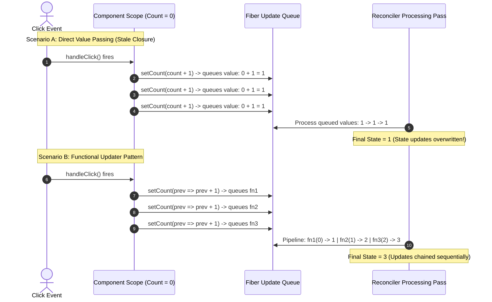
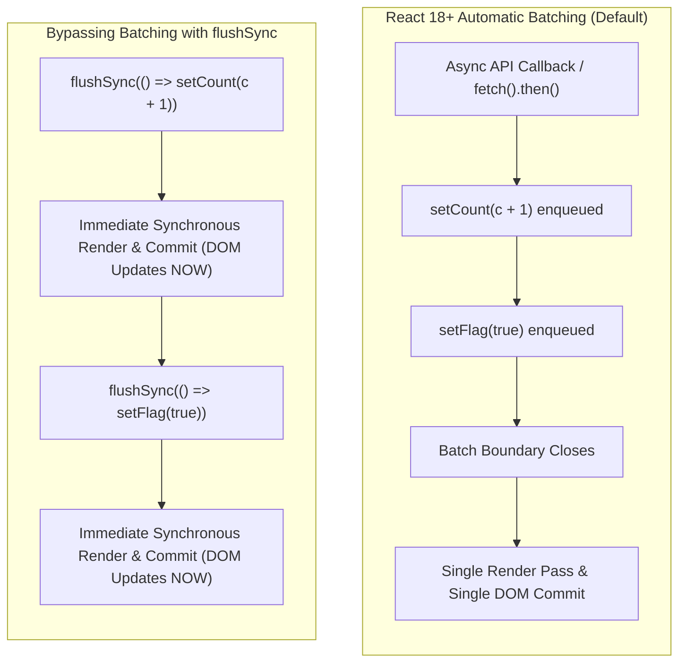

# React useState Hook and State Batching Architecture

> [!note] The Stateless Nature of Plain Functions
>
> Standard JavaScript functions cannot preserve local state across invocations because their activation records (call stack frames) are discarded as soon as execution completes. Before React 16.8, functional components were strictly **Stateless Functional Components (SFCs)** used only for presentation (`UI = f(props)`). `useState` bridges this gap by offloading reactive state to an external memory record—the component's internal **Fiber node** on the heap—preserving state across functional re-executions.


> [!abstract] Automatic Batching in React 18+
>
> **Batching** is React's optimization where multiple state updates are grouped into a single re-render pass. Prior to React 18, batching only occurred inside synthetic event handlers. In React 18+, **Automatic Batching** applies uniformly across **Promises, `setTimeout`, native event listeners, and asynchronous API callbacks**. To opt out and force an immediate, synchronous DOM repaint, React provides `flushSync`.


## Evolution: Class Instances vs Functional Closure State

```mermaid
flowchart TD
    subgraph PRE_16_8 ["Pre-16.8: Class Instance State"]
        C1["Class Component (`class Comp extends React.Component`)"]
        C2["Long-lived Object Instance (`this`) persists in Heap"]
        C3["`this.state = { count: 0 }` stored on instance"]
        C4["`this.setState()` mutates instance state bag"]
        C1 --> C2 --> C3 --> C4
    end

    subgraph POST_16_8 ["Modern React: Functional + Fiber Hooks"]
        F1["Functional Component runs as a plain function"]
        F2["Stack frame vanishes immediately after return"]
        F3["`useState()` hooks into `fiber.memoizedState` on the Heap"]
        F4["Fiber persists state across sequential function executions"]
        F1 --> F2
        F1 -.->|Read/Write Hook Link| F3 --> F4
    end
```

## State Updates: Direct Assignment vs Functional Callback Queue

Code snippet



## Automatic Batching vs Opting Out via `flushSync`



## Key Concepts

### 1. Why Functional Components Needed Hooks (The Heap Bridge)

- In JavaScript, a plain function call allocates a local scope frame on the call stack. When the function returns JSX, its execution context is popped off the stack, and all local variables are destroyed by garbage collection.

- Class components preserved state because they were instantiated using `new Component()`. The instance reference persisted in memory, making `this.state` accessible over time.

- React introduced hooks to allow plain functions to be stateless themselves while having their reactive state managed externally on the **Fiber node** in the heap. When `useState(initialValue)` runs:

    - On mount: It allocates a hook object in the Fiber's linked list and registers the initial value.

    - On re-render: It looks up the existing hook node in the Fiber and returns the latest committed state.

### 2. Why State Updates Are Asynchronous and Batched

- **Batching** groups multiple state mutations within the same execution frame into a single re-render pass.

- If state updates were synchronous, calling:

```javascript
setCount(c => c + 1);
setFlag(true);
setUser(newUser);
```

    would trigger **three distinct render and commit cycles**, causing three separate layouts/repaints and exposing intermediate, half-updated states to the UI.

### 3. The Closure Problem & Functional Updates

- JavaScript closures capture the values of variables in their lexical scope at the time the function was instantiated.

- If an event handler triggers multiple `setState(count + 1)` calls, each call captures the exact same closed-over `count` value from the current render.

- **The Functional Callback Queue**:

    - When passing a function `setState(prev => prev + 1)`, React appends the callback to the Fiber’s `updateQueue`.

    - During the render phase, React processes this queue in order, feeding the output of the previous updater function as the input `prev` argument to the next updater function.

### 4. Automatic Batching (React 17 vs React 18+)

- **React <= 17**: Only batched updates occurring directly inside React's synthetic event handlers. Updates occurring inside native promises (`fetch().then()`), `setTimeout`, or native event listeners were **not batched**, triggering multiple re-renders.

- **React 18+**: Introduces **Automatic Batching** via `createRoot`. All updates—regardless of whether they originate in synthetic events, native event handlers, asynchronous callbacks, or timers—are batched into a single render pass automatically.

### 5. Forcing Immediate Render with `flushSync`

- Occasionally, you need DOM mutations to apply immediately (e.g., reading element dimensions or positioning right before triggering an animation or scrolling to the bottom of a message list).

- `ReactDOM.flushSync(callback)` instructs React to bypass batching and force a synchronous render and DOM commit immediately inside the provided callback.

## Common Interview Questions

- Why were functional components called "stateless components" prior to React 16.8?

- Where does React store the state of `useState` if functional components have no `this` reference?

- Why does calling `setCount(count + 1)` three times in a row only increment the value by 1?

- How does the functional updater `setCount(prev => prev + 1)` resolve the stale closure issue?

- How did state batching change between React 17 and React 18?

- When would you use `flushSync`, and what are its performance trade-offs?

## Strong Answers / Talking Points

- **The Fiber Storage Mechanism**:

    - `useState` does not store values inside the functional component closure. It stores them in a linked-list node on the component's Fiber instance (`fiber.memoizedState`). The functional component is merely a pure projection function executed repeatedly with state injected from the Fiber.

- **Why Automatic Batching in React 18 is a Major Milestone**:

    - In React 17, developers had to import `unstable_batchedUpdates` to batch asynchronous state changes manually. React 18 aligns all asynchronous primitives with the Fiber Scheduler by leveraging the Lane priority system, eliminating inconsistent rendering patterns.

- **Trade-offs of `flushSync`**:

    - `flushSync` degrades performance because it forces React to synchronously interrupt the work loop, calculate the Virtual DOM diff, and block the main thread while applying real DOM mutations and triggering layout reflow. It should be reserved exclusively for DOM integration edge cases.

## Code Snippets / Examples

```javascript
import { useState } from 'react';
import { flushSync } from 'react-dom';

export function StateBatchingDemo() {
  const [count, setCount] = useState(0);
  const [flag, setFlag] = useState(false);

  // 1. Direct vs Functional Updater
  const handleTripleIncrement = () => {
    // BUG: All three close over the current 'count' (e.g., 0)
    // setCount(count + 1); // queues: 0 + 1 = 1
    // setCount(count + 1); // queues: 0 + 1 = 1
    // setCount(count + 1); // queues: 0 + 1 = 1
    // Result after render: 1

    // CORRECT: Queues updater callbacks
    setCount(prev => prev + 1); // queues: (0) => 1
    setCount(prev => prev + 1); // queues: (1) => 2
    setCount(prev => prev + 1); // queues: (2) => 3
    // Result after render: 3
  };

  // 2. React 18 Automatic Batching in Asynchronous APIs
  const handleAsyncFetch = () => {
    setTimeout(() => {
      // In React 17: Caused TWO separate renders
      // In React 18: Automatically batched into ONE single render
      setCount(c => c + 1);
      setFlag(f => !f);
    }, 1000);
  };

  // 3. Opting out of Batching using flushSync
  const handleForcedFlush = () => {
    // Forces React to flush DOM updates synchronously
    flushSync(() => {
      setCount(c => c + 1);
    });
    // The DOM node is guaranteed to have updated by this line
    console.log('DOM updated synchronously for count');

    flushSync(() => {
      setFlag(f => !f);
    });
    // Triggers a second synchronous DOM update
  };

  return (
    <div>
      <p>Count: {count} | Flag: {String(flag)}</p>
      <button onClick={handleTripleIncrement}>Triple Increment</button>
      <button onClick={handleAsyncFetch}>Async Batch</button>
      <button onClick={handleForcedFlush}>Flush Sync</button>
    </div>
  );
}
```

## Related Topics

- [[Rules of Hooks and Internal Linked List Architecture]]

- [[React Fiber Architecture and Non-Blocking Rendering]]

- [[React Concurrent Multitasking, Scheduling, and Priority Interruptions]]

- [[React useEffect and Synchronization Architecture|Stale Closures in React Hooks]]

## Tags

#fullstack #interview #react-hooks #usestate #batching #flushsync #mermaid

## Revision Checklist

- [ ] Can explain in 60 seconds

- [ ] Can explain trade-offs

- [ ] Can give a real project example

- [ ] Can answer common follow-ups
