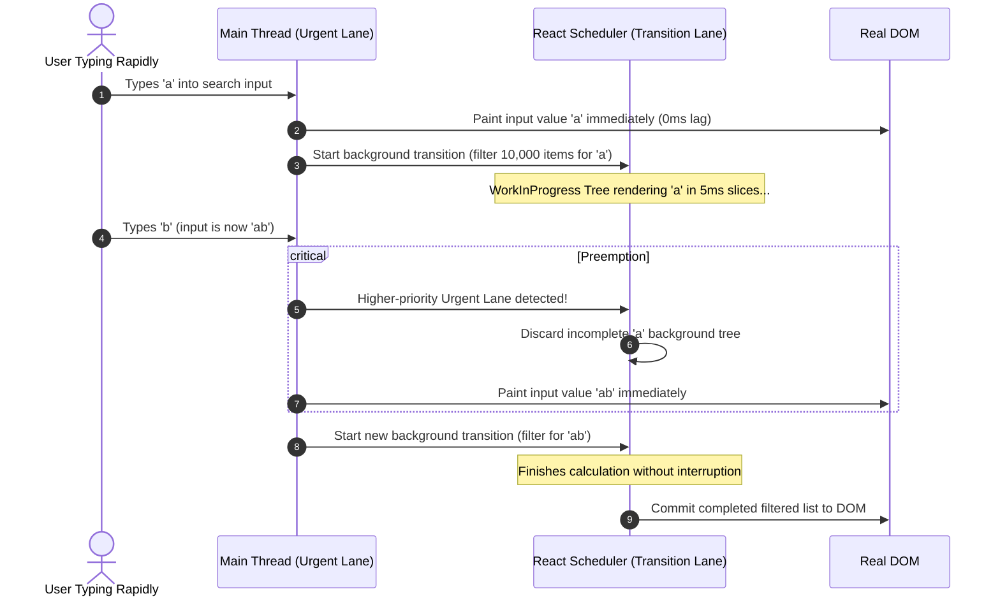
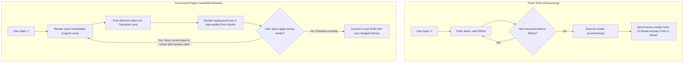
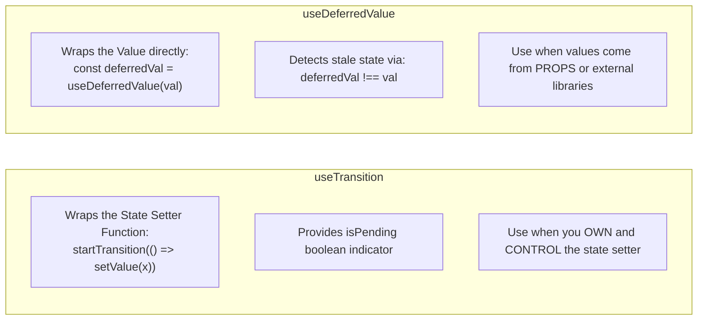

> [!note] The Core Purpose of Transitions
> 
> `useTransition` and `useDeferredValue` are Concurrent React primitives that let you differentiate between **urgent updates** (e.g., typing in an input, clicking a tab, dragging a slider) and **non-urgent transitions** (e.g., filtering a list of 10,000 items, switching a heavy analytical view). They tell React: _"Keep the UI responsive to user input; render this heavy background work in an interruptible, low-priority lane."_
> 
>   

> [!abstract] useDeferredValue vs. Debouncing
> 
> **Debouncing** is an artificial, fixed timer (e.g., wait 300ms after the last keystroke before triggering work). If the user types on a fast machine, it introduces unnecessary lag; if the machine is slow, 300ms may still freeze the frame rate.
> 
> **`useDeferredValue`** has **no fixed timeout**. It updates immediately on fast devices, and on slower devices, it leverages React’s cooperative time-slicing to yield to the main thread during render, rendering in the background and aborting outdated work as soon as new input arrives.
> 
>   

## Urgent vs Non-Urgent Priority Scheduling




## useDeferredValue vs Debounce Mental Model




## Comparison: `useTransition` vs `useDeferredValue`




## Key Concepts

### 1. Why Do We Need Concurrent Transitions?

- Before React 18, all state updates were treated with equal, synchronous priority.
    
      
    
- If rendering a list or graph took 150ms of CPU time, typing into an `<input>` on the same screen would drop frames, causing input lag, frozen cursors, and poor user experience.
    
      
    
- `useTransition` and `useDeferredValue` tap into the **Lanes priority model** (assigning `TransitionLane`), telling the Fiber reconciler to render using time-sliced cooperative multitasking.
    
      
    

### 2. What is `useTransition`?

- Hook that returns: `[isPending, startTransition]`
    
      
    - `startTransition(scope)`: A function that wraps any state update you want to mark as low priority.
        
          
        
    - `isPending`: A boolean flag that stays `true` while the background render is in progress, allowing you to show inline spinners or dim the stale UI.
        
          
        
- **Rule**: Use `startTransition` when you have direct access to the `setState` function.
    
      
    

### 3. What is `useDeferredValue`?

- Hook that accepts a value and returns a deferred copy: `const deferredValue = useDeferredValue(value)`.
    
      
    
- On the initial render, `deferredValue` matches the provided value.
    
      
    
- On updates, React immediately renders the component with the old `deferredValue` (keeping the main thread responsive), and then schedules a low-priority background render to catch `deferredValue` up to the new value.
    
      
    
- **Rule**: Use `useDeferredValue` when you receive data via **props**, hooks, or third-party state stores where you cannot wrap the underlying `setState` call.
    
      
    

### 4. Why `useDeferredValue` is Superior to Debouncing / Throttling

1. **No Arbitrary Lag**: Debouncing forces a static delay (e.g., 300ms) even on high-end devices with idle CPUs. `useDeferredValue` starts rendering in the background immediately.
    
      
    
2. **Interruptible Work**: A debounced update, once the timer expires, still runs synchronously and can freeze the browser if the calculation is heavy. `useDeferredValue` is completely interruptible—if a user types during render, React discards the work and starts fresh.
    
      
    
3. **Adaptive Performance**: On powerful hardware, deferred renders finish almost instantly; on slow mobile devices, React yields every 5ms, maintaining smooth UI animations and responsiveness without manual tuning.
    
      
    

## Common Interview Questions

- What problem do `useTransition` and `useDeferredValue` solve in React applications?
    
      
    
- What is the fundamental difference between `useTransition` and `useDeferredValue`?
    
      
    
- Why should you prefer `useDeferredValue` over traditional debouncing for heavy UI rendering?
    
      
    
- Does `startTransition` run asynchronously like a `setTimeout`?
    
      
    
- How do you know when a deferred value is still stale and calculating in the background?
    
      
    
- Can you wrap network requests (`fetch`) directly inside `startTransition`?
    
      
    

## Strong Answers / Talking Points

- **`startTransition` Executes Synchronously, Renders Concurrently**:
    
      
    - _Misconception_: Developers often think `startTransition` delays function execution like `setTimeout`.
        
          
        
    - _Reality_: The callback inside `startTransition` executes **synchronously**. React records all state setters called during that synchronous tick, tags them with `TransitionLane`, and schedules their _render phase_ at low, interruptible priority.
        
          
        
- **Debouncing for Network vs Transitions for CPU**:
    
      
    - _Use Debounce_: For rate-limiting **network calls** (e.g., avoiding hitting an external search API on every single keystroke to save bandwidth and server costs).
        
          
        
    - _Use `useDeferredValue` / `useTransition`_: For offloading **in-browser CPU rendering bottlenecks** (e.g., filtering arrays in memory, rendering SVG charts, redrawing complex DOM nodes).
        
          
        
- **Indicating Stale State with `useDeferredValue`**:
    
      
    - While `useTransition` provides `isPending`, with `useDeferredValue` you compare references:
        
          
        
        JavaScript
        
        ```
        const isStale = value !== deferredValue;
        ```
        
    - This allows you to apply CSS opacity transitions (e.g., dimming the list to 0.6 opacity) while the new list renders in the background.
        
          
        

## Code Snippets / Examples


```JavaScript
import { useState, useTransition, useDeferredValue, useMemo } from 'react';

// 1. useTransition: Used when you control the state setter
export function TabContainer() {
  const [tab, setTab] = useState('home');
  const [isPending, startTransition] = useTransition();

  const handleSelectTab = (nextTab) => {
    // Wrap low-priority view switch inside startTransition
    startTransition(() => {
      setTab(nextTab);
    });
  };

  return (
    <div>
      <button onClick={() => handleSelectTab('home')}>Home</button>
      <button onClick={() => handleSelectTab('analytics')}>
        Analytics (Heavy)
      </button>

      {/* isPending allows showing an inline transition indicator */}
      {isPending && <span> Switching view...</span>}

      <div style={{ opacity: isPending ? 0.7 : 1 }}>
        {tab === 'home' ? <HomeView /> : <HeavyAnalyticsView />}
      </div>
    </div>
  );
}

// 2. useDeferredValue: Used when data is received via props
export function ProductList({ searchTerm }) {
  // Defers the searchTerm prop; updates at low priority
  const deferredSearchTerm = useDeferredValue(searchTerm);

  // Check if background calculation is still catching up
  const isStale = searchTerm !== deferredSearchTerm;

  const items = useMemo(() => {
    // Heavy CPU computation: filtering 20,000 records
    return Array.from({ length: 20000 }, (_, i) => `Product ${i}`)
      .filter(item => item.toLowerCase().includes(deferredSearchTerm.toLowerCase()));
  }, [deferredSearchTerm]);

  return (
    <div style={{ opacity: isStale ? 0.5 : 1, transition: 'opacity 0.2s' }}>
      {isStale && <p>Updating catalog...</p>}
      <ul>
        {items.slice(0, 100).map(item => (
          <li key={item}>{item}</li>
        ))}
      </ul>
    </div>
  );
}
```

## Related Topics

- [[React Fiber Architecture and Non-Blocking Rendering]]
    
      
    
- [[React Concurrent Multitasking, Scheduling, and Priority Interruptions]]
    
      
    
- [[React useState Hook and State Batching Architecture]]
    
      
    
- [[React useMemo, useCallback, and Fiber Memoization Architecture]]
    
      
    

## Tags

#fullstack #interview #react-concurrency #usetransition #usedeferredvalue #debouncing #mermaid

  

## Revision Checklist

- [ ] Can explain in 60 seconds
    
      
    
- [ ] Can explain trade-offs
    
      
    
- [ ] Can give a real project example
    
      
    
- [ ] Can answer common follow-ups