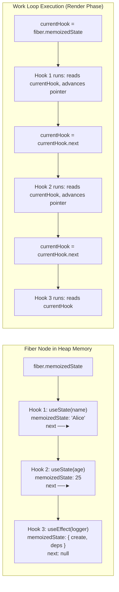
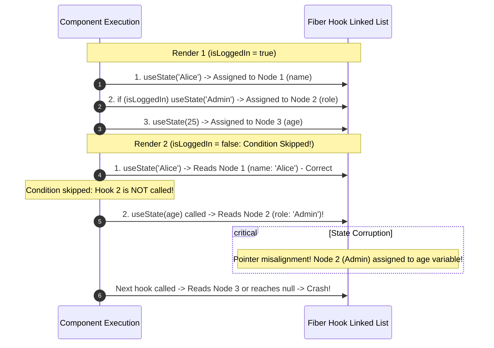

> [!note] The Two Rules of Hooks
> 
>   
> 
> 1. **Only Call Hooks at the Top Level**: Do not call hooks inside loops, conditions, nested functions, or `try`/`catch` blocks.
>     
>       
>     
> 2. **Only Call Hooks from React Functions**: Call them only from React function components or custom hooks, never from regular JavaScript utility functions or class methods.
>     
>       
>     

> [!abstract] Why the Top-Level Rule Exists (The Linked List Model)
> 
> React does **not** identify hooks by names, keys, or labels. Under the hood, a component’s Fiber node stores all hooks in a **sequential, singly-linked list** (`fiber.memoizedState`). React tracks which state belongs to which hook purely through an internal **pointer index** that advances on each call. If a hook is wrapped inside a condition or loop, the invocation count shifts, corrupting the pointer sequence and cross-wiring the component's state variables.
> 
>   

## How React Tracks Hooks Under the Hood




## What Happens When a Hook is Placed Inside a Condition

Code snippet



## Key Concepts

### 1. The Internal Hook Node Structure

Every time a hook is invoked in your component, React creates or inspects a plain JavaScript node on the Fiber:

  

- `memoizedState`: Stores the current hook value (for `useState`, the state value; for `useEffect`, the effect object containing cleanup and tag flags).
    
      
    
- `queue`: Enqueued state updates waiting to be processed.
    
      
    
- `next`: Pointer referencing the next hook in the component.
    
      
    

### 2. The Pointer Advancement Mechanism

- On **Mount**: React creates hook nodes one by one, chaining them via `next` pointers to form `fiber.memoizedState`.
    
      
    
- On **Update**: React resets its internal pointer `workInProgressHook = fiber.memoizedState`.
    
      
    
- Each subsequent hook invocation reads the value from `workInProgressHook` and immediately sets `workInProgressHook = workInProgressHook.next`.
    
      
    
- Because this relies entirely on call order, **the exact sequence and count of hooks must remain identical on every single render**.
    
      
    

### 3. Why Not Use Keys or Identifiers?

- A common interview question is: _"Why didn't React just accept a key like `useState('userName', 'Alice')`?"_
    
      
    
- Reasons the React team rejected named keys:
    
      
    - **Namespace collisions**: Passing keys down through nested custom hooks creates name collision bugs across libraries.
        
          
        
    - **Refactoring friction**: Changing variable names would require manually updating string keys.
        
          
        
    - **Bundle size & overhead**: Passing string identifiers adds bundle payload and requires hash map lookups on every single render pass instead of $O(1)$ pointer steps.
        
          
        

### 4. Enforcement via ESLint (`eslint-plugin-react-hooks`)

- Because JavaScript runtimes cannot natively prevent conditional hook placement, React provides an official ESLint rule: `react-hooks/rules-of-hooks`.
    
      
    
- It performs static AST analysis on code to guarantee all hooks are called strictly at the top level of a component before any early returns.
    
      
    

## Common Interview Questions

- What are the two official Rules of Hooks?
    
      
    
- How does React manage hook state internally without requiring a key or ID?
    
      
    
- What data structure does React use inside the Fiber to store hook values?
    
      
    
- Exactly what breaks if you call a hook inside an `if` block or a `for` loop?
    
      
    
- Why can’t you call hooks after an early `if (!data) return null;` statement?
    
      
    
- How would you conditionally apply hook logic without violating the Rules of Hooks?
    
      
    

## Strong Answers / Talking Points

- **Early Return Gotcha**:
    
      
    - Placing a hook after an early return violates the top-level rule:
        
          
        
        
        ```JavaScript
        function UserProfile({ data }) {
          if (!data) return null; // Early return
          const [tab, setTab] = useState(0); // DANGEROUS: Hook count varies!
        }
        ```
        
    - If `data` is null on render 1 and present on render 2, the number of hooks called changes from 0 to 1, corrupting the Fiber pointer. All hooks must precede all conditional returns.
        
          
        
- **Conditional Logic Belongs INSIDE the Hook, Not Around It**:
    
      
    - You cannot conditionally call a hook, but you **can** execute conditional logic within the hook itself:
        
          
        
        
        ```JavaScript
        // BAD: Conditional hook
        if (isPremium) useEffect(() => { ... }, []);
        
        // GOOD: Condition inside the hook
        useEffect(() => {
          if (!isPremium) return;
          // Perform synchronization
        }, [isPremium]);
        ```
        
- **Custom Hooks as Abstraction Boundaries**:
    
      
    - Custom hooks are standard functions that execute within the calling component’s current Fiber context. Their internal hooks are seamlessly inserted into the caller's linked list in the exact order they execute.
        
          
        

## Code Snippets / Examples


```JavaScript
import { useState, useEffect } from 'react';

// 1. VIOLATION: Conditional Hook Placement
export function BrokenComponent({ isSpecialUser }) {
  const [name, setName] = useState('Alice');

  // CRITICAL BUG: Hook count varies between renders!
  if (isSpecialUser) {
    const [rewardPoints, setRewardPoints] = useState(100);
  }

  const [age, setAge] = useState(25);

  return <div>{name} - {age}</div>;
}

// 2. SAFE PATTERN: Always call at top level, evaluate condition internally
export function SafeComponent({ isSpecialUser }) {
  // Hook 1: Always calls
  const [name, setName] = useState('Alice');

  // Hook 2: Always calls, default state handles condition
  const [rewardPoints, setRewardPoints] = useState(isSpecialUser ? 100 : 0);

  // Hook 3: Always calls, condition evaluated inside effect
  useEffect(() => {
    if (!isSpecialUser) return; // Guard inside the hook
    console.log('Syncing special user telemetry');
  }, [isSpecialUser]);

  // Hook 4: Always calls
  const [age, setAge] = useState(25);

  // Early returns are ONLY safe AFTER all hooks have executed
  if (!name) {
    return <div>No User</div>;
  }

  return <div>{name} - {age}</div>;
}

// 3. Conceptual Fiber Linked List Traversal
function mountWorkInProgressHook() {
  const hook = {
    memoizedState: null,
    queue: null,
    next: null
  };

  if (workInProgressHook === null) {
    // First hook in list becomes the head of fiber.memoizedState
    currentlyRenderingFiber.memoizedState = workInProgressHook = hook;
  } else {
    // Append to end of linked list
    workInProgressHook = workInProgressHook.next = hook;
  }
  return workInProgressHook;
}
```

## Related Topics

- [[React Fiber Architecture]]
    
      
    
- [[React useEffect and Synchronization Architecture]]
    
      
    
- [[React Component Lifecycle]]
    
      
    
- [[Stale Closures in React Hooks]]
    
      
    

## Tags

#fullstack #interview #react-hooks #rules-of-hooks #fiber #linked-list #mermaid

  

## Revision Checklist

- [ ] Can explain in 60 seconds
    
      
    
- [ ] Can explain trade-offs
    
      
    
- [ ] Can give a real project example
    
      
    
- [ ] Can answer common follow-ups