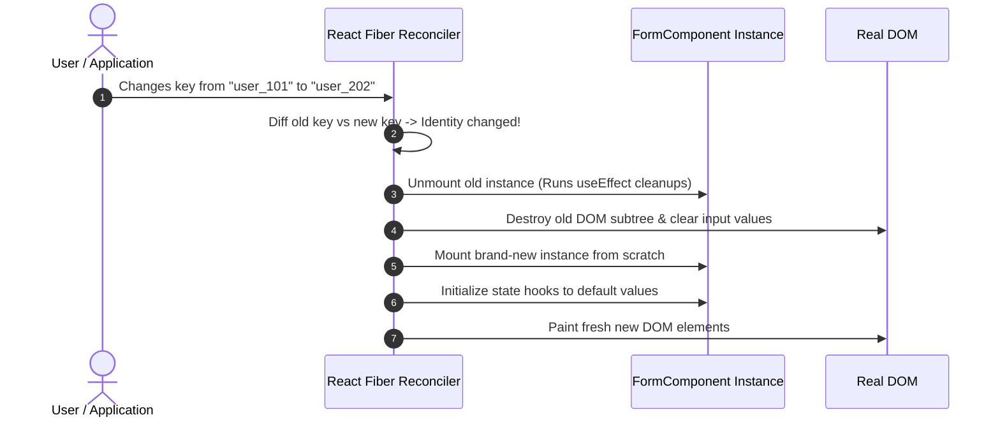

# Importance of Keys in React

> [!note] Core Definition
>
> A `key` is a special string attribute that gives elements inside an array a stable, persistent identity across renders. It acts as an identity badge that allows React’s reconciliation algorithm to distinguish between which items were inserted, reordered, kept, or deleted.


> [!abstract] Identity vs Position
>
> Without keys, React identifies list elements strictly by their **array index position**. With unique keys, React identifies elements by their **data identity**, allowing it to move existing DOM nodes and preserve component state regardless of positional shifts.


## How React Reconciles Lists: With vs Without Keys

```mermaid
flowchart TD
    subgraph WITHOUT_KEYS ["Without Keys (or key={index}) - Prepending Item"]
        A1["Old: [0: ItemA, 1: ItemB]"] --> A2["New: [0: ItemX, 1: ItemA, 2: ItemB]"]
        A2 --> A3["Diff Index 0: ItemA becomes ItemX (Mutate DOM node 0)"]
        A3 --> A4["Diff Index 1: ItemB becomes ItemA (Mutate DOM node 1)"]
        A4 --> A5["Diff Index 2: No match (Create & Append DOM node 2)"]
        A5 --> A6["Result: 3 DOM mutations & internal state transferred to wrong items!"]
    end

    subgraph WITH_KEYS ["With Stable Keys - Prepending Item"]
        B1["Old: [k_A: ItemA, k_B: ItemB]"] --> B2["New: [k_X: ItemX, k_A: ItemA, k_B: ItemB]"]
        B2 --> B3["Match k_A to k_A: Move existing DOM node"]
        B3 --> B4["Match k_B to k_B: Move existing DOM node"]
        B4 --> B5["Match k_X: Brand new key -> Insert 1 new DOM node at index 0"]
        B5 --> B6["Result: 1 DOM insertion, 0 mutations, internal state preserved!"]
    end
```



## What Happens When You Change a Key (Resetting Component State)

Code snippet



## Key Concepts

### 1. How to Map a List of Elements

- React maps arrays of data into arrays of React elements using the standard JavaScript `.map()` method.

- The `key` prop must be placed on the **outermost element** returned directly inside the `.map()` callback (including `<React.Fragment key="{id}">` if multiple siblings are returned).

### 2. What Happens If You Don't Provide a Key?

- **Console Warning**: React logs a prominent warning: `Each child in a list should have a unique "key" prop`.

- **Fallback to Index**: React internally falls back to using the array index (`key={index}`) by default.

- **Performance Hit**: Any insertion at the start or middle forces React to mutate the text/attributes of every single subsequent element rather than just inserting one node.

### 3. What Happens If You Use `key={index}`?

Using the index as a key is acceptable **only** if the list is static (read-only, never filtered, sorted, prepended, or deleted). If the list is dynamic, index-as-key causes subtle, dangerous UI bugs:

- **State Contamination**: If each list item holds internal state (e.g., an uncontrolled `<input />`, a checkbox checkmark, or a collapsed toggle), deleting the first item causes its state to "stick" to the new first item. React sees `key=0` existed before and reuses the old DOM node and component Fiber, leaving the user's checked checkbox on the wrong item.

- **Animation Glitches**: Reordering or sorting items causes elements to mutate in place rather than smoothly moving across the screen.

### 4. Why Don't Non-List Elements Need Keys?

- When you write static sibling elements like:

```javascript
<div>
  <Header />
  <Sidebar />
  <MainContent />
</div>
```

    React determines their identity by their **static call-site position and element type** in the Virtual DOM tree. React knows `Header` is child #1, `Sidebar` is child #2, and `MainContent` is child #3. Their order never shifts dynamically at runtime.

- Keys are strictly needed when the **number, order, or identities of sibling elements are dynamic**, which happens almost exclusively in arrays and lists.

### 5. Intentional Key Changes: Using Keys Outside of Lists

A key is not restricted to `.map()`. Changing a `key` on any component forces React to **destroy the old instance and mount a fresh one**:

- **Resetting Form State**: Changing `<Form key="{userId}"/>` resets all internal form state and uncontrolled inputs when switching users, without needing manual `useEffect` cleanup or state reset calls.

- **Re-triggering CSS Animations**: Changing `<Notification key="{notificationId}"/>` unmounts and remounts the node, forcing CSS keyframe entry animations to replay immediately.

- **Forcing Network Fetch or Timer Resets**: Forces all internal hooks and lifecycle methods to run their initial mounting routines cleanly.

## Common Interview Questions

- Why are keys necessary when rendering dynamic lists in React?

- What happens under the hood if you omit the `key` prop entirely?

- Why is passing array indices as keys considered an anti-pattern for dynamic lists? Under what specific circumstances is it safe?

- Why do static JSX siblings (like `<header />` and `<main />`) not require key attributes?

- How can you leverage changing a `key` on a single component as an architectural pattern to reset state?

- What are the requirements for a valid `key` value (uniqueness scope, stability)?

## Strong Answers / Talking Points

- **Keys Must Be Unique Among Siblings, Not Globally**:

    - Keys do not need to be globally unique across the whole application. They only need to be unique among immediate sibling elements in that specific array.

- **Keys Must Be Stable (Never use `Math.random()` or `Date.now()`)**:

    - Generating random keys on every render (`key={Math.random()}`) is worse than omitting keys entirely. It forces React to destroy and reconstruct the entire list DOM on _every single render_, causing extreme lag, loss of focus, and unmounting all children.

- **State Preservation vs Reset via Keys**:

    - _Preserving State_: To keep a component's state alive when its position shifts, give it the same stable key.

    - _Resetting State_: To completely reset a component's internal state when an ID changes, change its key. React treats different keys as different identities and garbage collects the previous Fiber.

## Code Snippets / Examples

```javascript
import { useState } from 'react';

// 1. Correct List Mapping Pattern with Stable IDs
export function TodoList({ todos }) {
  return (
    <ul>
      {todos.map((todo) => (
        // Key belongs on the outermost tag in the map callback
        <li key={todo.id}>
          <span>{todo.title}</span>
          <input type="checkbox" defaultChecked={todo.completed} />
        </li>
      ))}
    </ul>
  );
}

// 2. The Danger of Index as Key (Bug Demonstration)
export function BadKeyExample() {
  const [items, setItems] = useState(['Alice', 'Bob']);

  const prependItem = () => {
    // Adding 'Charlie' to the start
    setItems(['Charlie', ...items]);
  };

  return (
    <div>
      <button onClick={prependItem}>Prepend Charlie</button>
      <ul>
        {items.map((name, index) => (
          // BUG: If you type text into the input, prepending a new user
          // shifts the text to the wrong name because key stays index-based!
          <li key={index}>
            {name}: <input placeholder="Enter note..." />
          </li>
        ))}
      </ul>
    </div>
  );
}

// 3. Strategic Key Changing to Force Complete State Reset
export function UserProfileContainer({ selectedUserId }) {
  // When selectedUserId changes, React unmounts the old UserForm,
  // wipes all internal form state, and mounts a fresh one cleanly.
  return <UserForm key={selectedUserId} userId={selectedUserId} />;
}

function UserForm({ userId }) {
  const [draftComment, setDraftComment] = useState('');
  return (
    <div>
      <h3>Editing Profile: {userId}</h3>
      <input
        value={draftComment}
        onChange={(e) => setDraftComment(e.target.value)}
        placeholder="Unsaved draft..."
      />
    </div>
  );
}
```

## Related Topics

- [[React Reconciliation and Diffing Algorithm]]

- [[React Reconciliation and Diffing Algorithm|Virtual DOM and Reconciliation]]

- [[React Lifecycle and Execution Flow|React Component Lifecycle]]

- [[React State and Props Architecture|React State and Props]]

## Tags

#fullstack #interview #react-keys #reconciliation #lists #mermaid

## Revision Checklist

- [ ] Can explain in 60 seconds

- [ ] Can explain trade-offs

- [ ] Can give a real project example

- [ ] Can answer common follow-ups
