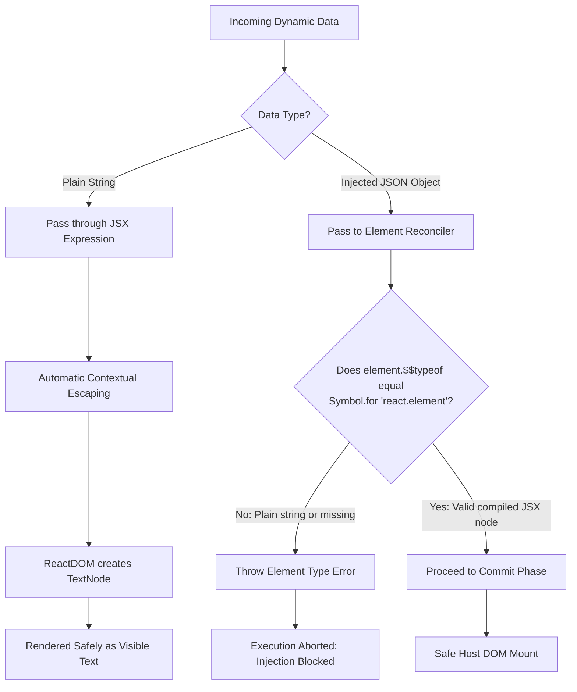
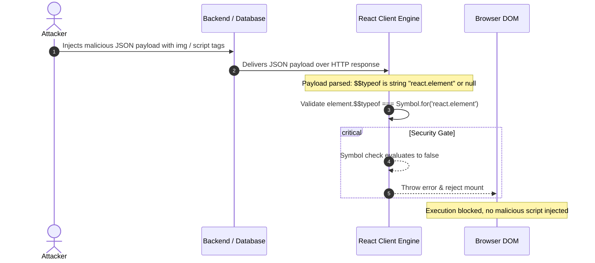

# JSX and Cross-Site Scripting (XSS) Prevention

> [!note] Core Defense Mechanisms
> 
> React defends against Cross-Site Scripting (XSS) through two primary layers:
> 
>   
> 
> 1. **Automatic String Escaping**: String content inside `{expression}` is sanitized and inserted as text nodes, not executable HTML.
>     
>       
>     
> 2. **Object Tagging via `$$typeof`**: Every valid React element is tagged with `Symbol.for('react.element')`, preventing server-injected JSON payloads from impersonating Virtual DOM nodes.
>     
>       
>     

> [!abstract] Why `Symbol` Prevents JSON Injection
> 
> Standard JSON specifications (`JSON.parse` and `JSON.stringify`) support only strings, numbers, booleans, objects, arrays, and null. JavaScript `Symbol` values cannot be serialized or deserialized through JSON. Consequently, an attacker attempting to pass raw component-like JSON via an API response cannot forge a valid `Symbol` reference.
> 
>   

## Visual Architecture of React XSS Defense




## How `$$typeof` Blocks Attack Payloads




## Key Concepts

- **Automatic String Sanitization**: React sets dynamic text using browser DOM primitives like `textContent` and `document.createTextNode` instead of `innerHTML`. Characters like `<`, `>`, `"`, and `&` render literally as characters rather than HTML markup.
    
      
    
- **Symbol Integrity**: `Symbol.for()` registers a runtime memory token inside the JavaScript engine. Because network-serialized JSON lacks a representation for `Symbol`, client-side element verification reliably rejects forged object trees.
    
      
    
- **Security Exceptions (Developer Bypass)**:
    
      
    - `dangerouslySetInnerHTML`: Explicitly bypasses sanitization by writing raw HTML straight to `innerHTML`.
        
          
        
    - Protocol-based injection: Attributes like `<a href={url}>` can still execute scripts if dynamic input starts with `javascript:`.
        
          
        

## Common Interview Questions

- How does React prevent Cross-Site Scripting (XSS) attacks by default?
    
      
    
- What is the exact purpose of the `$$typeof` property on a React Element?
    
      
    
- Why was a JavaScript `Symbol` chosen for `$$typeof` instead of an integer or a random string?
    
      
    
- How could an attacker exploit an application if `$$typeof` validation were absent?
    
      
    
- In what scenarios can an application using React still be vulnerable to XSS?
    
      
    
- What is the difference between string escaping and element validation in React?
    
      
    

## Strong Answers / Talking Points

- **Two Distinct Protection Layers**:
    
      
    - _Layer 1 (String Injection)_: Prevents user input containing markup (such as `<script>alert(1)</script>`) from being evaluated as code. React handles this by rendering strings through native text node APIs.
        
          
        
    - _Layer 2 (Virtual DOM Object Injection)_: Prevents API response poisoning where an attacker injects structured JSON objects mimicking a React element tree. React verifies that `element.$$typeof === Symbol.for('react.element')`.
        
          
        
- **Attribute-Based Vulnerabilities**:
    
      
    - React does not inspect protocols on dynamic URLs passed to `href` or `src`.
        
          
        
    - An input value like `javascript:stealSession()` inside an anchor tag will execute on click unless sanitized with an allowlist check (`https://`, `mailto:`).
        
          
        
- **Server-Side Rendering (SSR) Considerations**:
    
      
    - Injecting unsanitized state into an inline HTML script tag (for example, `window.__INITIAL_STATE__ = ${JSON.stringify(data)}`) permits attackers to escape the script tag with `</script><script>`.
        
          
        
    - Mitigate by serializing with tools like `serialize-javascript` instead of raw `JSON.stringify`.
        
          
        

## Code Snippets / Examples


```JavaScript
// 1. Safe by default: dynamic strings are rendered as plain text nodes
export function CommentBox({ userComment }) {
  // Input like "<script>evil()</script>" renders harmlessly as literal text
  return <div>{userComment}</div>;
}

// 2. High Risk: Explicitly bypassing React's built-in protections
export function RawPost({ htmlContent }) {
  // Vulnerable to XSS unless htmlContent is sanitized first via DOMPurify
  return <div dangerouslySetInnerHTML={{ __html: htmlContent }} />;
}

// 3. Protocol Validation: Preventing javascript: URI exploits
export function ExternalLink({ url, children }) {
  const isAllowed = /^https?:\/\//i.test(url);
  const targetUrl = isAllowed ? url : "#";

  return (
    <a href={targetUrl} rel="noopener noreferrer">
      {children}
    </a>
  );
}
```

## Related Topics

- [[JSX and ReactDOM Execution Pipeline|JSX and Babel Compilation]]
    
      
    
- [[JSX and ReactDOM Execution Pipeline|JSX to Real DOM Pipeline]]
    
      
    
- [[React Reconciliation and Diffing Algorithm|Virtual DOM and Reconciliation]]
    
      
    
- [[Web Security & Identity Architecture. SOP, XSS, CSRF & Token Lifecycles|Frontend Security and OWASP Top 10]]
    
      
    

## Tags

#fullstack #interview #react-security #xss-prevention #jsx #mermaid

  

## Revision Checklist

- [ ] Can explain in 60 seconds
    
      
    
- [ ] Can explain trade-offs
    
      
    
- [ ] Can give a real project example
    
      
    
- [ ] Can answer common follow-ups