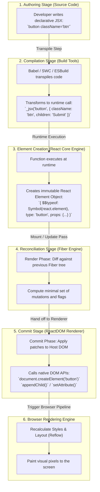

# JSX and ReactDOM Execution Pipeline

> [!note] Core Definition of JSX
> 
> JSX (JavaScript XML) is a declarative syntax extension for JavaScript that allows developers to write HTML-like markup inside JavaScript files. It is not valid ECMAScript on its own; compilers (Babel, SWC, ESBuild) must transpile it into native JavaScript objects before runtimes can execute it.
> 
>   

> [!abstract] ReactDOM vs React Core
> 
> `react` is the abstract engine that models component logic, hooks, and Virtual DOM state trees. `react-dom` is the platform-specific renderer for web browsers that bridges Virtual DOM trees to native browser DOM nodes (`HTMLElement`) and reconciles mutations.
> 
>   

## Key Concepts

- **Syntactic Sugar**: JSX is not HTML or a string template. Every `<tag ...>` element compiles down to a JavaScript function call that returns a plain JavaScript object called a **React Element**.
    
      
    
- **The React Element Object**: A plain object containing metadata: `{ type, props, key, ref, $$typeof }`. The `$$typeof: Symbol.for('react.element')` property prevents Cross-Site Scripting (XSS) injection attacks via raw JSON payloads.
    
      
    
- **Classic vs Modern JSX Transform (React 17+)**:
    
      
    - _Classic_: Compiles `<div />` into `React.createElement('div', null)`. Required `import React from 'react'` in every file.
        
          
        
    - _Modern_: Compiles `<div />` into `_jsx('div', {})` imported automatically from `react/jsx-runtime`. No manual `React` import needed.
        
          
        
- **Role of ReactDOM**:
    
      
    - Exposes browser entry points: `createRoot(container).render(<App/>)` (React 18+ concurrent root).
        
          
        
    - Handles the commit phase: translates the abstract Fiber/VDOM trees into native DOM mutations (`document.createElement`, `node.appendChild`, `node.setAttribute`).
        
          
        
    - Manages the synthetic event system (`onClick`, `onChange`) by delegating events at the root container.
        
          
        

## How JSX Transforms: Behind the Scenes

### 1. Classic Runtime (React <=16)

Every JSX element compiled to `React.createElement`:


```javascript
// Input JSX:
const element = <h1 className="title">Hello World</h1>;

// Transpiled Output:
const element = React.createElement('h1', { className: 'title' }, 'Hello World');
```

_Limitation_: Because the code calls `React.createElement`, `React` had to be in scope (`import React from 'react'`). It also passed props and children dynamically, making compiler optimization harder.

  

### 2. Modern New JSX Transform (React 17+)

Compilers work directly with React's new runtime entry points (`react/jsx-runtime` and `react/jsx-dev-runtime`):

  

JavaScript

```javascript
// Input JSX:
const element = <h1 className="title">Hello World</h1>;

// Transpiled Output (compiled automatically):
import { jsx as _jsx } from 'react/jsx-runtime';

const element = _jsx('h1', { className: 'title', children: 'Hello World' });
```

_Why this changed_:

  

- Eliminates manual boilerplate imports.
    
      
    
- Decreases bundled bundle size slightly.
    
      
    
- Separates `key` and `props` at compile time for faster element creation.
    
      
    

## The End-to-End Pipeline: From JSX to Screen Pixels




## Common Interview Questions

- What is JSX, and can browsers execute JSX files directly?
    
      
    
- Why did we need `import React from 'react'` in older React versions, and why is it no longer required in React 17+?
    
      
    
- What does `React.createElement` return under the hood?
    
      
    
- What is the purpose of the `$$typeof` field inside a React element object?
    
      
    
- What is the architectural difference between the `react` package and `react-dom`?
    
      
    
- How does ReactDOM transform a nested tree of React Elements into actual DOM nodes?
    
      
    

## Strong Answers / Talking Points

- **What is a React Element?**:
    
      
    - It is an immutable, lightweight JavaScript object representation of a DOM node or a component.
        
          
        
    - It is cheap to create and destroy because it does not have the expensive overhead or browser bindings of a true native `HTMLElement`.
        
          
        
- **Why React 17+ dropped `import React`**:
    
      
    - The JSX Babel/SWC transform plugin now injects imports from `react/jsx-runtime` behind the scenes.
        
          
        
    - In addition to developer convenience, `_jsx` creates elements more efficiently than `React.createElement` because `key` is passed as a dedicated separate argument rather than extracted from `props` at runtime.
        
          
        
- **The `$$typeof` Security Guardrail**:
    
      
    - If a backend vulnerability allows an attacker to inject arbitrary JSON objects that mimic a React component tree, the browser could theoretically be tricked into rendering malicious nodes.
        
          
        
    - React marks valid elements with `$$typeof: Symbol.for('react.element')`. Because standard JSON cannot serialize JavaScript `Symbol` primitives, attacker-injected JSON will fail the type check and React will refuse to mount it, mitigating client-side XSS.
        
          
        
- **Why Separate React and ReactDOM?**:
    
      
    - Decouples core reconciling algorithms from the platform target.
        
          
        
    - The same `react` logic can be rendered via `react-dom` (web), `react-native` (iOS/Android native views), `react-three-fiber` (3D WebGL scenes), or `react-pdf` (PDF documents).
        
          
        

## Code Snippets / Examples


```javascript
// 1. Authoring JSX
export function Card({ title, children }) {
  return (
    <div className="card-box">
      <h2>{title}</h2>
      {children}
    </div>
  );
}
```


```javascript
// 2. What Babel/SWC outputs under React 17+ JSX Transform:
import { jsx as _jsx, jsxs as _jsxs } from "react/jsx-runtime";

export function Card({ title, children }) {
  return _jsxs("div", {
    className: "card-box",
    children: [
      _jsx("h2", { children: title }),
      children
    ]
  });
}
```


```javascript
// 3. How ReactDOM (conceptually) maps an element to the browser DOM:
function mountElementToDom(reactElement, container) {
  // If text node, create text
  if (typeof reactElement === 'string' || typeof reactElement === 'number') {
    const textNode = document.createTextNode(reactElement);
    container.appendChild(textNode);
    return;
  }

  // 1. Create real host DOM element
  const domNode = document.createElement(reactElement.type);

  // 2. Attach props and attributes
  Object.keys(reactElement.props).forEach(propName => {
    if (propName === 'children') return;
    if (propName.startsWith('on')) {
      // Event delegation handled by ReactDOM
      const eventName = propName.toLowerCase().substring(2);
      domNode.addEventListener(eventName, reactElement.props[propName]);
    } else if (propName === 'className') {
      domNode.className = reactElement.props[propName];
    } else {
      domNode.setAttribute(propName, reactElement.props[propName]);
    }
  });

  // 3. Recursively mount children
  const children = reactElement.props.children;
  if (Array.isArray(children)) {
    children.forEach(child => mountElementToDom(child, domNode));
  } else if (children) {
    mountElementToDom(children, domNode);
  }

  // 4. Append to host DOM
  container.appendChild(domNode);
}
```

## Related Topics

- [[React Fundamentals and Core Concepts]]
    
      
    
- [[React Reconciliation and Diffing Algorithm|Virtual DOM and Reconciliation]]
    
      
    
- [[React Fiber Architecture and Non-Blocking Rendering|React Fiber Architecture]]
    
      
    
- [[React Lifecycle and Execution Flow|React Render and Commit Phases]]
    
      
    

## Tags

#fullstack #interview #react-jsx #reactdom

  

## Revision Checklist

- [ ] Can explain in 60 seconds
    
      
    
- [ ] Can explain trade-offs
    
      
    
- [ ] Can give a real project example
    
      
    
- [ ] Can answer common follow-ups