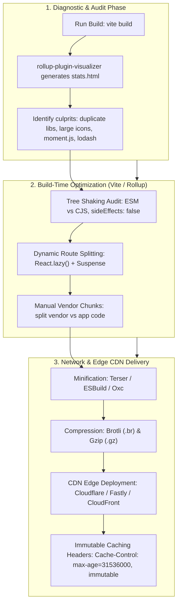
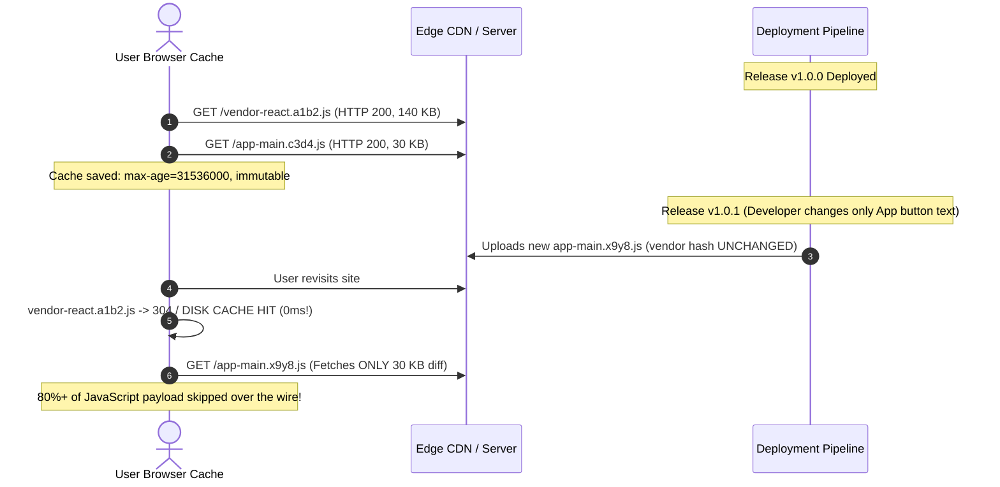
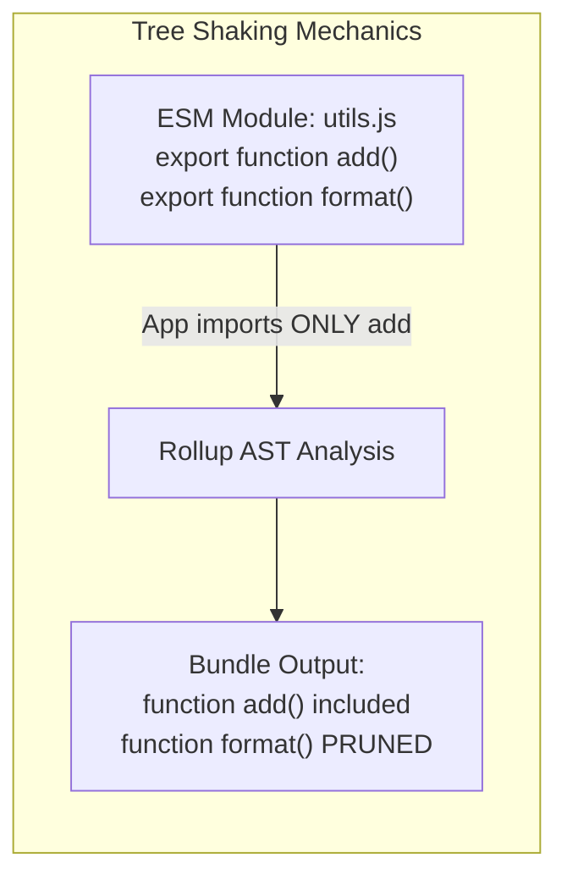
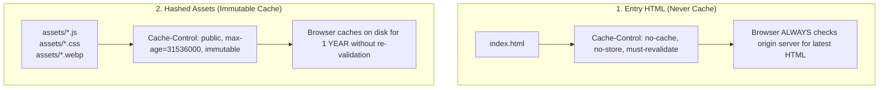

> [!note] The Core Objective
> 
> Bundle size optimization is the discipline of minimizing the JavaScript payload delivered over the wire to accelerate **First Contentful Paint (FCP)**, **Largest Contentful Paint (LCP)**, and reduce **Total Blocking Time (TBT)**. Modern toolchains (Vite built on Rollup/Rolldown) rely on static AST inspection, ES module semantics for tree shaking, dynamic code splitting, manual chunk separation, and content-hashed immutable CDN caching.
> 
>   

> [!abstract] Architectural Strategy
> 
>   
> 
> 1. **Measure & Visualize**: Generate interactive treemaps via `rollup-plugin-visualizer` to pinpoint heavy dependencies and accidental duplication.
>     
>       
>     
> 2. **Eliminate Dead Code (Tree Shaking)**: Ensure pure ESM consumption and verify `sideEffects: false` configurations.
>     
>       
>     
> 3. **Chunk Splitting**: Separate core framework libraries (`react`, `react-dom`) into long-lived vendor chunks while dynamic application features load on demand.
>     
>       
>     
> 4. **Edge CDN Caching**: Leverage content hashes (`[name]-[hash].js`) with `Cache-Control: public, max-age=31536000, immutable` headers.
>     
>       
>     

## The Bundle Optimization and Delivery Pipeline

Code snippet



## Manual Chunking vs Long-Term Browser Caching

Code snippet



## 1. How to Analyze Bundle Size and Find Heavy Components

### Using `rollup-plugin-visualizer` in Vite

Vite delegates its production bundling to Rollup. To generate a visual, zoomable treemap of every byte in your final distribution:

  

1. **Install the plugin**:
    
      
    
    ```Bash
    npm install --save-dev rollup-plugin-visualizer
    ```
    
2. **Configure `vite.config.ts`**:
    
      
    
    ```TypeScript
    import { defineConfig } from 'vite';
    import react from '@vitejs/plugin-react';
    import { visualizer } from 'rollup-plugin-visualizer';
    
    export default defineConfig({
      plugins: [
        react(),
        visualizer({
          filename: './dist/stats.html', // Output report path
          open: true,                    // Auto-opens browser after build
          gzipSize: true,                // Display Gzip-compressed footprints
          brotliSize: true,              // Display Brotli footprints
          template: 'treemap',           // 'treemap' | 'sunburst' | 'network'
        }),
      ],
    });
    ```
    
3. **Execute Build**:
    
    
    
    ```Bash
    npm run build
    ```
    
    This generates `dist/stats.html`. Open it to inspect:
    
      
    - **Stat Size**: Raw unminified file size on disk.
        
          
        
    - **Parsed Size**: Size of the minified JavaScript code the browser parser evaluates.
        
          
        
    - **Gzip/Brotli Size**: The actual size transferred over the network.
        
          
        

## 2. Separating Vendor NPM Packages into Independent Chunks

By default, Vite bundles your code and external `node_modules` into general route chunks. When application code changes, the entire chunk's content hash changes, invalidating the browser cache for third-party libraries that didn't change at all.

  

### Advanced Vite Manual Chunker (`output.manualChunks`)

Configure your chunking strategy in `vite.config.ts` under `build.rollupOptions`:


```TypeScript
import { defineConfig } from 'vite';
import react from '@vitejs/plugin-react';

export default defineConfig({
  plugins: [react()],
  build: {
    target: 'esnext',
    minify: 'esbuild', // Fast minification (or 'terser' for max compression)
    cssCodeSplit: true,
    rollupOptions: {
      output: {
        // Enforce deterministic hash-based naming conventions
        entryFileNames: 'assets/[name]-[hash].js',
        chunkFileNames: 'assets/[name]-[hash].js',
        assetFileNames: 'assets/[name]-[hash].[ext]',
        
        // Strategic Vendor Separation
        manualChunks(id) {
          if (id.includes('node_modules')) {
            // 1. Core Framework: Highly static, rarely changes
            if (id.includes('react') || id.includes('react-dom') || id.includes('scheduler')) {
              return 'vendor-react-core';
            }
            // 2. Data Fetching & State: Shared business foundations
            if (id.includes('@tanstack') || id.includes('zustand') || id.includes('axios')) {
              return 'vendor-data-layer';
            }
            // 3. UI Kits / Heavy Component Libs (e.g., Radix, Lucide, Framer Motion)
            if (id.includes('@radix-ui') || id.includes('lucide-react') || id.includes('framer-motion')) {
              return 'vendor-ui-kit';
            }
            // 4. Fallback for all other third-party dependencies
            return 'vendor-libs';
          }
        },
      },
    },
    // Raise warning threshold if needed (default is 500 kB)
    chunkSizeWarningLimit: 600,
  },
});
```

> [!warning] The Circular Dependency Pitfall of Manual Chunks
> 
> Do not over-split `manualChunks` into dozens of micro-chunks (e.g., one per npm package). If Module A and Module B in different chunks import each other, Rollup is forced to create intermediary glue chunks or introduces execution-order evaluation bugs in the browser. Group dependencies by **cohesion and update frequency**.
> 
>   

## 3. Tree Shaking: Mechanics, Blockers, and Fixes

**Tree Shaking** is the dead-code elimination process where Rollup inspects ES6 module syntax (`import` / `export`) statically to prune exports that are never imported anywhere in the project.




### Critical Tree Shaking Blockers & Solutions

1. **CommonJS (`require` / `module.exports`)**:
    
      
    - _Problem_: CommonJS modules are dynamic and can be conditionally mutated at runtime; bundlers cannot safely determine if an export is unused.
        
          
        
    - _Fix_: Prefer pure ESM packages. In `package.json`, ensure your dependencies provide an `"exports"` field with `"import"` pointing to ESM builds.
        
          
        
2. **The Barrel File Problem (`index.ts` exports)**:
    
      
    - _Problem_: Importing from a barrel file:
        
          
        
        ```JavaScript
        import { Check } from 'lucide-react'; // Or from '@mui/icons-material'
        ```
        
        can force the bundler to parse thousands of icon components declared in `index.js`, bloating compilation and sometimes pulling unwanted icons into the bundle.
        
          
        
    - _Fix_: Use targeted path imports or Vite configuration plugins:
        
          
        
        ```JavaScript
        import Check from 'lucide-react/dist/esm/icons/check';
        ```
        
3. **Package Side Effects (`sideEffects: false`)**:
    
      
    - Bundlers will **not** tree-shake a module if it believes executing the module causes external side effects (e.g., modifying global prototypes, injecting global CSS).
        
          
        
    - In your own internal shared libraries or monorepo packages, declare in `package.json`:
        
          
        
        ```JSON
        {
          "name": "my-shared-ui",
          "sideEffects": [
            "**/*.css",
            "**/*.scss"
          ]
        }
        ```
        
        This explicitly informs Rollup: _"Unless a file is CSS, anything not explicitly imported can be safely deleted."_
        
          
        
4. **Replacing Heavy Legacy Libraries**:
    
      
    - Replace **`moment.js`** (includes all locales, ~300 KB uncompressed) with **`date-fns`** (modular ESM) or native **`Intl` APIs**.
        
          
        
    - Replace **`lodash`** with **`lodash-es`** or native modern JavaScript array/object primitives.
        
          
        

## 4. Serving Assets with Cache-Control Headers via CDN

Once Vite builds assets with deterministic content hashes (`assets/vendor-react-core-a1b2c3d4.js`), configure your web server (Nginx, Caddy) or Edge CDN (Cloudflare, AWS CloudFront, Vercel) with distinct caching rules:

  

### The Two-Tier Caching Strategy



### Sample Nginx Configuration


```Nginx
server {
    listen 80;
    server_name example.com;
    root /usr/share/nginx/html;

    # 1. Root HTML: Always validate to discover new chunk hashes immediately
    location = /index.html {
        add_header Cache-Control "no-cache, no-store, must-revalidate";
        add_header Pragma "no-cache";
        add_header Expires "0";
        try_files $uri =404;
    }

    # 2. Hashed static assets generated by Vite: Cache indefinitely
    location /assets/ {
        add_header Cache-Control "public, max-age=31536000, immutable";
        access_log off;
        try_files $uri =404;
    }

    # SPA Fallback
    location / {
        try_files $uri $uri/ /index.html;
    }
}
```

## 5. Modern Compression: Gzip vs Brotli

Minifying reduces code syntax; **HTTP compression** reduces transfer size over the wire. Configure pre-compression during the Vite build step to avoid on-the-fly CPU bottlenecks on your web server:


```Bash
npm install --save-dev vite-plugin-compression2
```


```TypeScript
// vite.config.ts
import { defineConfig } from 'vite';
import { compression } from 'vite-plugin-compression2';

export default defineConfig({
  plugins: [
    // 1. Generate standard .gz assets
    compression({ algorithm: 'gzip', exclude: [/\.(br)$/, /\.(gz)$/] }),
    // 2. Generate high-efficiency .br (Brotli) assets
    compression({ algorithm: 'brotliCompress', exclude: [/\.(br)$/, /\.(gz)$/] }),
  ],
});
```

_Brotli achieves approximately **15–25% higher compression ratios** on text-based JavaScript payloads compared to standard Gzip._

  

## Architectural Decision Checklist

|**Priority**|**Action Item**|**Tool / Config**|**Expected Impact**|
|---|---|---|---|
|**High**|Route-level code splitting|`React.lazy()` + `<Suspense>`|Drops initial bundle size by 40–70%|
|**High**|Treemap inspection|`rollup-plugin-visualizer`|Spots accidental multi-version library duplication|
|**Medium**|Core vendor isolation|`build.rollupOptions.output.manualChunks`|Maximizes browser long-term cache hits|
|**Medium**|CDN Immutable headers|`Cache-Control: max-age=31536000, immutable`|Instant loads on return visits (0ms disk cache)|
|**Medium**|Modern ESM imports|Replace CJS dependencies with ESM equivalents|Enables functional tree shaking|
|**Low**|Pre-compressed Brotli|`vite-plugin-compression2`|~20% smaller network transfer size|

## Common Interview Questions

- How does tree shaking work under the hood in Rollup and Vite?
    
      
    
- What is the difference between `Stat Size`, `Parsed Size`, and `Gzip Size` in bundle analyzers?
    
      
    
- What makes a JavaScript module untree-shakeable?
    
      
    
- Why is caching `index.html` with an `immutable` header dangerous?
    
      
    
- How does `output.manualChunks` improve user experience on repeat visits?
    
      
    
- What are side effects in ES modules, and how does the `"sideEffects": false` flag in `package.json` help the bundler?
    
      
    

## Strong Answers / Talking Points

- **The Core Rule of Caching**:
    
      
    - _"Never cache `index.html`. Always cache content-hashed assets (`[name]-[hash].js`) with `immutable`."_
        
          
        
    - If `index.html` is cached in the user's browser, you cannot ship a hotfix because the browser will not request the updated HTML file containing the new script hash tags until the cache expires.
        
          
        
- **Why Dynamic Imports Create Split Points**:
    
      
    - Rollup treats static `import x from './x'` as hard dependencies compiled into the parent chunk.
        
          
        
    - A dynamic `import('./x')` returns a Promise; Rollup treats this as an **asynchronous boundary**, emitting a distinct chunk file that is only fetched over HTTP when that line of code executes.
        
          
        
- **Parsed Size vs Download Size**:
    
      
    - Download size affects network transfer time, but **Parsed Size** affects device main-thread execution time. A 1 MB library compressed to 200 KB downloads quickly on 5G, but a low-end mobile device still has to decompress, parse, and compile the full 1 MB of JavaScript, blocking the CPU and causing high Interaction to Next Paint (INP) latency.
        
          
        

## Related Topics

- [[Code Splitting vs Lazy Loading in React]]
    
      
    
- [[Comprehensive Performance Optimization Architecture in React]]
    
      
    
- [[Browser Rendering Pipeline and Core Web Vitals]]
    
      
    
- [[Frontend Security and OWASP Top 10]]
    
      
    

## Tags

#fullstack #interview #vite #rollup #bundle-optimization #tree-shaking #cdn-caching #brotli #mermaid

  

## Revision Checklist

- [ ] Can explain in 60 seconds
    
      
    
- [ ] Can explain trade-offs
    
      
    
- [ ] Can give a real project example
    
      
    
- [ ] Can answer common follow-ups