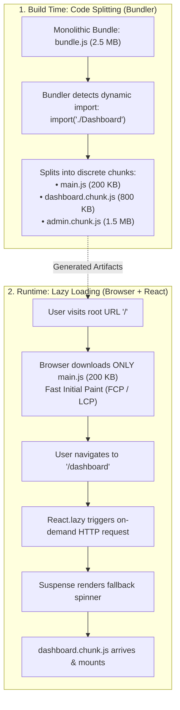
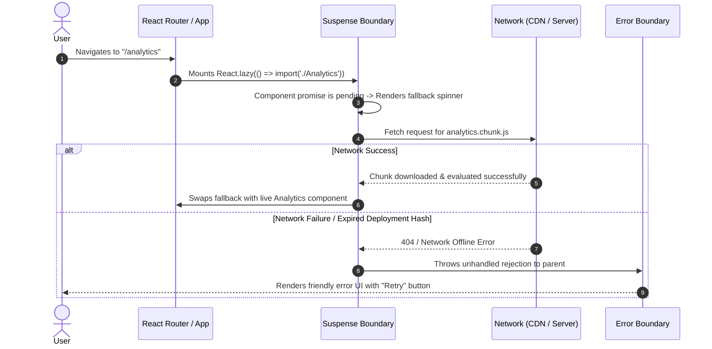

# Code Splitting vs Lazy Loading in React

> [!note] Core Mental Model
> 
> **Code Splitting** is a **build-time preparation** technique where bundlers (Webpack, Vite, Rollup, ESBuild) divide a single monolithic JavaScript bundle into smaller, discrete chunks using dynamic imports (`import()`).
> 
> **Lazy Loading** is a **runtime deferral strategy** that waits to download and execute those chunks, images, or components until they are actually needed on screen (e.g., via user navigation, viewport scrolling, or user clicks).
> 
>   

> [!abstract] Build Time vs Runtime Relationship
> 
>   
> 
> - Code Splitting produces the split files (e.g., `dashboard.chunk.js`, `admin.chunk.js`).
>     
>       
>     
> - Lazy Loading determines _when_ the browser makes the network request to fetch them (paired with `React.lazy()` and `<Suspense>`).
>     
>       
>     
> - You can have code splitting without lazy loading (e.g., split vendor chunks loaded in parallel upfront), and you can have lazy loading without code splitting (e.g., native browser `` or off-screen iframes).
>     
>       
>     

## The Build-Time vs Runtime Pipeline



## Suspense and Error Boundary Architecture



## Key Concepts

### 1. What is Code Splitting?

- The process of breaking a single bundled JavaScript file into multiple smaller bundles (chunks).

- **Why it matters**: In single-page apps (SPAs), shipping the entire application upfront delays **First Contentful Paint (FCP)** and **Time to Interactive (TTI)** because the browser must parse and compile megabytes of code the user hasn't asked for yet.

- Enabled standardly via ECMAScript dynamic imports: `import('./module.js')` which returns a Promise.

### 2. What is Lazy Loading?

- Deferring the loading of non-critical resources until the moment they are needed.

- Applied to:

    - **Routes**: Loading route views only when the path matches.

    - **Heavy Modals / Drawers**: Loading complex rich-text editors, video players, or charts only when a user clicks "Edit" or "Play".

    - **Media / Images**: Deferring image requests until they enter the viewport (`IntersectionObserver` or native `loading="lazy"`).

### 3. Core React Primitives: `React.lazy()` and `<Suspense>`

- **`React.lazy(loadFn)`**: Accepts a function that calls a dynamic `import()`. It returns a React component that resolves to a default export.

- **`<Suspense fallback="{<Spinner"/>}>`**: A boundary that catches pending Promises thrown by lazy-loaded components during the render phase and renders a fallback placeholder until the chunk resolves.

- **The Error Boundary Mandate**: If an asset fails to download (e.g., lost connectivity or redeployment that invalidated previous chunk hashes), `React.lazy` throws an error. Every lazy tree **must** be wrapped in an **Error Boundary** to prevent app-wide crashes.

## Common Strategies for Code Splitting

|**Strategy**|**Where it's applied**|**Primary Benefit**|
|---|---|---|
|**Route-based Splitting**|High-level routes (`/`, `/dashboard`, `/settings`)|Maximum initial bundle reduction; logical split points.|
|**Component-based Splitting**|Heavy UI elements (Data grids, Leaflet maps, Monaco editor)|Prevents heavy sub-dependencies from polluting parent routes.|
|**Vendor Splitting**|Third-party node_modules (`react`, `lodash`, `chart.js`)|Maximizes long-term browser cache hit rates across releases.|

## Common Interview Questions

- What is the difference between Code Splitting and Lazy Loading?

- How does `React.lazy` work under the hood with `<Suspense>`?

- Why should you always pair `React.lazy` and `Suspense` with an Error Boundary?

- What happens if a deployment occurs while a user has an active session and tries to lazy load a route whose chunk hash changed?

- What are the trade-offs and performance pitfalls of over-splitting code into too many small chunks?

- How do you prefetch or preload a lazy-loaded chunk on hover before the user clicks?

## Strong Answers / Talking Points

- **The Core Distinction**:

    - _"Code splitting is the mechanism by which your bundler carves up your application into chunks. Lazy loading is the behavioral runtime strategy of requesting those chunks only when required by user actions or viewport triggers."_

- **The Over-Splitting Penalty**:

    - Splitting a tiny 3 KB utility or component creates a negative performance trade-off: the time spent initiating an additional HTTP round-trip (~100–300ms on mobile connections) exceeds the microsecond cost of parsing the 3 KB of JavaScript. Split components with meaningful dependencies (15 KB+ or libraries like Moment/Chart.js).

- **Handling Stale Chunk Deployment Errors**:

    - When you deploy a new production build, old hashed chunk files (e.g., `dashboard.a8b12.js`) are deleted from the server or CDN. Users on active sessions who navigate to that route will get a chunk-loading 404 error.

    - _Solution_: Intercept chunk loading errors in an Error Boundary or `window.addEventListener('error')`, check if it's a dynamic import failure, and trigger a graceful window reload (`window.location.reload()`) to fetch the fresh index HTML.

- **Prefetching on Hover**:

    - Don't force users to wait on a spinner after clicking a link. Preload the dynamic import on mouse enter or focus:

```javascript
const loadDashboard = () => import('./Dashboard');
// On link hover: trigger download early
<Link onMouseEnter={loadDashboard} to="/dashboard">Dashboard</Link>
```

## Code Snippets / Examples

```javascript
import React, { Suspense, lazy } from 'react';
import { BrowserRouter, Routes, Route } from 'react-router-dom';
import { ErrorBoundary } from './ErrorBoundary';

// 1. Route-Based Code Splitting via React.lazy
const Home = lazy(() => import('./routes/Home'));
const Dashboard = lazy(() => import('./routes/Dashboard'));
const Settings = lazy(() => import('./routes/Settings'));

// 2. Component-Based Code Splitting on Demand (Heavy Modal)
const HeavyChartModal = lazy(() => import('./components/HeavyChartModal'));

export function App() {
  const [showChart, setShowChart] = React.useState(false);

  // Preload on mouse hover for instant interaction
  const preloadChart = () => {
    import('./components/HeavyChartModal');
  };

  return (
    <BrowserRouter>
      {/* Error Boundary catches network failures on chunk fetch */}
      <ErrorBoundary fallback={<div>Failed to load module. Please refresh.</div>}>
        <Suspense fallback={<div className="loading-spinner">Loading...</div>}>
          <Routes>
            <Route path="/" element={<Home />} />
            <Route path="/dashboard" element={<Dashboard />} />
            <Route path="/settings" element={<Settings />} />
          </Routes>
        </Suspense>
      </ErrorBoundary>

      <div className="extra-tools">
        <button
          onMouseEnter={preloadChart}
          onClick={() => setShowChart(true)}
        >
          Open Analytics Chart
        </button>

        {showChart && (
          <Suspense fallback={<div>Loading Chart...</div>}>
            <HeavyChartModal onClose={() => setShowChart(false)} />
          </Suspense>
        )}
      </div>
    </BrowserRouter>
  );
}
```

## Related Topics

- [[React Fiber Architecture and Non-Blocking Rendering]]

- [[The Browser Rendering Pipeline. Reflow, Repaint, and Composite|Browser Rendering Pipeline and Core Web Vitals]]

- [[Bundle Size Optimization and Build Analysis Architecture in React (Vite & Rollup)|Webpack and Vite Bundling Strategies]]

- [[React Concurrent Multitasking, Scheduling, and Priority Interruptions|React Suspense and Streaming SSR]]

## Tags

#fullstack #interview #code-splitting #lazy-loading #react-performance #suspense #mermaid

## Revision Checklist

- [ ] Can explain in 60 seconds

- [ ] Can explain trade-offs

- [ ] Can give a real project example

- [ ] Can answer common follow-ups