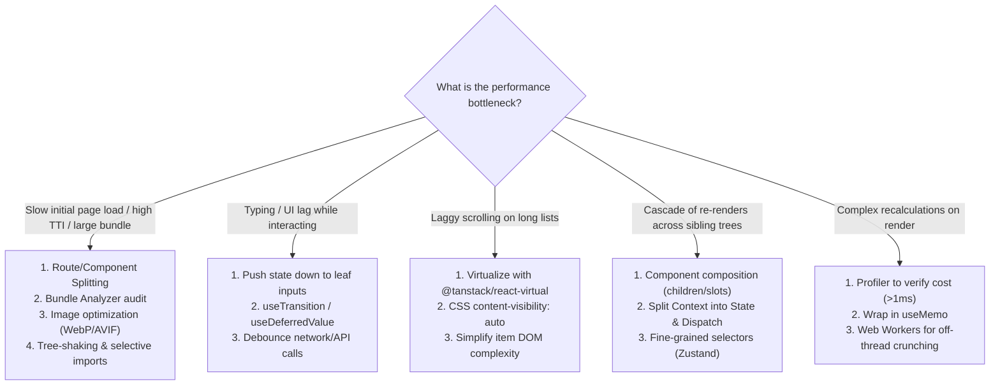

> [!note] The Core Philosophy of React Performance
> 
> **"Measure before you optimize."** Premature optimization adds cognitive overhead, code complexity, and subtle bugs (like stale closures). Optimization should follow a systematic methodology: **Audit $\rightarrow$ Eliminate Unnecessary Work $\rightarrow$ Break Up Long Tasks $\rightarrow$ Minimize Network Payload $\rightarrow$ Optimize DOM Nodes.**
> 
>   

## The Holistic 5-Pillar Optimization Pipeline

Code snippet

```mermaid
flowchart TD
    subgraph P1 ["1. Bundle & Network Footprint"]
        direction TB
        B1["Route-Level Code Splitting (React.lazy / Suspense)"]
        B2["Dynamic Component Imports (Heavy modals, charts, editors)"]
        B3["Tree Shaking & Barrel File Elimination"]
        B4["Asset & Image Compression (WebP, AVIF, SVG SVGO)"]
        B1 --> B2 --> B3 --> B4
    end

    subgraph P2 ["2. Reconciliation & Render Elimination"]
        direction TB
        R1["Component Composition (Moving state down, slots/children)"]
        R2["Pure Component Memoization (React.memo with stable props)"]
        R3["Reference Stabilization (useCallback & useMemo)"]
        R4["Context Partitioning (Split State vs Dispatch)"]
        R1 --> R2 --> R3 --> R4
    end

    subgraph P3 ["3. DOM & Virtualization (Windowing)"]
        direction TB
        D1["List Virtualization (TanStack Virtual / react-window)"]
        D2["Render only items visible in viewport (DOM node limit)"]
        D3["CSS content-visibility: auto for off-screen cards"]
        D1 --> D2 --> D3
    end

    subgraph P4 ["4. Concurrent Scheduling & Responsiveness"]
        direction TB
        S1["useTransition for heavy view transitions (Low Priority Lane)"]
        S2["useDeferredValue for deferred search filtering"]
        S3["Debouncing / Throttling for I/O & Network Rate-Limiting"]
        S1 --> S2 --> S3
    end

    subgraph P5 ["5. State Scoping & Data Architecture"]
        direction TB
        M1["Server State via TanStack Query (Deduplication & Caching)"]
        M2["Selective Client Subscriptions (Zustand / Jotai selectors)"]
        M3["Derived State during Render (Eliminating redundant useState)"]
        M1 --> M2 --> M3
    end

    P1 --> P2 --> P3 --> P4 --> P5
```



## Detailed Step-by-Step Optimization Strategies

### Pillar 1: Bundle Size & Network Optimization (Loading Performance)

1. **Route-Based Code Splitting**:
    
      
    - Wrap top-level route definitions in `React.lazy()` and `<Suspense>`.
        
          
        
    - Ensures the client downloads only the JavaScript needed for the current URL route.
        
          
        
2. **On-Demand Component & Library Splitting**:
    
      
    - Heavy dependencies (Monaco Editor, Chart.js, D3, Leaflet, Excel export parsers) should never sit in the critical initial bundle.
        
          
        
    - Dynamically load them inside click/hover event handlers or conditional `<Suspense>` boundaries.
        
          
        
3. **Audit and Eliminate Barrel File Imports**:
    
      
    - Importing from `import { Button } from '@/components'` or `import { debounce } from 'lodash'` often forces bundlers to include the entire library module.
        
          
        
    - Use direct path imports (e.g., `import debounce from 'lodash/debounce'`) or configure bundlers for path optimization (`optimizePackageImports` in Vite/Next.js).
        
          
        
4. **Preloading & Prefetching Chunks**:
    
      
    - Trigger dynamic chunk downloads on link hover (`onMouseEnter`) so assets load before the user completes the navigation click.
        
          
        

### Pillar 2: Eliminating Unnecessary Re-renders (Reconciliation Overhead)

1. **Push State Down to Leaf Nodes**:
    
      
    - Don't lift state higher than necessary. If only a single input field cares about typing, isolate the input into its own component. The parent and surrounding siblings will not re-evaluate on each keystroke.
        
          
        
2. **Leverage Component Composition (Children / Slots)**:
    
      
    - Passing components as `children` or slot props (`<Parent left="{<Child"/>} />`) prevents `<Child/>` from re-rendering when `<Parent/>` updates its local state. In React Fiber, JSX passed as a prop preserves its object reference unless the grandparent re-renders.
        
          
        
3. **Strategic `React.memo`**:
    
      
    - Wrap components that have heavy subtrees, SVG visualizations, or extensive child lists in `React.memo`.
        
          
        
    - _Requirement_: Every prop passed to the memoized component must maintain stable referential equality (`useCallback` for callbacks, `useMemo` for objects/arrays).
        
          
        
4. **Context Splitting**:
    
      
    - Never combine high-frequency state and actions into one context.
        
          
        
    - Split into `StateContext` and `DispatchContext`. Components triggering mutations will consume `dispatch` and never re-render when state changes.
        
          
        

### Pillar 3: List Virtualization / Windowing (DOM Footprint)

1. **The Large List Trap**:
    
      
    - Rendering 1,000+ DOM nodes creates significant memory overhead, increases style recalculation times, and degrades scroll performance.
        
          
        
2. **Virtual Windowing (`react-window`, `@tanstack/react-virtual`)**:
    
      
    - Mount only the items currently inside the visible viewport (plus a small buffer of 3–5 items above and below).
        
          
        
    - Recycles DOM nodes as the user scrolls, maintaining a fixed DOM node count regardless of whether the dataset contains 100 or 100,000 rows.
        
          
        
3. **CSS `content-visibility: auto`**:
    
      
    - For long scrollable feeds, applying `content-visibility: auto` instructs the browser engine to skip layout and paint calculations for off-screen elements until they approach the viewport.
        
          
        

### Pillar 4: Main-Thread Scheduling & Concurrent Prioritization

1. **Non-Blocking Transitions (`useTransition`)**:
    
      
    - Mark non-urgent UI updates (e.g., filtering a dashboard, switching tabs) with `startTransition`.
        
          
        
    - React processes these updates in interruptible 5ms time-slices, keeping typing, animations, and clicks responsive.
        
          
        
2. **Deferred Props (`useDeferredValue`)**:
    
      
    - Defer heavy child renders driven by rapidly changing parent props without introducing fixed artificial delays.
        
          
        
3. **Distinguish Debounce from Transitions**:
    
      
    - Use **Debounce / Throttle** for rate-limiting **I/O, network calls, and resize/scroll listeners**.
        
          
        
    - Use **Concurrent Transitions** for handling **heavy in-memory CPU rendering**.
        
          
        

### Pillar 5: State Scoping & Memory Architecture

1. **Derive State Instead of Syncing (`useEffect` elimination)**:
    
      
    - Do not store computed values in `useState` and update them via `useEffect`. Calculate derived values directly in the render body (or wrap in `useMemo` if computationally expensive).
        
          
        
2. **Move Server State out of Global Client Stores**:
    
      
    - Storing API responses in Zustand/Redux forces manual tracking of loading, errors, and caching.
        
          
        
    - Migrate to **TanStack Query** to leverage automatic request deduplication, background caching, garbage collection, and stale-while-revalidate cycles.
        
          
        
3. **Use Granular Selectors**:
    
      
    - In global stores, subscribe strictly to required slices: `useStore(state => state.user.name)`. Prevent components from re-rendering when unobserved properties mutate.
        
          
        

## Senior Architectural Decision Matrix




## Production Code Snippets

### 1. List Virtualization with `@tanstack/react-virtual`


```JavaScript
import { useRef } from 'react';
import { useVirtualizer } from '@tanstack/react-virtual';

export function VirtualizedUserList({ users }) {
  const parentRef = useRef(null);

  // Virtualize dynamic list: renders only visible items in DOM
  const virtualizer = useVirtualizer({
    count: users.length,
    getScrollElement: () => parentRef.current,
    estimateSize: () => 50, // estimated height of each row in px
    overscan: 5,            // buffer elements outside visible area
  });

  return (
    <div
      ref={parentRef}
      style={{ height: '400px', overflow: 'auto', border: '1px solid #ccc' }}
    >
      <div
        style={{
          height: `${virtualizer.getTotalSize()}px`,
          width: '100%',
          position: 'relative',
        }}
      >
        {virtualizer.getVirtualItems().map((virtualRow) => {
          const user = users[virtualRow.index];
          return (
            <div
              key={user.id}
              style={{
                position: 'absolute',
                top: 0,
                left: 0,
                width: '100%',
                height: `${virtualRow.size}px`,
                transform: `translateY(${virtualRow.start}px)`,
              }}
            >
              {user.name} - {user.email}
            </div>
          );
        })}
      </div>
    </div>
  );
}
```

### 2. Composition to Prevent Child Re-renders (Zero Hooks/Memo Overhead)


```JavaScript
import { useState } from 'react';

// BAD PATTERN: State changes in Parent force ExpensiveChild to re-render
export function BadParent() {
  const [count, setCount] = useState(0);
  return (
    <div>
      <button onClick={() => setCount(c => c + 1)}>Count: {count}</button>
      <ExpensiveChart /> {/* Re-renders every single click! */}
    </div>
  );
}

// OPTIMIZED PATTERN: Composition via Children (No React.memo required!)
export function OptimizedContainer({ children }) {
  const [count, setCount] = useState(0);
  return (
    <div>
      <button onClick={() => setCount(c => c + 1)}>Count: {count}</button>
      {/* children is passed from outside; its reference doesn't change when count updates */}
      {children}
    </div>
  );
}

// Usage:
export function App() {
  return (
    <OptimizedContainer>
      <ExpensiveChart /> {/* NEVER re-renders when count button is clicked */}
    </OptimizedContainer>
  );
}
```

## Profiling & Measurement Tooling

To justify optimizations during architectural reviews or interviews, anchor your explanations around profiling tools:

  

1. **React Developer Tools Profiler**:
    
      
    - Record user flows to highlight which components re-rendered, why they rendered (e.g., "props changed", "hooks changed"), and their execution duration in milliseconds.
        
          
        
2. **Chrome DevTools Performance Panel**:
    
      
    - Trace Long Tasks (>50ms) blocking the main thread.
        
          
        
    - Inspect Interaction to Next Paint (INP) to verify that input latency remains under the recommended 200ms threshold.
        
          
        
3. **Webpack Bundle Analyzer / Vite Rollup Plugin Visualizer**:
    
      
    - Generate visual treemaps of production bundles to spot duplicate dependencies, un-shrunk libraries, and oversized vendor chunks.
        
          
        

## Common Interview Questions

- Walk me through how you diagnose and fix a slow React application in production.
    
      
    
- How does virtualization (windowing) work under the hood, and what problems does it introduce (e.g., searchability, scroll restoration)?
    
      
    
- Why is component composition often superior to wrapping everything in `React.memo`, `useMemo`, and `useCallback`?
    
      
    
- What are the tradeoffs between code-splitting at the route level versus code-splitting at the component level?
    
      
    
- What is Interaction to Next Paint (INP), and what React patterns cause it to degrade?
    
      
    
- How do you address duplicate dependencies in a large React monorepo bundle?
    
      
    

## Related Topics

- [[Code Splitting vs Lazy Loading in React]]
    
      
    
- [[React useMemo, useCallback, and Fiber Memoization Architecture]]
    
      
    
- [[React useTransition, useDeferredValue, and Concurrent Prioritization]]
    
      
    
- [[React State Management Architecture: Context vs External Stores vs React Query]]
    
      
    
- [[Browser Rendering Pipeline and Core Web Vitals]]
    
      
    

## Tags

#fullstack #interview #react-performance #optimization #virtualization #bundle-splitting #web-vitals #mermaid

  

## Revision Checklist

- [ ] Can explain in 60 seconds
    
      
    
- [ ] Can explain trade-offs
    
      
    
- [ ] Can give a real project example
    
      
    
- [ ] Can answer common follow-ups