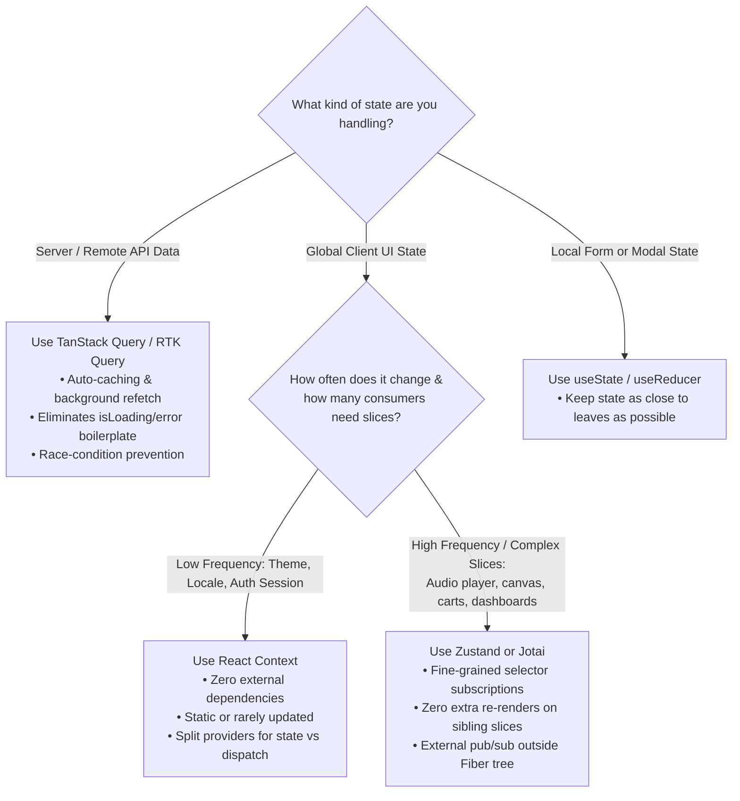

# React State Management Architecture: Context vs External Stores vs React Query

> [!note] The Core Mental Model
> State management is about **scoping, subscription granularity, and ownership**:
> 1. **Component State** (`useState`, `useReducer`): Local to an isolated component subtree.
> 2. **Context API**: A dependency-injection vehicle embedded directly within React's Fiber reconciliation loop.
> 3. **Client State Libraries** (Zustand, Redux, Jotai): External, framework-agnostic stores using the **pub/sub pattern** with selective subscriptions.
> 4. **Server State Managers** (TanStack Query / React Query): Asynchronous caches that handle remote data, caching, deduplication, and synchronization.


> [!abstract] Reconciliation-Bound Context vs Pub/Sub Selective Stores
> React Context has no selector mechanism out of the box. When a Context value changes, React flags **all consumer Fibers as dirty** during the render phase. In contrast, external stores (Zustand, Jotai) live outside React's heap. Components subscribe directly to specific slices using selectors via `useSyncExternalStore`; only components whose selected slice changes re-render.

---

## State Distribution Strategies Compared

```mermaid
flowchart TD
    subgraph DRILL ["1. Prop Drilling"]
        P["Parent (Holds State)"] --> I1["Intermediary 1 (Pass-Through)"]
        I1 --> I2["Intermediary 2 (Pass-Through)"]
        I2 --> C1["Leaf Consumer (Uses Data)"]
        style I1 fill:#ffebee,stroke:#c62828
        style I2 fill:#ffebee,stroke:#c62828
    end

    subgraph CTX ["2. Context API (In-Reconciliation)"]
        CP["Context.Provider value={state}"]
        CP -.->|Renders Entire Subtree| CI["Intermediary (No Props)"]
        CP ==>|Triggers Render on ALL Consumers| CC1["Consumer A (Needs user)"]
        CP ==>|Triggers Render on ALL Consumers| CC2["Consumer B (Needs theme only)"]
        style CC2 fill:#fff3e0,stroke:#ef6c00
    end

    subgraph PUBSUB ["3. External Store (Zustand/Jotai - Pub/Sub)"]
        S[("External Store (Heap)")]
        S -.->|useStore(s => s.user)| SC1["Component A (Subscribed to user)"]
        S -.->|useStore(s => s.theme)| SC2["Component B (Subscribed to theme)"]
        SC1 -.->|Updates user| S
        Note over S,SC2: Changing 'user' notifies ONLY Component A.<br/>Component B does NOT re-render!
    end
```

## Decision Matrix: What Tool Where?



---

## Key Concepts

### 1. Prop Drilling: Definition and Critical Drawbacks

* **What it is**: Passing props through intermediate components that have no operational interest in the data, strictly to deliver it to deeply nested children.
* **Why it degrades applications**:
* **Component Rigidity**: Intermediate components cannot easily be reused elsewhere without mocking props they do not use.
* **Refactoring Friction**: Adding, renaming, or removing a prop requires editing every layer along the path.
* **Unnecessary Render Cascades**: While intermediate components can be wrapped in `React.memo`, managing memoization across deep hierarchies adds cognitive load and fragile equality checks.

### 2. Why Context API Lives in the Reconciliation Loop

* Context values are tracked as properties on the Fiber tree (`fiber.dependencies`).
* When a `Context.Provider` value reference changes (`Object.is(oldVal, newVal) === false`), React marks every single descending Fiber that executed `useContext(MyContext)` as having work scheduled.
* **No Inherent Slice Selection**: If `value={{ user, theme }}`, updating `theme` forces consumers reading *only* `user` to re-render, unless divided into separate providers.

### 3. How External Stores (Zustand, Jotai, Redux) Work (Pub/Sub)

* **Decoupled from React**: The store exists in standard JavaScript memory outside of React’s Fiber tree.
* **Selective Subscriptions (`useSyncExternalStore`)**:
* React 18+ provides `useSyncExternalStore` to connect external mutable stores to React's concurrent scheduler without tearing.
* Components register a listener callback and a selector: `useStore(state => state.activeItemId)`.
* When the store mutates, it executes subscriber callbacks. React evaluates whether the output of the component's specific selector changed; if it has not, the component **does not render**.

### 4. Client State vs Server State: Why React Query Replaces Global Stores

Before libraries like TanStack Query, developers cached API data in global stores (Redux, Zustand) using repetitive boilerplate (`FETCH_START`, `FETCH_SUCCESS`, `FETCH_ERROR`).

* **Server State is fundamentally different from Client State**:
* It is asynchronous, remotely owned, not guaranteed to be up-to-date, and requires cache invalidation, deduplication, and retry logic.

* **TanStack Query** manages server state exclusively:
* Eliminates 80–90% of global state store code by caching server responses directly at the network boundary.
* Leaves client stores (Zustand) lean—handling only truly local, transient UI state (e.g., sidebar collapse, active modals, multi-step filter forms).

---

## Technical Comparison

| Feature | React Context API | Zustand / Jotai / Redux | TanStack Query (React Query) |
| --- | --- | --- | --- |
| **Primary Domain** | Low-frequency client UI state | High-frequency client UI state | Asynchronous Server State (APIs) |
| **Engine** | Inside Fiber Reconciliation | Outside React (Pub/Sub) | In-memory asynchronous cache layer |
| **Subscription Model** | Coarse: Any context change triggers all consumers | Fine-grained: Selector-based (`useStore(s => s.val)`) | Query key invalidation & active observer count |
| **Re-render Cost** | High if context object is not split | Minimal; only affected slice re-renders | Minimal; updates on query cache status change |
| **Bundle Impact** | 0 KB (Built into React core) | ~1–3 KB (Zustand/Jotai) | ~12 KB |

---

## Common Interview Questions

* What is prop drilling, and how can component composition resolve it without adding global state?
* Why is React Context not considered a true "state management tool"?
* How does the subscription model in Zustand prevent unnecessary re-renders compared to `useContext`?
* What is `useSyncExternalStore`, and why was it introduced in React 18?
* Why is it considered an anti-pattern to store fetched API responses inside Redux or Zustand today?
* What are atomic state managers (like Jotai/Recoil) versus single-store architectures (like Zustand/Redux)?

---

## Strong Answers / Talking Points

* **Context is a Transport Layer, Not a State Manager**:
* Context does not manage state; `useState` or `useReducer` manages state. Context is simply a **dependency injection tunnel** that distributes values across subtrees to avoid prop drilling.

* **The "Context Performance Problem"**:
* Context itself is fast, but it forces an architectural tradeoff: you either accept coarse re-renders across all consumers or break your state into dozens of fine-grained, nested providers (`<AuthProvider>`, `<ThemeProvider>`, `<CartProvider>`), leading to "provider hell."
* External stores solve this by allowing a single flat store while using selectors to provide sub-millisecond, granular UI re-renders.

* **The Modern Full-Stack State Split**:
* **Server State**: Managed by TanStack Query or SWR (caching, deduplicating, re-fetching).
* **Global Client State**: Managed by Zustand (modals, UI preferences, user input across routes).
* **Ambient Static Data**: Managed by Context (themes, translations, security tokens).
* **Local Component State**: Managed by `useState` / `useReducer` (toggles, input focus).

---

## Code Snippets / Examples

```jsx
// 1. TanStack Query: Handling Server State (NO global store needed!)
import { useQuery, useMutation, useQueryClient } from '@tanstack/react-query';

export function UserProfile({ userId }) {
  const queryClient = useQueryClient();

  // Handles caching, loading/error states, deduplication, and retries automatically
  const { data: user, isLoading, isError } = useQuery({
    queryKey: ['users', userId],
    queryFn: () => fetch(`/api/users/${userId}`).then(res => res.json()),
    staleTime: 1000 * 60 * 5, // Data remains fresh for 5 minutes
  });

  if (isLoading) return <div>Loading...</div>;
  if (isError) return <div>Failed to load user.</div>;

  return <h1>{user.name}</h1>;
}
```

```jsx
// 2. Zustand: High-Frequency Client State with Granular Selector Subscriptions
import { create } from 'zustand';

// Store lives outside React Fiber in pure JS memory
export const useUIStore = create((set) => ({
  sidebarOpen: false,
  activeTheme: 'dark',
  cartCount: 0,
  toggleSidebar: () => set((state) => ({ sidebarOpen: !state.sidebarOpen })),
  incrementCart: () => set((state) => ({ cartCount: state.cartCount + 1 })),
}));

// Component A: Subscribes ONLY to sidebarOpen
export function SidebarToggle() {
  // Selector: This component re-renders ONLY when `sidebarOpen` changes
  const sidebarOpen = useUIStore((state) => state.sidebarOpen);
  const toggleSidebar = useUIStore((state) => state.toggleSidebar);

  console.log('SidebarToggle rendered');
  return <button onClick={toggleSidebar}>Open: {String(sidebarOpen)}</button>;
}

// Component B: Subscribes ONLY to cartCount
export function CartBadge() {
  // Changes to sidebarOpen or activeTheme WILL NEVER trigger a re-render here!
  const cartCount = useUIStore((state) => state.cartCount);

  console.log('CartBadge rendered');
  return <span>Items: {cartCount}</span>;
}
```

```jsx
// 3. Solving Prop Drilling without Context or Libraries: Component Composition
// Instead of drilling `user` through Layout -> Header -> Nav -> Avatar:
export function App() {
  const [user] = useState({ name: 'Alex', avatar: '/pic.png' });

  return (
    // Compose via children or slots
    <Layout
      header={
        <Header>
          <Nav>
            <Avatar user={user} />
          </Nav>
        </Header>
      }
    >
      <MainContent />
    </Layout>
  );
}

function Header({ children }) {
  // Header does not know or care that `user` exists
  return <header className="top-nav">{children}</header>;
}
```

---

## Related Topics

* [[Combining React Context and useReducer Architecture]]
* [[React State and Props Architecture]]
* [[React Fiber Architecture and Non-Blocking Rendering]]
* [[React useMemo, useCallback, and Fiber Memoization Architecture]]

---

## Tags

#fullstack #interview #state-management #react-context #zustand #react-query #pub-sub #mermaid

---

## Revision Checklist

* [ ] Can explain in 60 seconds
* [ ] Can explain trade-offs
* [ ] Can give a real project example
* [ ] Can answer common follow-ups
