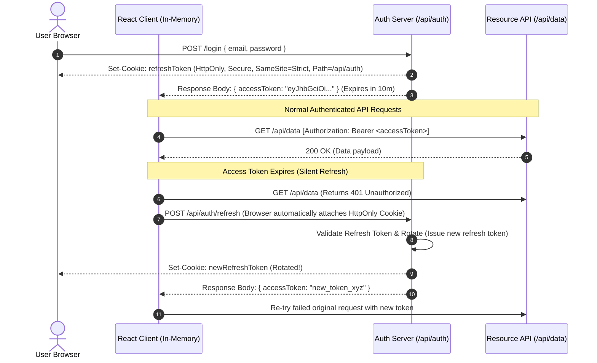
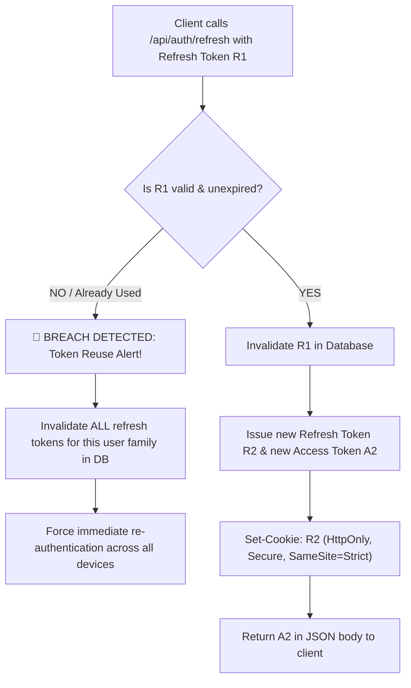

> [!note] The Core Security Dilemma
> Web token storage is a fundamental trade-off between **Cross-Site Scripting (XSS)** vulnerability and **Cross-Site Request Forgery (CSRF)** vulnerability:
> * **Web Storage (`localStorage` / `sessionStorage`)**: Accessible to *any* JavaScript executing on the page. Completely vulnerable to token theft via **XSS**.
> * **Cookies (`HttpOnly`)**: Inaccessible to JavaScript, neutralizing token exfiltration via XSS, but inherently susceptible to **CSRF** unless strict attributes (`SameSite`, CSRF tokens) are configured.
> 
> 

> [!abstract] Modern Industry Gold Standard
> 1. **Access Token (Short-lived, ~5–15 mins)**: Kept **in-memory only** (in a React state, closure, or client-side store) OR in a secure cookie.
> 2. **Refresh Token (Long-lived, ~7–30 days)**: Stored in an **`HttpOnly`, `Secure`, `SameSite=Strict` (or `Lax`) cookie** restricted to the auth renewal path (`/api/auth/refresh`) with server-side token rotation and reuse detection.
> 
> 

---

## Token Flow & Silent Refresh Architecture



---

## Storage Medium Comparison Matrix

| Storage Mechanism | Read/Write Access | Lifespan | XSS Vulnerability | CSRF Vulnerability | Primary Best-Use Case |
| --- | --- | --- | --- | --- | --- |
| **In-Memory (JS Variable / State)** | JavaScript only | Lost on tab refresh / close | **Low/Mitigated** (Cannot be read if XSS payload fires after load, though script can still intercept network traffic) | **Immune** (Not sent automatically by browser) | **Short-lived Access Tokens** (~5–15 min expiration). |
| **`HttpOnly` Cookie** | Browser only (JS cannot read via `document.cookie`) | Defined by `Max-Age` / `Expires` | **Immune to direct token theft** | **Vulnerable** (Mitigated via `SameSite=Lax/Strict` + Anti-CSRF tokens) | **Refresh Tokens**, Session Identifiers. |
| **`localStorage`** | Any JavaScript on same origin | Persists permanently until cleared | **Critical Risk** (`localStorage.getItem('token')` stolen instantly on XSS) | **Immune** (Must be manually attached to headers via JS) | Non-sensitive preferences (UI theme, language, cached layout state). |
| **`sessionStorage`** | Any JavaScript in that specific tab | Cleared when browser tab closes | **Critical Risk** (Vulnerable to XSS in active session) | **Immune** | Transient multi-step wizard state, temporary tab-isolated filter params. |

---

## The Attack Vectors Explained

```mermaid
flowchart TD
    subgraph XSS_ATTACK ["XSS Attack (Cross-Site Scripting)"]
        X1["Attacker injects malicious script: &lt;script src=evil.com&gt;"]
        X2["Script executes in victim's browser context"]
        X3["Reads `localStorage.getItem('accessToken')`"]
        X4["Exfiltrates token to attacker's server: evil.com/steal?t=..."]
        X1 --> X2 --> X3 --> X4
    end

    subgraph CSRF_ATTACK ["CSRF Attack (Cross-Site Request Forgery)"]
        C1["Victim logs into bank.com (HttpOnly cookie set)"]
        C2["Victim visits malicious website: evil-site.com"]
        C3["evil-site submits background POST form to bank.com/transfer"]
        C4["Browser automatically attaches bank.com cookie!"]
        C5["Bank executes unauthorized transfer"]
        C1 --> C2 --> C3 --> C4 --> C5
    end

```



---

## When to Use What

### 1. Short-Lived Access Token: In-Memory (or Memory + Silent Refresh)

* **Where to store**: In a closure variable, React Context, or a client state store (e.g., Zustand, Redux).
* **Why**:
* If an attacker exploits an XSS vulnerability, they cannot execute `localStorage.getItem('token')` to pull the token out of long-term storage.
* While an XSS attacker can execute API calls while the page is open, they cannot easily copy the token to use from an external script indefinitely.


* **The Tab Refresh Problem**: Because in-memory variables are wiped on page reload, trigger a **Silent Refresh** on app initialization (`App.tsx` mount):
* Call `/api/auth/refresh` on load.
* The browser includes the `HttpOnly` refresh cookie, returns a fresh access token, and repopulates the in-memory variable.


### 2. Long-Lived Refresh Token: `HttpOnly` Cookie

* **Where to store**: In an HTTP Cookie set by the backend server.
* **Must-Have Cookie Flags**:
* `HttpOnly`: Prevents `document.cookie` access in JS, stopping token theft via XSS.
* `Secure`: Ensures the cookie is transmitted **only over HTTPS**.
* `SameSite=Strict` (or `Lax`): Prevents the browser from attaching the cookie on cross-site requests, neutralizing CSRF attacks.
* `Path=/api/auth`: Restricts transmission so the refresh cookie is **only** sent when hitting authentication endpoints, not on every generic asset/data request.


### 3. `localStorage` (When is it appropriate?)

* **Appropriate for**:
* Non-sensitive user preferences (e.g., `theme: "dark"`, `sidebarCollapsed: true`, `locale: "en-US"`).
* Publicly cached data that carries zero security risk if read by a third party.


* **NEVER use for**:
* JWTs, access tokens, refresh tokens, passwords, credit card data, PII (Personally Identifiable Information).


### 4. `sessionStorage` (When is it appropriate?)

* **Appropriate for**:
* Multi-step checkout/registration forms where data should not bleed into other open tabs.
* Storing state that should discard immediately when the tab closes.


* **Avoid for**:
* Authentication tokens, as it has the same XSS exposure as `localStorage` for the lifetime of that tab.


---

## Token Rotation and Reuse Detection



* **Token Rotation**: Every time a refresh token is used, it is revoked and a brand new refresh token is issued.
* **Automatic Reuse Detection**: If an attacker steals a refresh token and uses it, and later the legitimate user attempts to use the same invalidated token, the server detects token reuse, invalidates the **entire token family**, and terminates the user's sessions immediately.

---

## Common Interview Questions

* Why is storing JWTs in `localStorage` considered a security liability?
* How does `HttpOnly` protect a cookie, and does it prevent CSRF attacks?
* What are the three crucial security flags every auth cookie must have?
* How do you solve the issue of losing in-memory access tokens when a user refreshes the page?
* What is the difference between `SameSite=Strict`, `SameSite=Lax`, and `SameSite=None`?
* What is Refresh Token Rotation, and how does Reuse Detection protect compromised sessions?

---

## Strong Answers / Talking Points

* **The False Sense of Security in `localStorage**`:
* Many developers store JWTs in `localStorage` simply because it is easy to read with JavaScript and attach as `Authorization: Bearer <token>`.
* In an enterprise environment, any third-party npm dependency (`node_modules`), injected analytics script, or compromised CDN script can execute `localStorage.getItem()` and instantly exfiltrate user credentials.


* **Why `SameSite=Lax` vs `SameSite=Strict` Matters**:
* `SameSite=Strict`: The cookie is **never** sent in cross-site requests (e.g., following a link from an external email or site to your app). Best for financial/sensitive apps, though it requires users to re-click or re-navigate to stay logged in from external links.
* `SameSite=Lax`: Default in modern browsers. Cookies are withheld on cross-site sub-requests (images, iframes, background POSTs), but sent when a user navigates to the origin site via a standard top-level link (GET request).


* **Backend-for-Frontend (BFF) Pattern**:
* In modern architectures (e.g., Next.js / Remix / API Gateways), the browser **never touches the raw access token**.
* The Next.js / BFF server maintains the session with secure encrypted cookies, and the BFF server attaches the JWT when forwarding requests to downstream backend microservices. The browser only holds an opaque encrypted session ID.


---

## Implementation Example: Axios Interceptor for Silent Refresh

```typescript
import axios from 'axios';

// In-Memory Token Reference (Not stored in localStorage!)
let inMemoryAccessToken: string | null = null;

export const setAccessToken = (token: string | null) => {
  inMemoryAccessToken = token;
};

export const api = axios.create({
  baseURL: 'https://api.example.com',
  withCredentials: true, // MANDATORY: Sends HttpOnly refresh cookies
});

// 1. Request Interceptor: Attach in-memory access token
api.interceptors.request.use((config) => {
  if (inMemoryAccessToken && config.headers) {
    config.headers.Authorization = `Bearer ${inMemoryAccessToken}`;
  }
  return config;
});

// 2. Response Interceptor: Handle 401 & Silent Refresh Queue
let isRefreshing = false;
let failedQueue: Array<{
  resolve: (value?: unknown) => void;
  reject: (reason?: unknown) => void;
}> = [];

const processQueue = (error: unknown, token: string | null = null) => {
  failedQueue.forEach((promise) => {
    if (error) {
      promise.reject(error);
    } else {
      promise.resolve(token);
    }
  });
  failedQueue = [];
};

api.interceptors.response.use(
  (response) => response,
  async (error) => {
    const originalRequest = error.config;

    // If 401 Unauthorized and not already retried
    if (error.response?.status === 401 && !originalRequest._retry) {
      if (isRefreshing) {
        // Queue pending requests while refresh is in-flight
        return new Promise((resolve, reject) => {
          failedQueue.push({ resolve, reject });
        })
          .then((token) => {
            originalRequest.headers.Authorization = `Bearer ${token}`;
            return api(originalRequest);
          })
          .catch((err) => Promise.reject(err));
      }

      originalRequest._retry = true;
      isRefreshing = true;

      try {
        // POST to refresh endpoint: HttpOnly cookie sent automatically
        const { data } = await axios.post(
          'https://api.example.com/api/auth/refresh',
          {},
          { withCredentials: true }
        );

        const newAccessToken = data.accessToken;
        setAccessToken(newAccessToken);
        processQueue(null, newAccessToken);

        originalRequest.headers.Authorization = `Bearer ${newAccessToken}`;
        return api(originalRequest);
      } catch (refreshError) {
        processQueue(refreshError, null);
        setAccessToken(null);
        // Redirect to login or dispatch auth logout event
        window.location.href = '/login';
        return Promise.reject(refreshError);
      } finally {
        isRefreshing = false;
      }
    }

    return Promise.reject(error);
  }
);

```

---

## Related Topics

* [[Frontend Security and OWASP Top 10]]
* [[Safe HTML Injection and innerHTML Handling in React]]
* [[Browser Event Propagation and Synthetic Events]]
* [[Client State vs Server State (TanStack Query)]]

---

## Tags

#fullstack #interview #security #auth-tokens #jwt #cookies #xss #csrf #localstorage #mermaid

---

## Revision Checklist

* [ ] Can explain in 60 seconds
* [ ] Can explain trade-offs
* [ ] Can give a real project example
* [ ] Can answer common follow-ups