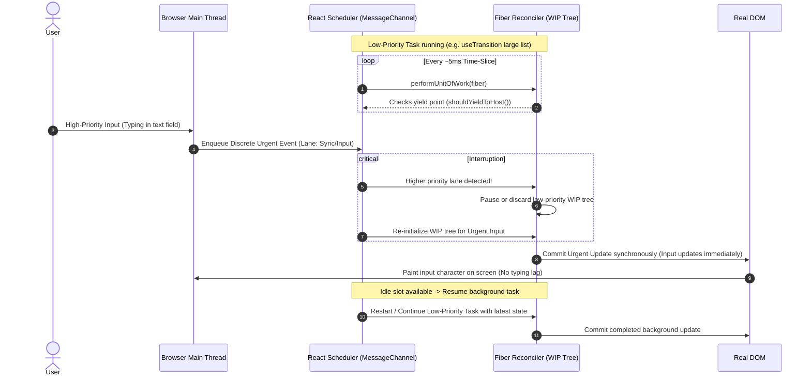
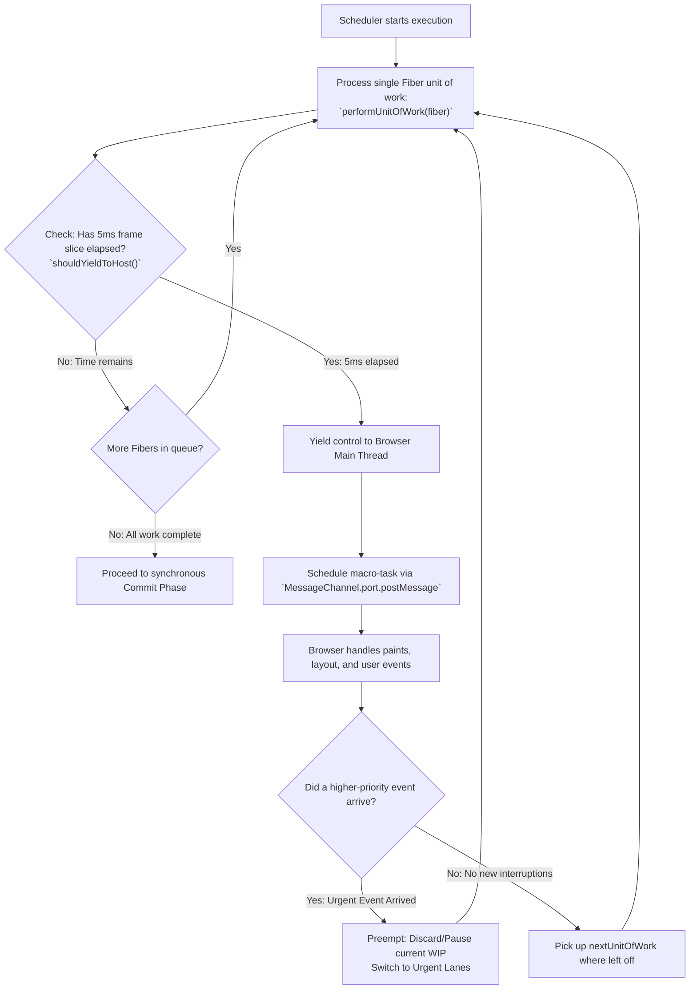
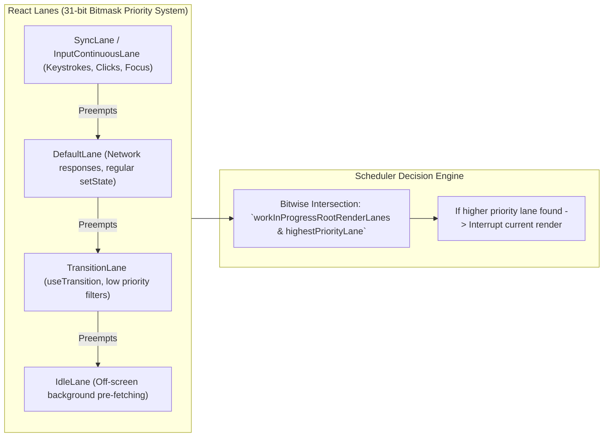

# React Concurrent Multitasking, Scheduling, and Priority Interruptions

> [!note] Core Mental Model
>
> React does not use true operating system multi-threading. Instead, it implements **cooperative multitasking via time-slicing** on a single thread. The React Scheduler acts like a mini-OS: it breaks rendering into atomic Fiber units of work, yields control back to the browser event loop every ~5ms, checks for higher-priority user inputs (e.g., clicks or keystrokes), and can pause, discard, or restart lower-priority rendering passes.


> [!abstract] Single WorkInProgress Tree Constraint
>
> At any given point in time, React maintains only **one active `workInProgress` (WIP) tree** alongside the mounted `current` tree. React does _not_ juggle multiple parallel branch trees simultaneously in memory. When interrupted, React either suspends the current pass or resets the WIP tree pointer, processes the urgent update, and then restarts or resumes the background task using the latest state.


## Priority Preemption and Interruption Workflow



## The 5ms Time-Slicing Work Loop

Code snippet



## Parallel Updates and Priority Lanes (Lanes Model)

Code snippet



## Key Concepts

### 1. Cooperative Time-Slicing (~5ms budget)

- React does not monopolize the main thread.

- During concurrent operations (`useTransition`, `useDeferredValue`), React sets a time budget of approximately **5 milliseconds** per slice.

- At the end of every unit of work, React calls `shouldYieldToHost()`. If `performance.now() >= deadline` (~5ms), it pauses the loop and yields control to the browser.

- It schedules its continuation using the browser’s **`MessageChannel`** API (a high-frequency macrotask that runs before `setTimeout(fn, 0)`).

### 2. How Interruption Works (Single WIP Constraint)

- React does **not** allocate multiple divergent trees for multiple pending updates. There is only:

    1. The **`current`** tree (what is on screen).

    2. The **`workInProgress`** tree (the active draft).

- When a high-priority task arrives (e.g., a keyboard stroke):

    1. React detects that the incoming event's **Lane** has higher priority than the currently computing lane.

    2. It immediately halts the work loop.

    3. The current WIP tree is either rewound to the nearest clean ancestor or discarded (resetting `workInProgress = createWorkInProgress(...)`).

    4. React executes the urgent task against the current tree, creates a new WIP snapshot, and commits it directly to the DOM so the user experiences zero lag.

    5. Once the urgent work is committed, the scheduler restarts the interrupted low-priority work, recalculating from the new root state.

### 3. Starvation Prevention (Task Expiration Timestamps)

- If a low-priority transition is repeatedly interrupted by incoming keystrokes, could it get delayed forever?

- **No**: Every update has an **expiration timestamp**.

- As long-delayed tasks wait in the queue, their deadline approaches. Once a task exceeds its expiration date, React elevates its priority to **`SyncLane`** (uninterruptible).

- The task locks the thread until it finishes, preventing infinite starvation.

### 4. React 18+ Lanes Architecture

- React models priorities using a **31-bit bitmask** known as **Lanes**.

- Bitwise operations (e.g., `lanes & -lanes`) allow React to add, remove, and check priority sets in $O(1)$ CPU time.

- Multiple updates of the same lane are batched together automatically, while differing lanes can be separated across time.

## Common Interview Questions

- How does React achieve multitasking on JavaScript's single-threaded event loop?

- What mechanism does React use to yield execution back to the browser (~5ms time-slicing)?

- Can React process two different component trees at the exact same millisecond in parallel?

- What happens to an ongoing `useTransition` render when a user suddenly clicks a button?

- How does React prevent low-priority updates from starving if high-priority events keep firing?

- Why did the React team migrate from integer priority levels to the 31-bit bitmask "Lanes" model?

## Strong Answers / Talking Points

- **Single-Threaded Illusion of Multitasking**:

    - React does not use OS threads or Web Workers for Fiber reconciliation. It uses time-sliced cooperative scheduling. By yielding every 5ms, the browser can handle painting and inputs smoothly, giving the appearance of true concurrency.

- **Why `MessageChannel` over `requestIdleCallback` or `setTimeout`**:

    - `requestIdleCallback` fires unpredictably (often only 20–30 times a second on high-refresh screens and halts when tabs are backgrounded).

    - `setTimeout(fn, 0)` has a mandatory 4ms minimum clamping penalty after nested calls.

    - React uses `MessageChannel` ports (`port2.postMessage(null)`), creating a lightweight macrotask scheduled immediately after the current microtask queue and rendering steps clear.

- **Handling Interrupted Work**:

    - Because the Render phase is pure and side-effect free, discarding or restarting an incomplete WIP tree has zero adverse consequences on the real DOM.

    - No incomplete UI is ever shown to the user because real DOM mutations are strictly reserved for the synchronous Commit phase.

## Code Snippets / Examples

```javascript
import { useState, useTransition } from 'react';

export function SearchFilter() {
  const [input, setInput] = useState('');
  const [list, setList] = useState([]);

  // useTransition marks state updates with a low-priority TransitionLane
  const [isPending, startTransition] = useTransition();

  const handleChange = (e) => {
    const value = e.target.value;

    // 1. HIGH-PRIORITY (InputContinuousLane):
    // Runs immediately. Interrupts any running background work.
    setInput(value);

    // 2. LOW-PRIORITY (TransitionLane):
    // Can be paused, time-sliced, or discarded if the user keeps typing.
    startTransition(() => {
      const filtered = Array.from({ length: 15000 }, (_, i) => `${value} item ${i}`);
      setList(filtered);
    });
  };

  return (
    <div>
      {/* Keystrokes feel responsive with 0ms lag */}
      <input value={input} onChange={handleChange} placeholder="Type rapidly..." /

      {isPending && <p>Filtering list in background...</p>}

      <ul>
        {list.slice(0, 10).map((item, idx) => (
          <li key={idx}>{item}</li>
        ))}
      </ul>
    </div>
  );
}
```

```javascript
// Conceptual implementation of React's cooperative scheduler yield check
let frameDeadline = 0;
const FRAME_YIELD_BUDGET = 5; // milliseconds

function shouldYieldToHost() {
  // Checks if the current 5ms time-slice has expired
  return performance.now() >= frameDeadline;
}

function workLoopConcurrent() {
  // While units of work exist and time remains in the 5ms slice
  while (workInProgress !== null && !shouldYieldToHost()) {
    performUnitOfWork(workInProgress);
  }

  // If time sliced expired, check if higher priority work arrived
  if (workInProgress !== null) {
    if (hasHigherPriorityWorkArrived()) {
      // Discard or pause current WIP pointer
      workInProgress = null;
      prepareFreshWorkTree();
    }
    // Yield to browser and schedule next execution continuation
    scheduleHostCallback();
  }
}
```

## Related Topics

- [[React Fiber Architecture and Non-Blocking Rendering|React Fiber Architecture]]

- [[React Lifecycle and Execution Flow|React Render and Commit Phases]]

- [[Asynchronous JavaScript, Event Loop & Concurrency Model|JavaScript Event Loop]]

- [[React Concurrent Multitasking, Scheduling, and Priority Interruptions|React Concurrent Mode and Transitions]]

## Tags

#fullstack #interview #react-concurrency #scheduler #fiber #time-slicing #mermaid

## Revision Checklist

- [ ] Can explain in 60 seconds

- [ ] Can explain trade-offs

- [ ] Can give a real project example

- [ ] Can answer common follow-ups
