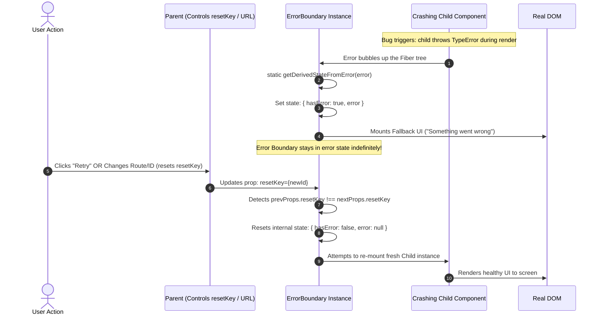

# React Error Boundaries, Execution Limits, and Reset Strategies

> [!note] Core Mental Model
> An **Error Boundary** is a specialized React component that acts like an imperative `try...catch` block for declarative UI trees. It catches JavaScript runtime errors in child components during **rendering, lifecycle methods, and constructors**, prevents the entire application from crashing with an unhandled white-screen exception, and displays a graceful fallback UI.

> [!abstract] Why Error Boundaries Do NOT Catch Errors in Event Handlers or Async Code
> Error Boundaries only catch errors thrown **during React's render and commit reconciliation pipeline**. Event handlers (`onClick`) and asynchronous callbacks (`fetch`, `setTimeout`) execute on distinct macrotask/microtask ticks in the browser's Event Loop *outside* of React’s render stack. Because React is not in the middle of computing the Virtual DOM tree when an event handler or timer throws, the UI tree remains intact and doesn't require an Error Boundary to rescue the tree.

---

## What Error Boundaries Catch vs What They Miss

```mermaid
flowchart TD
    subgraph CAUGHT ["Caught by Error Boundary (Render / Commit Pipeline)"]
        direction TB
        C1["Component Function Body (Render Phase)"]
        C2["Constructor and State Initializers"]
        C3["Lifecycle Methods: componentDidMount / componentDidUpdate"]
        C4["useLayoutEffect and useEffect execution"]
        C5["Rendering Child JSX Nodes"]
    end

    subgraph NOT_CAUGHT ["Ignored by Error Boundary (Outside Render Pipeline)"]
        direction TB
        N1["Event Handlers: onClick, onKeyDown (Use standard try/catch)"]
        N2["Asynchronous Code: setTimeout, requestAnimationFrame"]
        N3["Server-Side Rendering (SSR)"]
        N4["Errors Thrown Inside the Error Boundary Itself"]
        N5["Unhandled Promise Rejections in Data Fetching (fetch/axios)"]
    end

```



---

## Error Trapping and the Reset Key Pattern Workflow



---

## Key Concepts

### 1. The Class Component Requirement

* Historically, Error Boundaries **must be Class Components** because React only exposes boundary hooks via two class lifecycle methods:
* `static getDerivedStateFromError(error)`: Pure method used to update state (`{ hasError: true }`) and render the fallback UI during the render phase.
* `componentDidCatch(error, errorInfo)`: Side-effect method used to log the error and component stack traces to monitoring services (e.g., Sentry, Datadog).


* *React has not introduced a functional hook equivalent (like `useErrorBoundary`) as of React 19; production apps use libraries like `react-error-boundary`.*

### 2. Why Event Handlers Don't Need Error Boundaries

* When a render crashes, React cannot safely predict what the DOM should look like. Continuing to render a corrupted component tree leads to silent data corruption or visual bugs, so React unmounts the entire sub-tree down to the nearest boundary.
* Conversely, when an event handler (e.g., `onClick`) throws an error:
* The render phase has already completed.
* The DOM is completely stable and valid.
* React doesn't need to unmount the tree to protect UI integrity.
* Standard JavaScript `try...catch` blocks should be placed directly inside event handlers or async callbacks.


### 3. Error Boundary State Latching

* Once an Error Boundary catches an error, its local state (`hasError: true`) **remains latched permanently** until an explicit action resets it.
* Simply passing new props to the crashed child or re-rendering surrounding UI will not dismiss the fallback screen because the boundary itself is still returning the fallback component.

### 4. Overcoming the Latch: The Reset Key Pattern

To clear the error state and instruct the boundary to attempt re-rendering the children:

1. **Imperative Reset**: Exposing an `onReset` callback that calls `this.setState({ hasError: false })` triggered by a "Try Again" button.
2. **Declarative Key Reset (The Reset Key Pattern)**: Passing a dynamic dependency or route parameter (e.g., `resetKeys={[userId]}` or standard React `key={userId}`) to the boundary:
* When the user navigates to a new page or changes input parameters, the boundary detects the key change in `componentDidUpdate` (or React destroys and recreates the boundary Fiber via `key`), immediately resetting `hasError: false` and rendering the fresh tree.


---

## Common Interview Questions

* What is an Error Boundary, and what lifecycle methods define it?
* Why do Error Boundaries catch errors in the render phase but fail to catch errors in event handlers or `setTimeout`?
* How do you propagate an asynchronous or event-handler error into an Error Boundary?
* Why does an Error Boundary stay stuck on its fallback screen even after the problem in the child component is fixed?
* What is the "Reset Key Pattern" in error boundary architecture?
* What happens if an error is thrown inside the `render()` method of the Error Boundary itself?

---

## Strong Answers / Talking Points

* **Rethrowing Async Errors to Trigger Error Boundaries**:
* If you *want* an Error Boundary to catch an async error (such as a failed network call), you can trigger a state setter during render that throws:
```javascript
const [, setError] = useState();
// Inside async callback / catch block:
setError(() => { throw new Error('Network Failed'); });

```


* This forces the error into React's render pipeline, triggering the nearest Error Boundary.


* **Granular vs Global Boundaries**:
* *Anti-Pattern*: Wrapping only the root `<App/>` component in a single boundary. A single minor error in a comment widget crashes the whole page.
* *Best Practice*: Use **nested, granular boundaries**. Wrap independent widgets, sidebars, and route pages in their own boundaries. If the comment widget crashes, only the comment box renders an error card, while the rest of the dashboard remains interactive.


* **Errors Inside the Boundary Itself**:
* An Error Boundary **cannot** catch errors within its own `render()` or `getDerivedStateFromError()` methods. The error will bubble up to the next parent Error Boundary above it in the Fiber tree (or crash to the root).


---

## Code Snippets / Examples

```jsx
import React, { Component } from 'react';

// 1. Production-Grade Class Error Boundary with Reset Key Pattern
export class ErrorBoundary extends Component {
  constructor(props) {
    super(props);
    this.state = { hasError: false, error: null };
  }

  // 1. Synchronously update state to render fallback UI
  static getDerivedStateFromError(error) {
    return { hasError: true, error };
  }

  // 2. Log diagnostic data to monitoring services
  componentDidCatch(error, errorInfo) {
    console.error('ErrorBoundary caught an error:', error, errorInfo);
    // e.g., Sentry.captureException(error, { extra: errorInfo });
  }

  // 3. Reset Key Pattern: Auto-recover when dependency props change
  componentDidUpdate(prevProps) {
    if (this.state.hasError && prevProps.resetKey !== this.props.resetKey) {
      this.resetErrorBoundary();
    }
  }

  resetErrorBoundary = () => {
    this.setState({ hasError: false, error: null });
    this.props.onReset?.();
  };

  render() {
    if (this.state.hasError) {
      // Render custom fallback or default UI
      if (this.props.fallback) {
        return this.props.fallback({
          error: this.state.error,
          resetErrorBoundary: this.resetErrorBoundary,
        });
      }
      return (
        <div role="alert" style={{ padding: '16px', border: '1px solid red' }}>
          <h3>Something went wrong.</h3>
          <p>{this.state.error?.message}</p>
          <button onClick={this.resetErrorBoundary}>Try Again</button>
        </div>
      );
    }

    return this.props.children;
  }
}

```

```jsx
import { useState } from 'react';
import { ErrorBoundary } from './ErrorBoundary';

// 2. Consuming the Boundary with Reset Keys and Granular Isolation
export function UserDashboard({ selectedUserId }) {
  return (
    <div className="dashboard-layout">
      <nav>Sidebar Navigation (Always Safe)</nav>

      <main>
        {/*
          RESET KEY PATTERN:
          When selectedUserId changes, the ErrorBoundary automatically clears
          its error state and attempts to render the new user profile cleanly.
        */}
        <ErrorBoundary
          resetKey={selectedUserId}
          fallback={({ error, resetErrorBoundary }) => (
            <div>
              <p>Failed to load profile: {error.message}</p>
              <button onClick={resetErrorBoundary}>Retry Manual</button>
            </div>
          )}
        >
          <UserProfile userId={selectedUserId} />
        </ErrorBoundary>
      </main>
    </div>
  );
}

// 3. Propagating Async Errors to Error Boundaries (The Hook Pattern)
export function useAsyncError() {
  const [, setError] = useState();
  return (e) => {
    setError(() => {
      throw e; // Throws during next render pass, triggering Error Boundary
    });
  };
}

```

---

## Related Topics

* [[React Lifecycle and Execution Flow|React Component Lifecycle]]
* [[React Fiber Architecture and Non-Blocking Rendering]]
* [[Code Splitting vs Lazy Loading in React]]
* [[Web Security & Identity Architecture. SOP, XSS, CSRF & Token Lifecycles|Frontend Security and OWASP Top 10]]

---

## Tags

#fullstack #interview #react-error-boundary #error-handling #resilience #reset-key-pattern #mermaid

---

## Revision Checklist

* [ ] Can explain in 60 seconds
* [ ] Can explain trade-offs
* [ ] Can give a real project example
* [ ] Can answer common follow-ups