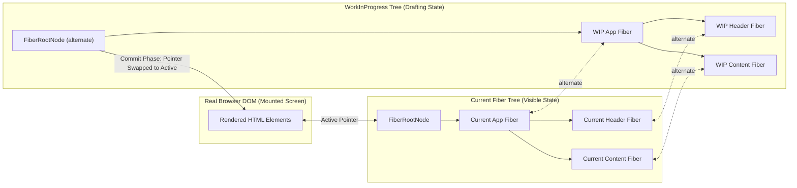
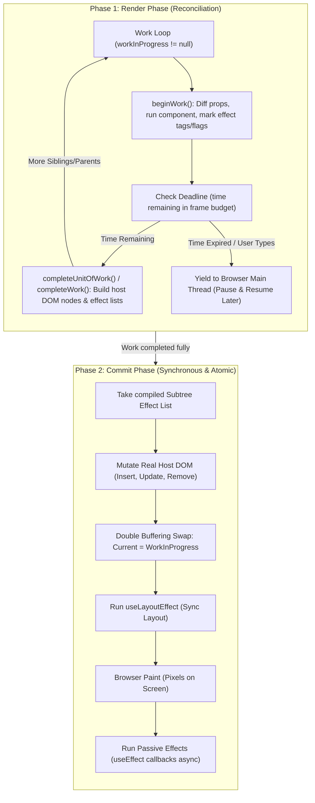

# React Fiber Architecture and Non-Blocking Rendering

> [!note] Core Definition of React Fiber
> 
> **React Fiber** is the rewrite of React’s core reconciliation engine introduced in React 16. It replaced the synchronous, recursive **Stack Reconciler** with an asynchronous, incremental, linked-list-based architecture capable of pausing, resuming, prioritizing, and aborting rendering tasks.
> 
>   

> [!abstract] What is a Fiber? (The Unit of Work)
> 
> A **Fiber** is a plain JavaScript object representing a **unit of work**. It mirrors a component instance or DOM node and forms a mutable singly-linked tree using `child`, `sibling`, and `return` pointers. It acts as a custom virtual call stack frame implemented in heap memory rather than on the JavaScript engine's native call stack.
> 
>   

## Evolution: Legacy Stack Reconciler vs Modern Fiber Engine

```mermaid
flowchart TD
    subgraph LEGACY ["Legacy Stack Reconciler (React 15 and earlier)"]
        L1["setState triggers reconciliation"]
        L2["Synchronous, recursive call stack traversal"]
        L3["Deep component trees lock the JavaScript main thread"]
        L4["Frame drops, dropped user input, choppy UI animations"]
        L1 --> L2 --> L3 --> L4
    end

    subgraph FIBER ["Modern Fiber Reconciler (React 16+)"]
        F1["setState creates a work queue unit"]
        F2["Cooperative Scheduling: Work loop checks remaining frame time"]
        F3["Breaks rendering into units of work (Fibers)"]
        F4["Can pause for high-priority user input, then resume"]
        F1 --> F2 --> F3 --> F4
    end
```




## Double Buffering: WorkInProgress vs Current Fiber Tree



## The Two Phases of Fiber: Render vs Commit




## Key Concepts

### 1. The Stack Reconciler vs The Fiber Reconciler

- **Stack Reconciler (Legacy)**:
    
      
    - Traversed the Virtual DOM recursively using the native JavaScript call stack (`renderChildren(child)`).
        
          
        
    - **The Problem**: A function call stack cannot be stopped once started. In large component trees, a render could block the main thread for 50–100ms+. The browser could not process keyboard strokes, mouse clicks, or frame paints (16.6ms budget for 60fps), causing noticeable input lag ("jank").
        
          
        
- **Fiber Reconciler (Modern)**:
    
      
    - Converts tree recursion into an iterative singly-linked list traversal.
        
          
        
    - Maintains state on the heap rather than relying on native stack frames.
        
          
        
    - Allows React to yield back to the browser's event loop via cooperative scheduling (`requestIdleCallback` concepts / internal scheduler with `MessageChannel`).
        
          
        

### 2. What Does a Fiber Node Contain?

A Fiber node is a single JavaScript object structured with:

  

- **Identity & Type**:
    
      
    - `tag`: Categorizes the Fiber type (Function Component, Class Component, Host Component/DOM tag).
        
          
        
    - `type`: The actual function, class, or string (e.g., `'div'`).
        
          
        
    - `key`: Identity badge for reconciliation.
        
          
        
- **Tree Pointers (The Singly Linked List Structure)**:
    
      
    - `child`: Points to its first immediate child.
        
          
        
    - `sibling`: Points to its immediate next sibling.
        
          
        
    - `return`: Points back to its parent (the Fiber to which it returns after completion).
        
          
        
- **State & Props**:
    
      
    - `pendingProps` vs `memoizedProps`: What props are coming in vs what were previously rendered.
        
          
        
    - `memoizedState`: A linked list of hook states (`useState`, `useReducer`, `useEffect`) attached to this component.
        
          
        
- **Effects & Work Tracking**:
    
      
    - `flags` (formerly `effectTag`): Bitmask recording needed mutations (e.g., `Placement`, `Update`, `Deletion`).
        
          
        
    - `alternate`: Pointer to its duplicate node in the opposite tree (supports double buffering).
        
          
        

### 3. Double Buffering Pattern

- React maintains **two Fiber trees** concurrently:
    
      
    1. **Current Tree**: Reflects what is currently displayed on the user's screen.
        
          
        
    2. **WorkInProgress (WIP) Tree**: A draft tree constructed in memory during the asynchronous render phase.
        
          
        
- Once the WIP tree is fully constructed and calculated without interruption, React commits all DOM changes at once and simply swaps the root pointer (`FiberRoot.current = workInProgress`).
    
      
    
- If an update is aborted, discarded, or superseded by a higher-priority task, the WIP tree is safely garbage collected without affecting the visible screen.
    
      
    

### 4. Render Phase vs Commit Phase

- **Render Phase (Interruptible, Pure, Async)**:
    
      
    - Evaluates component functions, calls hooks, diffs incoming elements against old Fibers, and computes minimal changes.
        
          
        
    - Can be paused, yielded, restarted from scratch, or cancelled dynamically based on priority.
        
          
        
    - Does **not** touch the real DOM.
        
          
        
- **Commit Phase (Uninterruptible, Mutating, Synchronous)**:
    
      
    - Applies all mutations to the host DOM in one fast, synchronous batch.
        
          
        
    - Swaps tree pointers.
        
          
        
    - Runs layout effects, lets the browser paint, and fires deferred passive effects.
        
          
        
    - **Cannot be interrupted**—guaranteeing that half-rendered, torn, or inconsistent UI never appears on screen.
        
          
        

## Common Interview Questions

- What is React Fiber, and what primary architectural problem did it solve?
    
      
    
- What was the Stack Reconciler, and why did it cause frame drops during heavy renders?
    
      
    
- What data structure does Fiber use to traverse the component tree without recursion?
    
      
    
- What is "Double Buffering" in React, and how does the `alternate` pointer work?
    
      
    
- Why is the Render Phase interruptible while the Commit Phase is completely synchronous?
    
      
    
- What is the relationship between React Fiber, the Scheduler, and Concurrent Features (`useTransition`, `Suspense`)?
    
      
    

## Strong Answers / Talking Points

- **Fiber as a Virtual Call Stack**:
    
      
    - In a standard programming language, a stack frame tracks local variables and return addresses.
        
          
        
    - Fiber acts as a custom implementation of call stack frames managed in JavaScript heap memory. Because it lives in the heap as objects, React can save a frame, pause execution, handle an urgent user click event, and return to finish the frame later.
        
          
        
- **Virtual DOM vs Fiber Comparison**:
    
      
    - _Virtual DOM Elements_ (`React.createElement` outputs) are immutable, ephemeral snapshots recreated on every render and quickly discarded.
        
          
        
    - _Fibers_ are persistent, stateful data structures that hold actual component state, memoized hooks, links to underlying DOM nodes, and mutation flags across the component's entire lifetime.
        
          
        
- **Priority-Based Scheduling**:
    
      
    - Fiber assigns priorities to different updates (e.g., discrete user input like clicks/typing get immediate priority, while off-screen data fetching or background analytics get low priority). High-priority work interrupts in-progress low-priority render work.
        
          
        

## Code Snippets / Examples


```JavaScript
// 1. Conceptual Structure of a Single Fiber Node
const FiberNode = {
  // Instance Identity
  tag: 0,                           // Type enum (0 = FunctionComponent, 5 = HostComponent)
  type: UserProfile,                // Component function or 'div'
  key: "profile_101",

  // Tree Topology (Singly Linked List)
  child: null,                      // First immediate child Fiber
  sibling: null,                    // Next sibling Fiber
  return: null,                     // Parent Fiber

  // State and Work
  memoizedState: null,              // Head of the Hook linked list (useState, useEffect)
  memoizedProps: { role: 'admin' }, // Props used in the previous render
  pendingProps: { role: 'super' },  // New incoming props to process

  // Mutation and Double-Buffering
  flags: 4,                         // Bitmask for required DOM mutations (Update = 4)
  alternate: null,                  // Pointer to the counterpart in the opposite tree
};
```


```JavaScript
// 2. The Core Fiber Work Loop (Simplified Representation)
let nextUnitOfWork = null;
let workInProgressRoot = null;

function workLoopConcurrent(deadline) {
  // Continue processing units of work while time remains in the frame budget
  while (nextUnitOfWork !== null && deadline.timeRemaining() > 1) {
    nextUnitOfWork = performUnitOfWork(nextUnitOfWork);
  }

  // If time ran out before finishing, yield to the browser and request another idle slot
  if (nextUnitOfWork !== null) {
    requestIdleCallback(workLoopConcurrent);
  } else {
    // All work is complete; hand off to the synchronous Commit phase
    commitRoot(workInProgressRoot);
  }
}

function performUnitOfWork(unitOfWorkFiber) {
  // 1. Begin work on current fiber: diff props, evaluate component
  let next = beginWork(unitOfWorkFiber);
  unitOfWorkFiber.memoizedProps = unitOfWorkFiber.pendingProps;

  // 2. If children exist, return the child as the next unit of work
  if (next !== null) {
    return next;
  }

  // 3. If no children, complete current unit and step to sibling or parent
  let current = unitOfWorkFiber;
  while (current !== null) {
    completeWork(current); // create host DOM nodes, collect effect lists
    if (current.sibling !== null) {
      return current.sibling;
    }
    current = current.return; // backtrack to parent
  }
  return null;
}
```

## Related Topics

- [[React Reconciliation and Diffing Algorithm]]
    
      
    
- [[React Lifecycle and Execution Flow|React Render and Commit Phases]]
    
      
    
- [[React useEffect and Synchronization Architecture|React useEffect vs useLayoutEffect]]
    
      
    
- [[React Concurrent Multitasking, Scheduling, and Priority Interruptions|React Concurrent Mode and Transitions]]
    
      
    

## Tags

#fullstack #interview #react-fiber #reconciliation #concurrency #mermaid

  

## Revision Checklist

- [ ] Can explain in 60 seconds
    
      
    
- [ ] Can explain trade-offs
    
      
    
- [ ] Can give a real project example
    
      
    
- [ ] Can answer common follow-ups