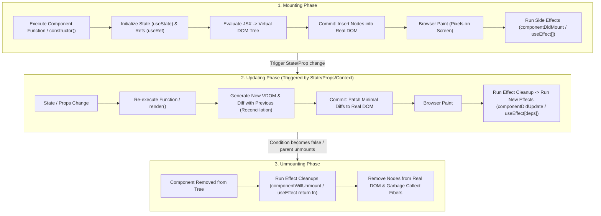

# React Lifecycle and Execution Flow

> [!note] Lifecycle Summary
> 
> React execution flows through two main phases across three stages: The **Render Phase** (pure, computes Virtual DOM diffs without side effects) and the **Commit Phase** (synchronously mutates the real DOM, paints pixels, and triggers effects).
> 
>   

> [!abstract] Architectural Transition
> 
> Modern React replaces sequential, imperative class lifecycles (`mount` -> `update` -> `unmount`) with declarative state synchronization (`useEffect`, `useLayoutEffect`) managed by the Fiber reconciler.
> 
>   

## Visual Lifecycle Flow




## Key Concepts

- **Mounting**: Runs the component code, sets initial memory cells (states and refs), converts JSX to Virtual DOM, inserts into real DOM, paints, and invokes post-mount effects.
    
      
    
- **Updating**: Triggered whenever props, state, or context change. Re-evaluates JSX, diffs the new Virtual DOM against the old snapshot (Fiber reconciliation), applies minimal patches to the real DOM, repaints, and executes effect cleanups followed by updated effects.
    
      
    
- **Unmounting**: Triggered when a component is conditionally removed from the tree. Runs cleanup functions, removes nodes from the real DOM, and disposes of memory/listeners.
    
      
    
- **Render Phase vs. Commit Phase**:
    
      
    - _Render Phase_: Top of component down to JSX return. Must be pure and free of side effects.
        
          
        
    - _Commit Phase_: DOM mutations, browser paint, and layout/passive effects execution.
        
          
        

## Common Interview Questions

- Walk through the visual phases of a React component from initial load to unmounting.
    
      
    
- Exactly at what point does the browser paint compared to when `useEffect` vs `useLayoutEffect` executes?
    
      
    
- Why can React pause, restart, or abort the Render phase, but never the Commit phase?
    
      
    
- In what order do parent and child lifecycle methods/effects execute during mounting and unmounting?
    
      
    
- How does the cleanup function in `useEffect` prevent race conditions during updates?
    
      
    

## Strong Answers / Talking Points

- **Detailed Lifecycle Breakdown**:
    
      
    1. **Mounting**:
        
          
        - _Setup_: Calls constructor or function body. Allocates state hooks and ref structures.
            
              
            
        - _VDOM Generation_: Evaluates JSX via `React.createElement` to create the initial VDOM tree.
            
              
            
        - _Commit & Paint_: Real DOM is updated synchronously, then the browser calculates layout and paints pixels.
            
              
            
        - _Effects_: `useEffect` callbacks run asynchronously after paint to avoid blocking the main UI thread.
            
              
            
    2. **Updating**:
        
          
        - _Scheduling_: A state setter or prop change enqueues an update.
            
              
            
        - _Diffing_: React re-renders the component, generates a new VDOM, and computes minimal changes (reconciliation).
            
              
            
        - _Patching_: Only changed attributes/nodes are mutated on the real DOM.
            
              
            
        - _Cleanup & Re-execution_: React runs the cleanup callback from the previous render's effect, then triggers the new effect.
            
              
            
    3. **Unmounting**:
        
          
        - _Teardown_: React invokes `componentWillUnmount` or the returned cleanup function from `useEffect`.
            
              
            
        - _Clean up resources_: Cancels timers, removes global event listeners, disconnects sockets.
            
              
            
        - _Garbage Collection_: Node references are severed and Fibers are marked for deletion.
            
              
            
- **Order of Execution (Parent vs. Child)**:
    
      
    - _Mounting Render_: Parent renders first, then Child renders (`Parent Body` -> `Child Body`).
        
          
        
    - _Mounting Effects_: Child effects execute before Parent effects (`Child useEffect` -> `Parent useEffect`).
        
          
        
    - _Unmounting_: Parent teardown starts, but cleanups run bottom-up or as nodes are detached.
        
          
        

## Code Snippets / Examples


```JavaScript
import { useState, useEffect, useLayoutEffect } from 'react';

export function LifecycleDemo({ triggerUpdate }) {
  // 1. RENDER PHASE: Initialization and execution
  const [count, setCount] = useState(0);

  // Synchronous effect: Runs AFTER DOM mutations, BEFORE paint
  useLayoutEffect(() => {
    // Blocks paint: Use only for measuring DOM layout
    return () => {
      // Runs before DOM updates or unmount
    };
  }, [count]);

  // Asynchronous effect: Runs AFTER browser paint
  useEffect(() => {
    // 2. COMMIT PHASE (Post-paint)
    const timer = setInterval(() => {
      // Background task
    }, 1000);

    // 3. UNMOUNT / UPDATE CLEANUP
    return () => {
      clearInterval(timer);
    };
  }, [count]);

  // VDOM Evaluation
  return (
    <div>
      <p>Count: {count}</p>
      <button onClick={() => setCount(prev => prev + 1)}>Increment</button>
    </div>
  );
}
```

## Related Topics

- [[React Fundamentals and Core Concepts]]
    
      
    
- [[React Reconciliation and Diffing Algorithm|Virtual DOM and Reconciliation]]
    
      
    
- [[React useEffect and Synchronization Architecture|React useEffect vs useLayoutEffect]]
    
      
    
- [[React Fiber Architecture and Non-Blocking Rendering|React Fiber Architecture]]
    
      
    

## Tags

#fullstack #interview #react-lifecycle

  

## Revision Checklist

- [ ] Can explain in 60 seconds
    
      
    
- [ ] Can explain trade-offs
    
      
    
- [ ] Can give a real project example
    
      
    
- [ ] Can answer common follow-ups