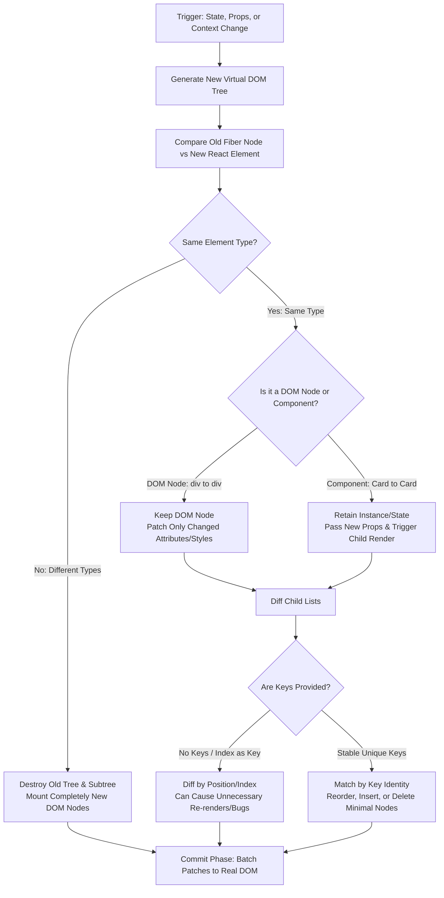
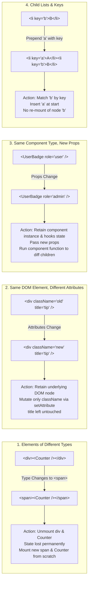

# React Reconciliation and Diffing Algorithm

> [!note] Core Definition
>
> Reconciliation is React's recursive algorithm that diffs two Virtual DOM trees to determine the minimal, optimal set of real DOM mutations needed to keep the UI in sync with the latest state.


> [!abstract] From $O(n^3)$ to $O(n)$: The Heuristic Diff
>
> The state-of-the-art tree diffing algorithms (like the Levenshtein distance on trees) have a complexity of $O(n^3)$. To display 1,000 elements, $10^9$ comparisons would be required. React reduces this to **$O(n)$** using a **heuristic diffing algorithm** based on two practical assumptions:
>
> 1. Two elements of different types produce completely different trees.
>
> 2. The developer can hint at which child elements remain stable across renders using a unique, consistent `key` prop.


## The Reconciliation Diffing Pipeline



## Four Diffing Scenarios



## Key Concepts

### 1. Elements of Different Types

- Whenever the root element type differs (e.g., `<a>` to ``, or `<Article>` to `<div>`), React discards the entire old tree.

- Old DOM nodes are destroyed (`componentWillUnmount` or `useEffect` cleanups fire).

- Subtree component state is completely reset.

- New DOM nodes are constructed from scratch and inserted into the DOM.

### 2. Same DOM Element Type, Different Attributes

- When comparing two DOM elements of the same type (e.g., `<div className="before" title="stuff" />` vs `<div className="after" title="stuff" />`), React retains the existing underlying native DOM node.

- React only checks and updates the modified attributes (e.g., mutating only `className`).

- When updating `style`, React updates only the specific style properties that changed (e.g., changing `color: 'red'` to `color: 'blue'` without recalculating `fontWeight`).

### 3. Same Component Type, Updated Props

- When a component type stays the same across renders (e.g., `<UserProfile id="{1}"/>` $\rightarrow$ `<UserProfile id="{2}"/>`), the component instance remains alive.

- Local component state (`useState`, `useRef`) is **preserved**.

- React updates the props of the underlying Fiber, invokes the component function (or `componentDidUpdate`), and recurses down to reconcile the children.

### 4. Recursing on Children (The Power of Keys)

- By default, when recursing on the children of a DOM node, React iterates over both lists of children simultaneously and generates a mutation whenever there’s a difference based on index position.

- **Without Keys (Prepend Problem)**:

    - Inserting an item at the beginning of an unkeyed list causes React to mutate _every single child_ because their position index shifted by 1.

- **With Unique Keys**:

    - React uses the `key` property to match children in the original tree to children in the subsequent tree.

    - If a child was prepended, React simply moves the existing DOM nodes and inserts the single new element at the front.

## Common Interview Questions

- What is reconciliation in React, and how does it relate to the Virtual DOM?

- How did the React team reduce tree diffing algorithmic complexity from $O(n^3)$ to $O(n)$?

- What are the two core heuristic assumptions of the diffing algorithm?

- What happens to a child component's state when its parent tag changes from a `<div>` to a `<section>`?

- Why is using array index as a `key` considered an anti-pattern for dynamic lists?

- How does React diff styles when only one CSS property inside an inline object changes?

## Strong Answers / Talking Points

- **Why $O(n^3)$ is Prohibitive**:

    - The general solution for minimal edit distance between arbitrary trees requires comparing each node to every other node in both trees ($n \times n = n^2$), multiplied by the work to shift subtrees, yielding $O(n^3)$.

    - In a UI tree with 1,000 nodes, $10^9$ operations would freeze the browser frame rate (dropping well below 60fps). React's linear $O(n)$ heuristic makes diffing predictable and instantaneous.

- **The Pitfall of Changing Element Types**:

    - Swapping an element type high in the tree destroys all state below it. If an input field is wrapped conditionally in `<div>` vs `<section>`, toggling the container completely unmounts the input, resetting user form input and focus.

- **Why `key={index}` Breaks Dynamic Lists**:

    - Keys match elements between renders. When an item is deleted from or prepended to a list, all items following it receive a new index.

    - React matches nodes by index rather than data identity, binding old internal state (like input text or checkbox status) to the wrong item. Always use stable, unique IDs from database records.

## Code Snippets / Examples

```javascript
// Scenario 1: Different Element Types (State Reset)
export function ContainerSwap({ isExpanded }) {
  // Toggling isExpanded UNMOUNTS <ChildComponent />, destroying its internal state!
  return isExpanded ? (
    <div>
      <ChildComponent />
    </div>
  ) : (
    <section>
      <ChildComponent />
    </section>
  );
}

// Scenario 2: Same Element, Different Attributes (DOM Node Retained)
export function AttributeDiff({ isDanger }) {
  // DOM element <div> is preserved; only style.color is mutated in real DOM
  return (
    <div style={{ color: isDanger ? 'red' : 'green', fontSize: '16px' }}>
      Status Text
    </div>
  );
}

// Scenario 4: Keys in Dynamic Lists (Good vs Bad)
export function ListDiff({ items }) {
  return (
    <ul>
      {/* BAD: Breaks when items are sorted, prepended, or removed */}
      {items.map((item, index) => (
        <li key={index}>{item.name}</li>
      ))}

      {/* GOOD: Predictable O(1) matching per list node */}
      {items.map((item) => (
        <li key={item.id}>{item.name}</li>
      ))}
    </ul>
  );
}
```

## Related Topics

- [[React Reconciliation and Diffing Algorithm|Virtual DOM and Reconciliation]]

- [[React Fiber Architecture and Non-Blocking Rendering|React Fiber Architecture]]

- [[React Lifecycle and Execution Flow|React Component Lifecycle]]

- [[JSX and ReactDOM Execution Pipeline|JSX to Real DOM Pipeline]]

## Tags

#fullstack #interview #react-reconciliation #diffing-algorithm #virtual-dom #mermaid

## Revision Checklist

- [ ] Can explain in 60 seconds

- [ ] Can explain trade-offs

- [ ] Can give a real project example

- [ ] Can answer common follow-ups
