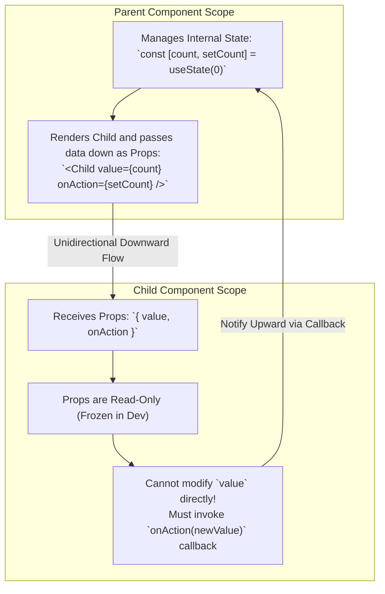
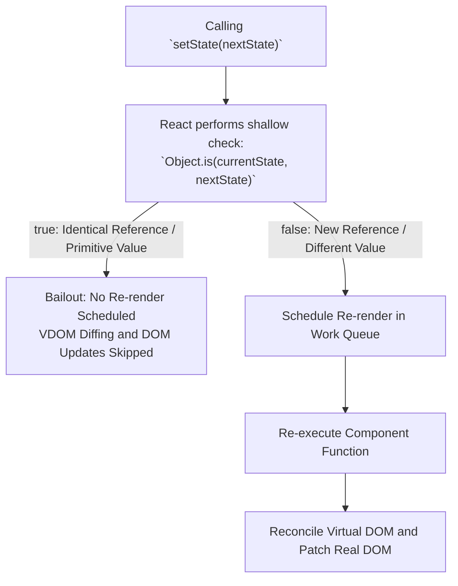

> [!note] State vs Props Core Mental Model
> 
> **Props** (short for properties) represent external configuration passed down from a parent component; they are read-only and owned by the caller. **State** represents internal, reactive memory managed and owned by the component itself over its lifecycle.
> 
>   

> [!abstract] React Immutability and `Object.is`
> 
> React triggers re-renders using **shallow reference equality checks** (`Object.is`). Mutating an object or array in place preserves its memory reference pointer, leading React to believe nothing changed and causing it to bail out of rendering. To signal a state update, you must create a new object or array reference (e.g., via spread syntax `...` or shallow copying).
> 
>   

## State vs Props Comparison




## How React Determines Re-renders: Reference Equality Check




## The Prop Drilling Problem and Architectural Alternatives

```mermaid
flowchart TD
    subgraph DRILLING ["Prop Drilling Anti-Pattern"]
        D_Root["Root / Page Component (Holds User State)"]
        D_L1["Layout Component (Passes user prop)"]
        D_L2["Header Component (Passes user prop)"]
        D_L3["Navbar Component (Passes user prop)"]
        D_Target["UserProfile Component (Actually consumes user prop)"]
        
        D_Root -->|user| D_L1
        D_L1 -->|user| D_L2
        D_L2 -->|user| D_L3
        D_L3 -->|user| D_Target
    end

    subgraph ALTERNATIVES ["Architectural Solutions"]
        direction TB
        A1["1. Component Composition: Pass component as children `&lt;Navbar&gt;&lt;UserProfile /&gt;&lt;/Navbar&gt;`"]
        A2["2. React Context API: For ambient global data (Auth, Theme, Locale)"]
        A3["3. External Stores: Zustand / Redux / Jotai for high-frequency client state"]
        A4["4. Server State Managers: TanStack React Query for cached network state"]
    end
```




## Key Concepts

### 1. What is State?

- Internal, mutable memory preserved between re-renders by React’s Fiber node.
    
      
    
- Defined via `useState` or `useReducer`.
    
      
    
- Changes to state are asynchronous/batched and trigger a re-render of the component and its children (unless memoized).
    
      
    

### 2. What are Props?

- Input arguments passed down into a component (like parameters to a function).
    
      
    
- Flow is strictly **unidirectional** (top-to-bottom).
    
      
    
- In development mode, React enforces prop immutability by applying `Object.freeze(props)`. Attempting to mutate `props.title = 'new'` throws a runtime error in strict mode.
    
      
    

### 3. Shallow Copying and Immutability

- React checks if state changed using `Object.is(prev, next)`.
    
      
    
- **The In-Place Mutation Trap**:
    
      
    
    ```    JavaScript
    // BUG: React bails out because the memory address is unchanged
    user.name = "Alice";
    setUser(user); // Object.is(oldUser, newUser) === true -> NO RENDER
    ```
    
- **The Immutable Solution**:
    
      
    
    ```JavaScript
    // CORRECT: Creates a brand-new object reference in memory
    setUser({ ...user, name: "Alice" }); // Object.is returns false -> TRIGGERS RENDER
    ```
    

### 4. What is Prop Drilling?

- The process of passing props through multiple levels of intermediary components that do not need the data themselves, merely serving as conduits to deliver it to a deeply nested child.
    
      
    
- **Why it hurts maintainability**: Tightly couples intermediate components to data shapes they don't care about, making refactoring brittle and tedious.
    
      
    

## Common Interview Questions

- What is the difference between state and props in React?
    
      
    
- Why can’t you mutate state or props directly in React?
    
      
    
- How does React detect when a state variable has changed?
    
      
    
- What does `Object.freeze()` do to props in development mode?
    
      
    
- What is prop drilling, and at what point does it become a problem?
    
      
    
- How does component composition solve prop drilling without needing Context or external state libraries?
    
      
    
- What is the difference between a shallow copy and a deep copy when updating nested state?
    
      
    

## Strong Answers / Talking Points

- **Why Immutability Matters for Concurrent React**:
    
      
    - Immutability allows React to perform $O(1)$ reference equality checks (`prev === next`) instead of performing expensive, recursive $O(n)$ deep object comparisons across complex state trees.
        
          
        
    - In Concurrent Mode, components can pause and restart rendering. If state objects are mutated in-place, concurrent render tasks could read torn or half-written values, corrupting the UI.
        
          
        
- **Why Props are Frozen (`Object.freeze`)**:
    
      
    - Components must behave as pure functions with respect to their props. If a child modifies a prop object in-place, it unintentionally mutates the parent’s state object behind the scenes, causing unpredictable cross-tree side effects.
        
          
        
- **Solving Prop Drilling Without Overusing Context**:
    
      
    - _Beginner impulse_: Jump straight to Redux or React Context.
        
          
        
    - _Senior architectural approach_: Leverage **Component Composition**. Instead of passing individual data props through 4 levels of containers, pass the configured consumer component directly as `children` or via dedicated slot props:
        
          
        
        
        ```        JavaScript
        // Passing slot instead of drilling props
        <Layout sidebar={<UserProfile user={user} />} />
        ```
        

## Best Practices for State and Props

1. **Keep State Minimal**: Never duplicate props in state. If a value can be computed or derived on the fly (e.g., `fullName = firstName + ' ' + lastName`), calculate it during render; do not duplicate it into a separate `useState`.
    
      
    
2. **Lift State Up Carefully**: Place state at the lowest common ancestor of the components that require it. Do not elevate state to the global level unless genuinely needed application-wide.
    
      
    
3. **Use Functional State Updates**: Always use `setState(prev => prev + 1)` when the next state depends on the previous state to avoid stale closure bugs during concurrent batching.
    
      
    
4. **Normalize Deeply Nested State**: Avoid deeply nested objects in state. Deep updates require cumbersome spread syntax (`{ ...prev, a: { ...prev.a, b: ... } }`). Normalize structures using entity dictionaries or tools like `immer`.
    
      
    

## Code Snippets / Examples


```JavaScript
import { useState } from 'react';

// 1. Shallow Copying vs Direct Mutation Demonstration
export function UserEditor() {
  const [profile, setProfile] = useState({
    name: 'John',
    preferences: { theme: 'dark' }
  });

  const handleBadUpdate = () => {
    // WRONG: In-place mutation maintains same pointer reference
    profile.name = 'Jane';
    setProfile(profile); // React skips re-render!
  };

  const handleGoodShallowUpdate = () => {
    // CORRECT: Brand new top-level object pointer
    setProfile(prev => ({
      ...prev,
      name: 'Jane'
    }));
  };

  const handleNestedUpdate = () => {
    // Handling nested immutability properly
    setProfile(prev => ({
      ...prev,
      preferences: {
        ...prev.preferences,
        theme: 'light' // Deep clone point of mutation
      }
    }));
  };

  return <div>{profile.name} - {profile.preferences.theme}</div>;
}

// 2. Solving Prop Drilling via Component Composition (Slots)
// Problem: Page has 'user', drilled through AppLayout -> Header -> Nav -> ProfileBadge
// Solution: Use children / slots so AppLayout and Header remain agnostic

export function App() {
  const [user] = useState({ name: 'Alex', avatar: '/alex.png' });

  return (
    <AppLayout
      header={
        // Header doesn't need to know 'user' exists!
        <Header>
          <ProfileBadge user={user} />
        </Header>
      }
    >
      <MainContent />
    </AppLayout>
  );
}

function Header({ children }) {
  return <header className="nav-bar">{children}</header>;
}

function ProfileBadge({ user }) {
  return <span>Welcome, {user.name}</span>;
}

function AppLayout({ header, children }) {
  return (
    <div className="layout">
      {header}
      <main>{children}</main>
    </div>
  );
}
```

## Related Topics

- [[React Component Lifecycle]]
    
      
    
- [[React Reconciliation and Diffing Algorithm]]
    
      
    
- [[React Context API vs State Libraries]]
    
      
    
- [[Pure Components and React memo]]
    
      
    
- [[JavaScript Pass-by-Reference vs Pass-by-Value]]
    
      
    

## Tags

#fullstack #interview #react-state #react-props #immutability #mermaid

  

## Revision Checklist

- [ ] Can explain in 60 seconds
    
      
    
- [ ] Can explain trade-offs
    
      
    
- [ ] Can give a real project example
    
      
    
- [ ] Can answer common follow-ups