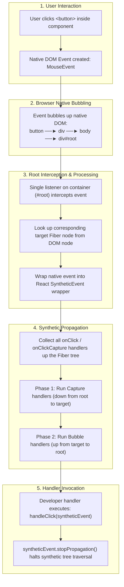
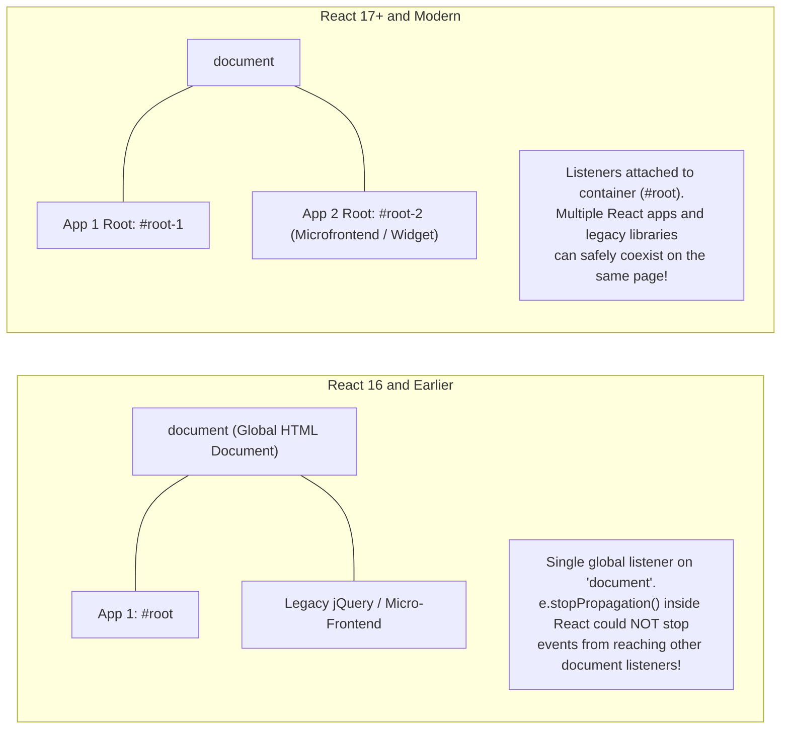

> [!note] Core Definition
> 
> A **SyntheticEvent** is a cross-browser, cross-platform wrapper around the browser’s native DOM event (`NativeEvent`). It provides a normalized, consistent API across all browsers (like Chrome, Safari, Firefox, Edge) following the W3C event specification.
> 
>   

> [!abstract] Event Delegation Architecture (React 17+ vs Legacy)
> 
> Instead of attaching individual event listeners to every single DOM node you render in JSX, React attaches **one single event listener per event type** directly onto the **root DOM container** (`#root`). When an event occurs anywhere in the DOM tree, it bubbles up to this root container, where React intercepts it, wraps it into a `SyntheticEvent`, and dispatches it through its internal Fiber tree.
> 
>   

## The End-to-End Event Delegation Pipeline




## Architectural Shift: React 16 vs React 17+

Code snippet



## Key Concepts

### 1. What is a SyntheticEvent?

- An object instance created by React that mirrors the browser's native event interface.
    
      
    
- Provides consistent naming and behavior (e.g., standardizing `e.target`, `e.currentTarget`, `e.preventDefault()`, and `e.stopPropagation()`) so developers don't need browser-specific polyfills or prefixes.
    
      
    
- You can access the raw browser event at any time via `e.nativeEvent`.
    
      
    

### 2. How Event Delegation Works in React

1. **Attachment at the Root**: When your app mounts via `createRoot(rootElement).render(<App/>)`, React inspects supported event types (`click`, `keydown`, `input`, etc.) and registers central top-level listeners on `rootElement` (`#root`).
    
      
    
2. **Native Event Bubbles to Root**: When the user interacts with an element (e.g., clicks a button), the native browser event bubbles normally through the real DOM until it reaches `#root`.
    
      
    
3. **Internal Fiber Lookup**: React reads the internal property attached to the real DOM element (e.g., `__reactFiber$...` or `__reactInternalInstance$...`) to locate the Fiber node corresponding to the clicked target.
    
      
    
4. **Synthetic Tree Traversal**: React walks up the Fiber tree, collects all relevant listeners (`onClickCapture` on the way down, `onClick` on the way up), and executes them in order.
    
      
    

### 3. Capture vs Bubble Phases

- Like the native DOM, React supports both phases:
    
      
    - **Capture Phase**: Suffix with `Capture` (e.g., `onClickCapture`, `onKeyDownCapture`). Handlers fire downward from the root Fiber to the target Fiber.
        
          
        
    - **Bubble Phase**: Default standard naming (e.g., `onClick`, `onKeyDown`). Handlers fire upward from the target Fiber back to the root Fiber.
        
          
        

### 4. Deprecated Event Pooling (React 16 vs 17+)

- **React 16 (Event Pooling)**: `SyntheticEvent` instances were pooled into a shared memory pool to improve performance. Once your callback finished, the object was wiped clean and recycled. Accessing `e.target` inside an asynchronous `setTimeout` or `Promise` caused an error (`null` or `undefined`) unless you called `e.persist()`.
    
      
    
- **React 17+ (No Event Pooling)**: Modern JavaScript engines (V8, JavaScriptCore) optimize garbage collection efficiently. Event pooling was completely removed in React 17. You can now access event properties inside async callbacks directly without calling `e.persist()`.
    
      
    

## Common Interview Questions

- What is a SyntheticEvent in React, and why does React use it instead of native events?
    
      
    
- How does React's event delegation work under the hood?
    
      
    
- Where does React 17+ attach event listeners compared to React 16?
    
      
    
- What was Event Pooling, why was it removed in React 17, and what did `e.persist()` do?
    
      
    
- What is the difference between `e.target` and `e.currentTarget` inside a synthetic event handler?
    
      
    
- What happens if you call `e.stopPropagation()` in a React synthetic event handler vs calling it on `e.nativeEvent`?
    
      
    

## Strong Answers / Talking Points

- **Why React 17 Moved Listeners from `document` to Root Container (`#root`)**:
    
      
    - In React 16, all events were attached to the global `document`. In enterprise apps embedding multiple React versions, micro-frontends, or integrating with non-React libraries (like jQuery plugins or web components), calling `e.stopPropagation()` inside one React sub-app would not prevent the event from bubbling up to `document`.
        
          
        
    - Attaching listeners to the container container (`rootNode`) isolates each React application instance safely.
        
          
        
- **`e.target` vs `e.currentTarget`**:
    
      
    - `e.target`: The actual DOM element where the interaction physically occurred (e.g., the nested `<span>` inside a `<button>`).
        
          
        
    - `e.currentTarget`: The element whose event listener is currently executing (the component DOM element with the `onClick` prop).
        
          
        
- **Stopping Propagation: Synthetic vs Native**:
    
      
    - `e.stopPropagation()` inside a React handler prevents propagation along the **React Fiber tree** and stops execution of synthetic handlers higher up in the component tree.
        
          
        
    - However, because the native event has already bubbled from the button all the way up to `#root` in the native DOM to trigger React in the first place, calling `e.stopPropagation()` in React **cannot** stop native DOM listeners attached directly to child DOM nodes (`element.addEventListener`) from firing.
        
          
        

## Code Snippets / Examples


```JavaScript
export function EventDelegationDemo() {
  const handleParentCapture = () => console.log('1. Parent Capture');
  const handleChildCapture = () => console.log('2. Child Capture');
  
  const handleChildClick = (e) => {
    console.log('3. Child Bubble (Target)');
    console.log('Target (what you clicked):', e.target);
    console.log('CurrentTarget (where onClick is bound):', e.currentTarget);
    console.log('Native Browser Event:', e.nativeEvent);

    // Stops bubbling up the REACT Fiber tree
    // e.stopPropagation();
  };

  const handleParentClick = () => console.log('4. Parent Bubble');

  return (
    <div
      onClickCapture={handleParentCapture}
      onClick={handleParentClick}
      style={{ padding: '20px', border: '1px solid #ccc' }}
    >
      <button
        onClickCapture={handleChildCapture}
        onClick={handleChildClick}
      >
        <span>Click Me</span>
      </button>
    </div>
  );
}

// Execution Order Output when clicking the <span>:
// 1. Parent Capture
// 2. Child Capture
// 3. Child Bubble (Target)
// 4. Parent Bubble
```

JavaScript

```JavaScript
// Accessing synthetic events in asynchronous code (React 17+ vs 16)
function AsyncEventDemo() {
  const handleClick = (e) => {
    // In React 16: e.target became null unless e.persist() was called
    // In React 17+: Completely safe because Event Pooling was removed
    setTimeout(() => {
      console.log('Async target accessed safely:', e.target.tagName);
    }, 100);
  };

  return <button onClick={handleClick}>Async Action</button>;
}
```

## Related Topics

- [[JSX to Real DOM Pipeline]]
    
      
    
- [[React Reconciliation and Diffing Algorithm]]
    
      
    
- [[React Fiber Architecture]]
    
      
    
- [[Browser Event Propagation (Capture, Target, Bubble)]]
    
      
    

## Tags

#fullstack #interview #react-events #synthetic-event #event-delegation #mermaid

  

## Revision Checklist

- [ ] Can explain in 60 seconds
    
      
    
- [ ] Can explain trade-offs
    
      
    
- [ ] Can give a real project example
    
      
    
- [ ] Can answer common follow-ups