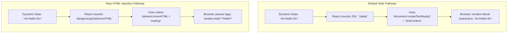

# Safe HTML Injection and innerHTML Handling in React

> [!note] The Core Concept
> 
> By default, React treats all data embedded in `{expression}` as pure strings and injects it using browser APIs like `textContent` (or `document.createTextNode`), completely neutralizing executable tags. To deliberately render raw HTML strings, React provides `dangerouslySetInnerHTML`, which maps directly to the browser's native `innerHTML`.
> 
>   

> [!abstract] Why the Name "dangerouslySetInnerHTML"?
> 
> The API was intentionally named with the prefix "dangerously" to remind developers that directly injecting unverified HTML bypasses React’s sanitization pipeline, re-opening the application to Cross-Site Scripting (XSS) attacks.
> 
>   

## How React Renders by Default: textContent vs innerHTML



## Safe vs Vulnerable HTML Rendering Pipeline

Code snippet

```mermaid
sequenceDiagram
    autonumber
    actor Attacker as Attacker / Unsafe API
    participant App as React App
    participant Sanitizer as DOMPurify Sanitizer
    participant DOM as Browser DOM

    Attacker->>App: Submits payload: `&lt;img src=x onerror=alert(1)&gt;`

    alt Unsafe Direct Usage
        App->>DOM: dangerouslySetInnerHTML: { __html: payload }
        DOM-->>DOM: Parses HTML & executes malicious script
    else Safe Sanitized Usage
        App->>Sanitizer: DOMPurify.sanitize(payload)
        Sanitizer-->>App: Strips onerror handler -> `&lt;img src=x&gt;`
        App->>DOM: dangerouslySetInnerHTML: { __html: cleanPayload }
        DOM-->>DOM: Mounts safe image tag; no script runs
    end
```

## Key Concepts

- **Default Injection Mechanism**: When rendering a string in `{content}`, React sets the content using `textContent` under the hood. Browsers treat this strictly as character data, meaning tags like `<script>` or `` are rendered as literal text without DOM parsing.

- **The `dangerouslySetInnerHTML` Property**: An attribute on DOM elements that accepts an object with the key `__html` (e.g., `dangerouslySetInnerHTML={{ __html: rawString }}`). The nested object syntax acts as a purposeful speed bump to prevent accidental assignment.

- **The Golden Rule of HTML Injection**: Never pass raw user input or unvetted CMS/API strings directly to `dangerouslySetInnerHTML` without sanitizing it first.

- **Sanitization Standards**: Using a dedicated, audited library like **DOMPurify** to strip dangerous tags (`<script>`, `<iframe>`), executable event attributes (`onload`, `onerror`), and unsafe protocols (`javascript:`).

## Common Interview Questions

- How does React inject string values into the DOM by default, and why does that prevent XSS?

- What is `dangerouslySetInnerHTML`, and why does it require an object with an `__html` property?

- What are the risks of using `dangerouslySetInnerHTML` directly with content from an external API or user input?

- How do you safely render rich text or HTML content inside a React component?

- What is DOMPurify, and at what stage of data processing should it be executed?

- Besides `dangerouslySetInnerHTML`, are there alternative approaches to rendering rich markup in React?

## Strong Answers / Talking Points

- **Default Safety (textContent)**:

    - In vanilla JavaScript, assigning to `innerHTML` instructs the browser’s HTML parser to evaluate and execute any markup.

    - React defaults to safe text nodes (`document.createTextNode` or `node.textContent`), ensuring that characters like `<`, `>`, and `&` are automatically escaped and rendered as text glyphs, completely disarming script tags.

- **Why `dangerouslySetInnerHTML={{ __html: ... }}` requires a nested object**:

    - It acts as an intentional friction mechanism. It prevents developers from accidentally doing `<div dangerouslySetInnerHTML={userText} />` thinking it's a regular prop.

- **Safe HTML Injection Strategy**:

    1. **Sanitize with DOMPurify**: Before passing the string to `__html`, pass it through `DOMPurify.sanitize()`. This parses the HTML tree in memory and removes malicious nodes or attributes before the browser parses it in the live document.

    2. **Alternative: Structured Parsing**: Instead of parsing HTML strings at runtime, use tools like `html-react-parser` or compile rich-text to an Abstract Syntax Tree (AST) (e.g., Markdown/MDX, JSON-based rich text formats from headless CMSs) and render them via native React components.

## Code Snippets / Examples

```javascript
import DOMPurify from 'dompurify';

// 1. Default Behavior (Safe): Renders tags as literal plain text
export function SafeDefault({ rawInput }) {
  // Input: "<b>Bold text</b>"
  // Displays on screen: <b>Bold text</b> (as text, not bold)
  return <div>{rawInput}</div>;
}

// 2. Vulnerable Usage (DO NOT DO THIS): Direct unsanitized injection
export function VulnerableHTML({ untrustedInput }) {
  // If untrustedInput = ""
  // The script will execute immediately in the victim's browser!
  return <div dangerouslySetInnerHTML={{ __html: untrustedInput }} />;
}

// 3. Recommended Safe Method: Sanitizing with DOMPurify
export function SafeHTMLRenderer({ richTextFromCMS }) {
  // Strips out scripts, onerror, onclick, and dangerous protocols
  const cleanHTML = DOMPurify.sanitize(richTextFromCMS, {
    ALLOWED_TAGS: ['b', 'i', 'em', 'strong', 'a', 'p', 'ul', 'li', 'h1', 'h2'],
    ALLOWED_ATTR: ['href', 'target', 'rel']
  });

  return (
    <div
      className="rich-text-content"
      dangerouslySetInnerHTML={{ __html: cleanHTML }}
    />
  );
}

// 4. Alternative Method: Converting to React Elements via AST/Parser
import parse from 'html-react-parser';

export function ParsedHTMLComponent({ cleanMarkup }) {
  // Converts valid HTML strings directly into safe React Elements
  return <div className="parsed-wrapper">{parse(cleanMarkup)}</div>;
}
```

## Related Topics

- [[JSX and Cross-Site Scripting (XSS) Prevention|JSX and Cross-Site Scripting Prevention]]

- [[JSX and ReactDOM Execution Pipeline|JSX to Real DOM Pipeline]]

- [[Web Security & Identity Architecture. SOP, XSS, CSRF & Token Lifecycles|Frontend Security and OWASP Top 10]]

- [[JSX and ReactDOM Execution Pipeline|ReactDOM and Host Mutations]]

## Tags

#fullstack #interview #react-security #innerhtml #xss-prevention #mermaid

## Revision Checklist

- [ ] Can explain in 60 seconds

- [ ] Can explain trade-offs

- [ ] Can give a real project example

- [ ] Can answer common follow-ups